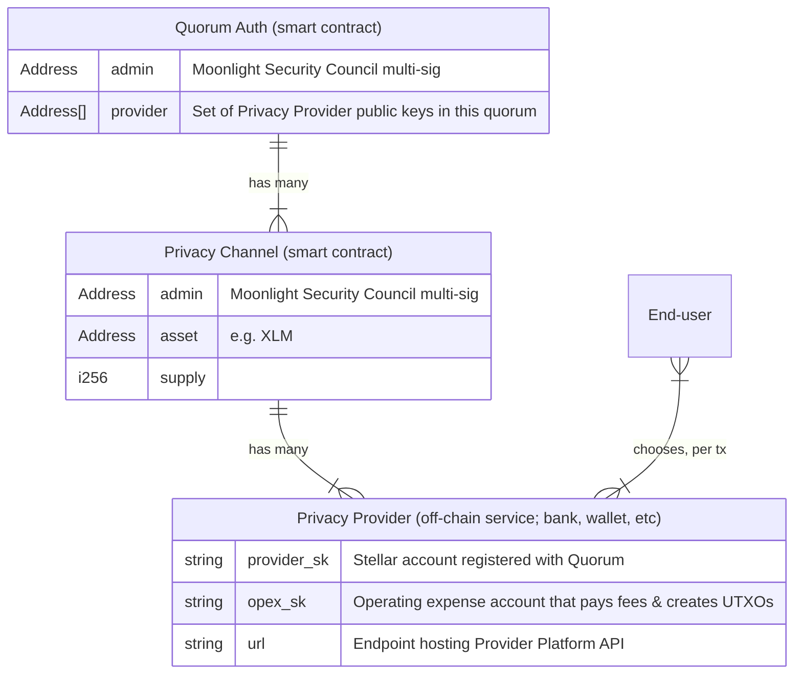

<p align=center>
  
</p>

<h1 align=center>Core Contracts</h1>

Moonlight: the missing privacy layer, for any blockchain, built on Stellar.

This repository contains the core smart contracts and modules for the Moonlight Protocol on Soroban.



This repository contains the smart contracts. A reference implementation of the Privacy Provider API can be found at [Moonlight-Protocol/provider-platform](https://github.com/Moonlight-Protocol/provider-platform/tree/dev).


## Structure

```
.
├── contracts/
│   ├── privacy-channel/     - Privacy Channel contract using UTXO model
│   └── channel-auth/        - Quorum Auth contract for provider authorization
│
└── modules/
    ├── utxo-core/           - UTXO accounting system
    ├── auth/                - Authentication and signature verification
    ├── primitives/          - Core types (Condition, Signature, AuthPayload, etc.)
    ├── storage/             - UTXO storage backends (simple and drawer-optimized)
    └── helpers/             - Address parsing utilities
```

## Contracts

### Privacy Channel (`privacy-channel`)

The Privacy Channel contract manages privacy-preserving asset transfers using a UTXO model. It supports:

- **Deposits**: Transfer assets into the channel, creating UTXOs
- **Withdrawals**: Spend UTXOs to withdraw assets to external addresses
- **Transfers**: Spend and create UTXOs within the channel (via `transact`)

The contract holds a single asset and tracks total supply. All UTXO operations are authorized through the linked Quorum Auth contract.

### Quorum Auth (`channel-auth`)

The Quorum Auth contract manages a set of authorized providers and handles signature verification for channel operations. It implements:

- **Provider Management**: Admin can add/remove authorized providers
- **UTXO Authorization**: Verifies P256 (secp256r1) signatures on UTXO spend operations
- **Provider Authorization**: Requires at least one registered provider signature on transactions

The contract implements `CustomAccountInterface` to act as an authorization layer for the Privacy Channel.

## Modules

### utxo-core

UTXO accounting with support for:

- Creating and spending UTXOs (identified by 65-byte P256 public keys)
- Bundle processing (atomic multi-input, multi-output operations)
- Configurable event emission via feature flags

### auth

Signature verification for:

- P256 (secp256r1) signatures for UTXO spending
- Ed25519 signatures for provider authorization
- Condition-based authorization payloads

### primitives

Core types including:

- `Condition` - Describes expected outcomes (Create, ExtDeposit, ExtWithdraw, ExtIntegration)
- `Signature` / `SignerKey` - Multi-curve signature types
- `AuthPayload` / `AuthRequirements` - Authorization structures

### storage

Two UTXO storage backends (compile-time selectable):

- `storage-simple` - Basic persistent storage
- `storage-drawer` - Bitmap-optimized storage for cost efficiency

## Development

```bash
make build    # Build contracts
cargo test    # Run tests
```
