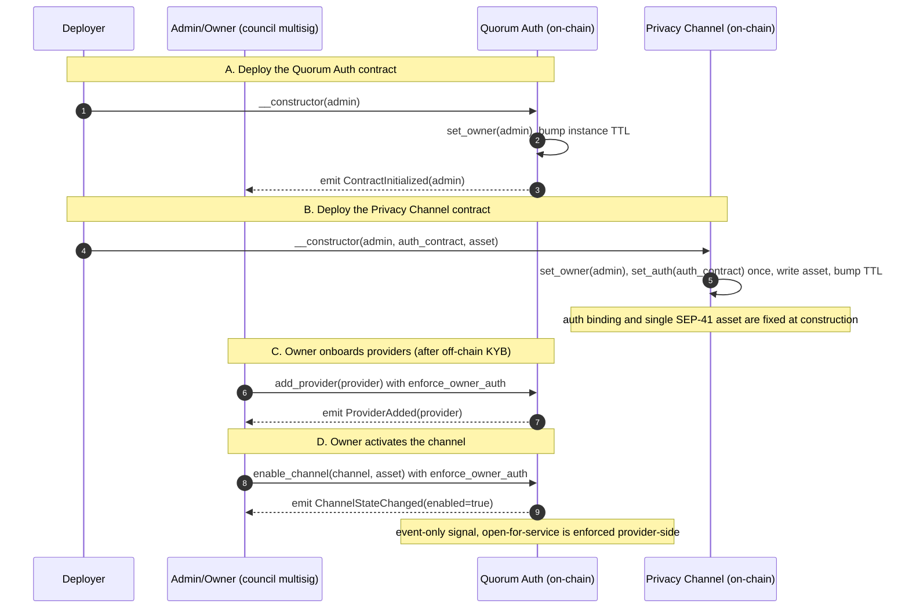
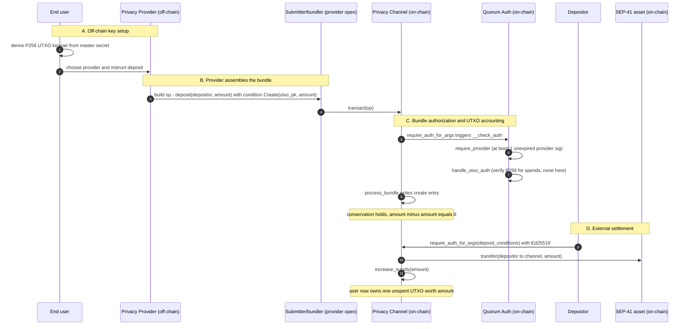
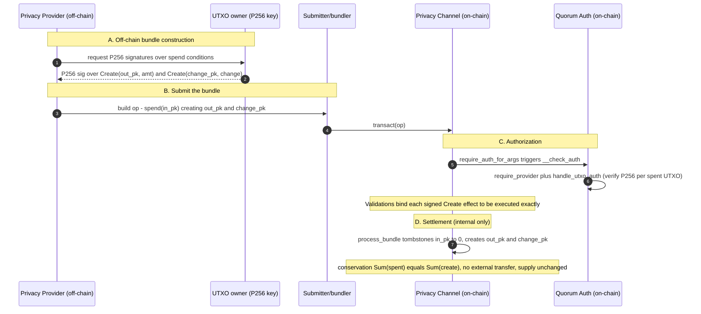
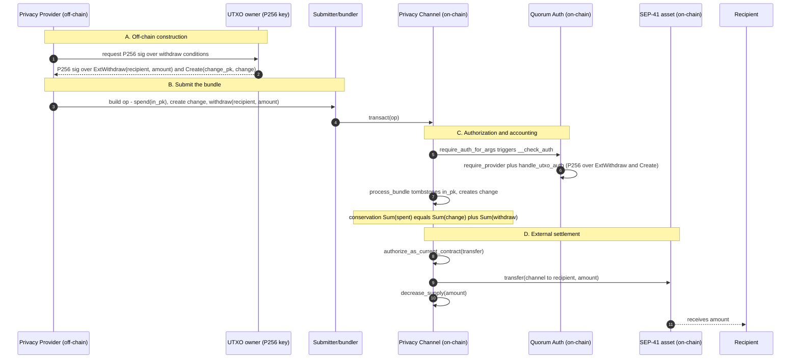
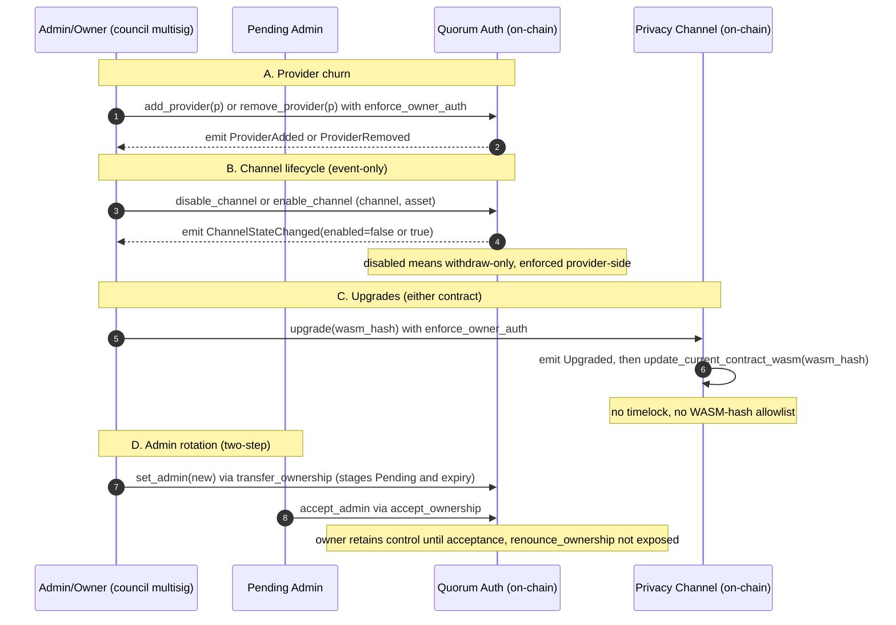

# Security Audit Report

**Moonlight** — *Stellar*

Delivered: July 23, 2026

## Table of Contents

- [Disclaimer](#disclaimer)
- [Executive Summary](#executive-summary)
- [Scope](#scope)
- [Methodology](#methodology)
- [Roles Description and Analysis](#roles-description-and-analysis)
    - [`channel-auth` (Quorum Auth) contract roles](#channel-auth-quorum-auth-contract-roles)
    - [`privacy-channel` (Privacy Channel) contract roles](#privacy-channel-privacy-channel-contract-roles)
  - [Trust/Authority Summary](#trustauthority-summary)
- [Business Logic and Expected Flow of Operations](#business-logic-and-expected-flow-of-operations)
- [Invariants](#invariants)
  - [A. Value conservation & supply](#a-value-conservation-supply)
  - [B. UTXO state machine](#b-utxo-state-machine)
  - [C. Authorization](#c-authorization)
  - [D. Governance](#d-governance)
  - [E. Execution discipline](#e-execution-discipline)
  - [T. Trust assumptions (boundary conditions, not enforced)](#t-trust-assumptions-boundary-conditions-not-enforced)
- [Findings](#findings)
- [[A1] `hash_payload` encoding is not injective](#a1-hash_payload-encoding-is-not-injective)
  - [Description](#description)
  - [Recommendation](#recommendation)
  - [Status](#status)
- [[A2] UTXO keys are never validated, value under a malformed key is locked permanently](#a2-utxo-keys-are-never-validated-value-under-a-malformed-key-is-locked-permanently)
  - [Description](#description)
  - [Recommendation](#recommendation)
  - [Status](#status)
- [[A3] Byte-identical signed effects merge into one execution](#a3-byte-identical-signed-effects-merge-into-one-execution)
  - [Description](#description)
  - [Recommendation](#recommendation)
  - [Status](#status)
- [Informative Findings](#informative-findings)
- [[B1] `set_admin` grants the maximum acceptance window, a pending transfer never auto-expires](#b1-set_admin-grants-the-maximum-acceptance-window-a-pending-transfer-never-auto-expires)
  - [Description](#description)
  - [Recommendation](#recommendation)
  - [Status](#status)
- [[B2] Bundle balance accumulator uses raw arithmetics rather than checked_add/checked_sub](#b2-bundle-balance-accumulator-uses-raw-arithmetics-rather-than-checked_addchecked_sub)
  - [Description](#description)
  - [Recommendation](#recommendation)
  - [Status](#status)
- [[B3] `hash_payload` Doc Specifies the Wrong Integer Width (8 vs 16 bytes)](#b3-hash_payload-doc-specifies-the-wrong-integer-width-8-vs-16-bytes)
  - [Description](#description)
  - [Recommendation](#recommendation)
  - [Status](#status)
- [[B4] Redundant Reentrancy Guard](#b4-redundant-reentrancy-guard)
  - [Description](#description)
  - [Recommendation](#recommendation)
  - [Status](#status)
- [[B5] Fragmented and Partially Duplicated Validation Across the Transact Flow](#b5-fragmented-and-partially-duplicated-validation-across-the-transact-flow)
  - [Description](#description)
  - [Recommendation](#recommendation)
  - [Status](#status)
- [[B6] Provider signature deadline is not provider-signed and enforced only against cooperative submitters](#b6-provider-signature-deadline-is-not-provider-signed-and-enforced-only-against-cooperative-submitters)
  - [Description](#description)
  - [Recommendation](#recommendation)
  - [Status](#status)
- [[B7] Provider registration accepts addresses the provider check can never match](#b7-provider-registration-accepts-addresses-the-provider-check-can-never-match)
  - [Description](#description)
  - [Recommendation](#recommendation)
  - [Status](#status)
- [[B8] Argument-less authorization contexts are gated by the provider check alone](#b8-argument-less-authorization-contexts-are-gated-by-the-provider-check-alone)
  - [Description](#description)
  - [Recommendation](#recommendation)
  - [Status](#status)
- [[B9] P256 signatures verified by the UTXO check carry no replay protection](#b9-p256-signatures-verified-by-the-utxo-check-carry-no-replay-protection)
  - [Description](#description)
  - [Recommendation](#recommendation)
  - [Status](#status)
- [[B10] Deposit amounts are not authorized at the channel, only by the asset transfer](#b10-deposit-amounts-are-not-authorized-at-the-channel-only-by-the-asset-transfer)
  - [Description](#description)
  - [Recommendation](#recommendation)
  - [Status](#status)
- [[B11] Withdrawals to the channel's own address burn claims without moving tokens](#b11-withdrawals-to-the-channels-own-address-burn-claims-without-moving-tokens)
  - [Description](#description)
  - [Recommendation](#recommendation)
  - [Status](#status)
- [[B12] `enable_channel` / `disable_channel` are event-only](#b12-enable_channel-disable_channel-are-event-only)
  - [Description](#description)
  - [Recommendation](#recommendation)
  - [Status](#status)
- [Appendix](#appendix)
- [Protocol Summary](#protocol-summary)

## Disclaimer

This report does not constitute legal or investment advice. You understand and agree that this report relates to new and emerging technologies and that there are significant risks inherent in using such technologies that cannot be completely protected against. While this report has been prepared based on data and information that has been provided by you or is otherwise publicly available, there are likely additional unknown risks that otherwise exist. This report is also not comprehensive in scope, excluding a number of components critical to the correct operation of this system. This report is for informational purposes only and is provided on an "as-is" basis, and you acknowledge and agree that you are making use of this report and the information contained herein at your own risk. The preparers of this report make no representations or warranties of any kind, either express or implied, regarding the information in or the use of this report and shall not be liable to you or any third parties for any acts or omissions undertaken by you or any third parties based on the information contained herein.

Smart contracts are still a nascent software arena, and their deployment and public offering carry substantial risk.

Finally, the possibility of human error in the manual review process is very real, and we recommend seeking multiple independent opinions on any claims that impact a large quantity of funds.

## Executive Summary

Moonlight engaged Runtime Verification Inc. to conduct a 2-week review of the Moonlight core contracts, followed by 1 week of remediation support. The audit began on June 29th, 2026, with the objective of evaluating the correctness and security of the protocol, reviewing existing quality assurance measures, identifying potential vulnerabilities, and providing recommendations for improvements in terms of code, testing, and documentation.

The audit's primary focus is the UTXO-based privacy-channel contract, which implements a shielded deposit / private-transfer / withdrawal lifecycle secured by P256 UTXO-owner signatures and Ed25519 provider co-signatures, with a secondary focus on the channel-auth (Quorum Auth) contract that gates this activity via a 1-of-N provider signature threshold and owner-governed provider registry. Each actor (Admin/Owner, Pending Admin, Privacy Provider, UTXO owner, Depositor, Withdrawal recipient, Transaction submitter) has a specific, bounded set of capabilities, and verifying these bounds, including that a provider cannot redirect, reduce, or drop a signer's intended outputs, is central to the protocol's security. The review will also cover TTL maintenance across both in-scope contracts.

Runtime Verification's audit process began with a design review, where we familiarized ourselves with the protocol's role structure and contract architecture by reviewing documentation and the existing codebase, with the objective of identifying gaps in the role and permission model and providing recommendations on how to address them. Using the understanding developed during the design review, we conducted a manual code review of the contract implementation, comparing the implemented role capabilities and bounds against the intended design and security best practices. This was followed by a one-week period of remediation support, during which Runtime Verification worked with the Moonlight team to address identified issues and verify proposed fixes.

## Scope

The scope of this audit was limited to the code contained in the public GitHub repository provided by the Moonlight team, located at [soroban-core](https://github.com/Moonlight-Protocol/soroban-core), with the fixed commit hash `d65780bbf0a6f8b2b601e4a536b38000775c8a15`. The elements within scope are divided into two core components, both implemented as Soroban smart contracts for the Stellar network:

- `./contracts/channel-auth`: Contains the implementation of the Quorum Auth contract, including its authority model (Admin/Owner and Pending Admin roles via stellar_access::ownable), the provider registry and its 1-of-N Privacy Provider signature threshold enforced through require_provider, the asset-channel enable/disable lifecycle, and contract upgrade logic.
- `./contracts/privacy-channel`: Contains the implementation of the Privacy Channel contract, including the UTXO-based deposit, private-transfer, and withdrawal flows; the P256 (secp256r1) UTXO-owner and Ed25519 depositor authorization and execution-binding of signed Create/ExtWithdraw conditions; conservation accounting across spend/create/withdraw operations; and persistent/instance TTL maintenance.

As findings are identified during the review, the client is expected to submit commits addressing reported issues. These remediation commits will also be reviewed to verify that the identified issues are appropriately resolved prior to the final report. The latest reviewed PRs are contained in commit ID `867c23da1769a2f56e42449ce5d5315ffb5f4cdc`.

## Methodology

Runtime Verification followed a structured methodology to evaluate the correctness and security of the Moonlight core smart contracts within the agreed 2-week engagement, followed by 1-week remediation period. Although manual review cannot guarantee the discovery of all vulnerabilities, our approach was designed to maximize coverage and identify the most impactful risks within the available timeline.

**Design Review and Role/Actor Mapping**

The engagement began with documentation and scope intake, followed by a high-level design review of the Moonlight protocol, focusing on the lifecycle of the channel-auth (Quorum Auth) contract and the privacy-channel contract, and on how the two components interact during deposit, private-transfer, and withdrawal operations.
The Moonlight contracts use a minimal authority model layered on explicit, signature-based authorization to correctly execute their functionality and implement their business logic. Each actor is enabled with specific capabilities in each contract, and the correct management of bounds for actions of each actor within the protocol is crucial to its proper functioning. Aiming to validate this, we first built an understanding of the actors available in each contract, including the Admin/Owner, Pending Admin, Privacy Provider, UTXO owner, Depositor, Withdrawal recipient, and Transaction submitter.

**Threat Analysis from the Design Review**

Building on the role and invariant mapping, we conducted a dedicated threat analysis of the protocol. This included generating invariants for each privileged operation and each signed condition (Create, ExtWithdraw, deposit), running Almanax scans of the codebase using the context developed during the design review, and evaluating financial and business-logic risk, with particular attention to the protocol's conservation guarantees, the implications of compromised or misused provider and owner keys, and dependencies on external inputs such as the provider registry and asset-channel lifecycle state.

**Manual Code Review**

After establishing the protocol model, we performed a line-by-line review of the Soroban Rust codebase, covering both in-scope contracts. This included examining:

- Correctness of the channel-auth contract's privileged operations, including provider registry management, the asset-channel enable/disable lifecycle, and the two-step admin rotation mechanism;
- Correctness of the channel-auth contract's 1-of-N provider signature threshold enforced via require_provider, and its distinction from the owner-level governance quorum;
- Correctness of the privacy-channel contract's UTXO lifecycle, including deposit, private-transfer, and withdrawal flows, and the execution-binding of signed Create/ExtWithdraw conditions;
- Soroban-specific concerns across both contracts, including storage layout, persistent and instance TTL maintenance and refresh behavior, event emission, and the existing test suites;
- Conservation accounting across spend/create/withdraw operations, and the reentrancy guard protecting transact;
- Authorization and permission boundaries across both contracts, verified against the role and trust model identified during the design review;
- Edge cases, boundary conditions, and potential state inconsistencies, including archived (TTL-lapsed) UTXOs and the currently-unexecuted ExtIntegration condition variant.

Execution paths and state transitions were evaluated against the invariants identified earlier, including a final invariant check based on the findings of the low-level code review, to ensure alignment between the intended design and the implemented behavior.

**Tool-Assisted Analysis**

To supplement manual review, we incorporated targeted automated analysis using Almanax for AI-assisted bug pattern detection and anomaly surfacing across the codebase, with findings analyzed and triaged alongside the manual review results. Standard Rust tooling (including cargo audit, cargo outdated, and cargo clippy) was additionally run over the codebase to surface dependency and code-quality issues.

Finally, we conducted rounds of internal discussions with security experts over the code and platform design to verify possible exploitation vectors and identify improvements for the analyzed contracts.

**Findings Consolidation and Reporting**

In the final stage of the review, we consolidated all findings from the manual review, the threat analysis, and the Almanax scans, revisited any pending notes raised during earlier phases, and proofread the resulting report prior to delivery.

## Roles Description and Analysis

The Moonlight core contracts use a minimal authority model layered on top of explicit, signature-based authorization. Privilege is concentrated in a single `admin`, which is implemented as the contract **owner** via `stellar_access::ownable` (so "admin" and "owner" are the same role under two names), plus a registry of `provider` accounts. The owner is intended to be the Moonlight Security Council quorum (multi-sig) account, so owner authorization is itself the quorum gate. On-chain, however, the contract only ever sees a single owner `Address`, and nothing enforces that it is a multisig (a deployment choice). Note, too, that "quorum" carries two distinct meanings in this system: this **owner-level** quorum gates governance, whereas the **"Quorum Auth"** contract name refers to *provider* authorization, which is currently 1-of-N (a single required signature) rather than an M-of-N quorum. Every other participant is a transient actor that authorizes individual operations with its own key rather than holding a standing role. To validate the trust boundaries, we enumerate the actors of each contract.

#### `channel-auth` (Quorum Auth) contract roles

 - **Admin / Owner**: the sole standing authority, set once at construction (`ownable::set_owner`) and intended to be the council quorum multi-sig. Governs the provider registry (`add_provider` / `remove_provider`), the asset-channel lifecycle (`enable_channel` / `disable_channel`), and contract upgrades (`upgrade`). All are gated by `ownable::enforce_owner_auth`. It also initiates transfer of its own role (`set_admin` -> `ownable::transfer_ownership`). Ownership transfer is **two-step** and revocable, and the contract does not expose `renounce_ownership`, so the role cannot be dropped to a null owner.
 - **Pending Admin / Owner**: a transient actor, which is the address proposed by `set_admin` as the next owner. It holds no authority until it calls `accept_admin` (`ownable::accept_ownership`) with its own authorization, which finalizes the transfer. The current owner retains full control until then, and the proposal expires at a set ledger.
 - **Privacy Provider**: a registered Ed25519 account (added by the admin) that must co-sign **every** governed bundle. `require_provider` enforces a hardcoded threshold of exactly one valid, unexpired provider signature, so any single registered provider can authorize a transaction. Despite the contract's *Quorum Auth* name, this is a 1-of-N check, not an M-of-N quorum. This is the off-chain, KYB-verified entity that bundles user activity. It is a gatekeeper, not a fund-holder.

#### `privacy-channel` (Privacy Channel) contract roles

 - **Admin / Owner**: same authority/identity as above, set at construction. Upgrades the channel (`upgrade`) and transfers its own role (`set_admin` / `accept_admin`), both via `ownable`. The authorization-contract binding (`set_auth`) is written once in the constructor and is **not** a public runtime entrypoint, so the admin cannot (and need not) repoint it after deployment.
 - **Pending Admin / Owner**: transient, identical two-step `accept_admin` semantics as the auth contract.
 - **UTXO owner**: a transient actor identified by the 65-byte P256 (secp256r1) public key of a UTXO. Holding the matching secret key authorizes spending that UTXO via a signature over its conditions, verified through the auth contract. Its signed `Create` / `ExtWithdraw` conditions are now execution-bound: the bundle must execute each signed effect exactly, with the same destination and amount, so a provider cannot redirect, reduce, or drop a signer's intended outputs while keeping the bundle balanced.
 - **Depositor**: a transient actor, which can be any address transferring the channel's asset into the privacy channel. It consents via `require_auth_for_args` over its deposit conditions (Ed25519), and those signed conditions are likewise execution-bound. Deposit and withdraw amounts must be strictly positive.
 - **Withdrawal recipient**: a transient, passive actor that receives withdrawn assets. It grants no authorization and is named by the bundle.
 - **Transaction submitter (bundler)**: unprivileged, meaning anyone may call `transact`, but execution depends entirely on the embedded P256 (UTXO) and provider (Ed25519) signatures and on `__check_auth`. In practice, this is a provider's operating-expense account that assembles the bundle and pays fees. It may also claim a fee as extra (unsigned) creates/withdraws, bounded by the residual value the signers left unallocated. `transact` is protected by a transient-storage reentrancy guard.

### Trust/Authority Summary

Restricting attention to the standing authorities plus the key signing actors, the trust and authorization permissions per core function are summarized below:

| Capability | Admin / Owner | Privacy Provider | UTXO Owner | Depositor |
|---|:--:|:--:|:--:|:--:|
| Upgrade contract (either contract) | ✓ | | | |
| Propose / cancel admin transfer (`set_admin`) | ✓ | | | |
| Accept admin transfer (`accept_admin`) | (*) | | | |
| Add / remove provider | ✓ | | | |
| Enable / disable asset channel | ✓ | | | |
| Co-authorize any bundle (threshold = 1) | | ✓ | | |
| Spend a UTXO + bind its signed create/withdraw effects | | | ✓ | |
| Authorize a deposit + bind its signed effects | | | | ✓ |

(*) Exercised by the **pending** admin (the proposed next owner), not the current one. It requires the address's own authorization and finalizes the two-step transfer.

## Business Logic and Expected Flow of Operations

To better understand the protocol's business logic, we need to define the expected flow of operations that correctly represent it. The expected actions can be broken down into:

**1. Setup & initialization (one-time, by deployer/owner)**
 A. Deploy the Quorum Auth contract with `__constructor(admin)`. This sets the council multisig as the contract **owner** (`ownable::set_owner`), bumps the instance TTL, and emits `ContractInitialized`.
 B. Deploy the Privacy Channel with `__constructor(admin, auth_contract, asset)`. This sets the same owner, writes the **one-time** `auth` binding (the Quorum Auth address) and the single SEP-41 `asset` handled by that channel, and bumps the instance TTL. Neither binding is a runtime entrypoint, so they cannot drift after deployment.
 C. After off-chain KYB, the owner registers each Privacy Provider via `add_provider(provider)` (owner-gated). This populates the 1-of-N provider set whose signatures gate every bundle.
 D. The owner activates a channel via `enable_channel(channel, asset)` (owner-gated, **event-only**). This emits `ChannelStateChanged(enabled=true)`. The channel contract stores no such flag, so "open for service" is enforced provider-side.



**2. Deposit flow (user enters the channel)**
 A. Off-chain setup. The end user derives a P256 (secp256r1) UTXO keypair from their master secret and instructs a chosen provider to deposit on their behalf. Owning the UTXO means holding this P256 secret key.
 B. Bundle assembly. The provider builds a `ChannelOperation` with a `deposit(depositor, amount)` carrying a `Create(utxo_pk, amount)` condition, plus a matching `create(utxo_pk, amount)`. The submitter (provider opex account) calls `transact(op)`.
 C. Bundle authorization. `process_bundle` calls `require_auth_for_args` on the Quorum Auth contract, invoking its `__check_auth`: `require_provider` checks at least one unexpired provider Ed25519 signature. `handle_utxo_auth` verifies P256 signatures for any spends (none here). The create entry is written, and conservation holds (`amount − amount == 0`).
 D. External settlement. The depositor authorizes via `require_auth_for_args(deposit_conditions)` (Ed25519). The asset is transferred into the channel, and `increase_supply` runs. The user now owns one unspent UTXO.



**3. Private transfer flow (internal spend + create)**
 A. Off-chain construction. The provider builds a spend -> create bundle from the user's UTXOs. The UTXO owner P256-signs each spent UTXO's condition list, which names the intended output UTXOs (recipient + change).
 B. Submission. The submitter calls `transact(op)` with the assembled spend/create sets.
 C. Authorization. `__check_auth` verifies the provider signature plus a P256 signature per spent UTXO over its conditions. Validations bind each signed `Create` effect to be executed exactly, so the provider cannot redirect, reduce, or drop the owner's intended outputs.
 D. Settlement (internal only). `process_bundle` tombstones each input UTXO and creates the outputs. Conservation requires `Σspent == Σcreate`. No asset leaves the contract, and total supply is unchanged. This is the unlinkable transfer.



**4. Withdrawal flow (user exits the channel)**
 A. Off-chain construction. The provider builds a bundle that spends the user's UTXO with an `ExtWithdraw(recipient, amount)` condition (plus optional `Create(change_pk, change)`). The UTXO owner P256-signs it.
 B. Submission. The submitter calls `transact(op)` with the spend, any change create, and the `withdraw(recipient, amount)` entry.
 C. Authorization & accounting. `__check_auth` verifies the provider signature and the P256 signatures over the `ExtWithdraw`/`Create` conditions. `process_bundle` tombstones the input, creates change, and enforces `Σspent == Σchange + Σwithdraw`.
 D. External settlement. The channel authorizes its own outbound transfer (`authorize_as_current_contract`), transfers the asset to the (passive) recipient, and runs `decrease_supply`.



**5. Governance flows (owner/council, over time)**
 A. Provider churn. As the KYB'd set changes, the owner calls `add_provider` / `remove_provider` (owner-gated), each emitting its event.
 B. Channel lifecycle. The owner calls `disable_channel` / `enable_channel` (owner-gated, event-only). A disabled channel is treated as withdraw-only, but that restriction is enforced provider-side. The contract keeps accepting `transact`.
 C. Upgrades. The owner calls `upgrade(wasm_hash)` on either contract (owner-gated). It emits `Upgraded` and then calls `update_current_contract_wasm`. There is no timelock and no WASM-hash allowlist.
 D. Admin rotation (two-step). The current owner calls `set_admin(new)` (`transfer_ownership`), which stages a Pending Admin with an expiry ledger. The Pending Admin calls `accept_admin` (`accept_ownership`) to finalize. The current owner keeps full control until acceptance, and `renounce_ownership` is not exposed, so the role can never be dropped to null.



**6. Ongoing keep-alive and boundary considerations:** Every `create`, `spend`, and `balance` refreshes the touched UTXO's persistent TTL (~30 days), and every mutating entrypoint and every `__check_auth` refreshes the instance TTL, so active usage keeps all state alive, while a UTXO left idle past its TTL *archives* (not deleted) and needs a paid restore before it can be spent again.

Two boundaries fall outside this intended path and should be treated as such: the `ExtIntegration` condition variant exists in the types but is **never executed** by `transact`, so cross-protocol integration is not a live on-chain flow, and `enable_channel`/`disable_channel` are advisory events only. The "disabled = withdraw-only" behavior lives entirely in off-chain provider logic, not in the contract.

## Invariants

The following invariants capture the properties that must hold for the Moonlight contracts (Privacy Channel and Channel Auth) to behave correctly and safely. Each is a condition the protocol is expected to preserve at all times, regardless of the order or combination of operations, and together they define the boundary between intended behavior and a potential vulnerability. They are organized by domain and serve as the reference against which the code is reviewed. Any execution path that can violate one of these properties is a finding.

### A. Value conservation & supply

- **I1 — Bundle conservation.** For every `transact`: `Σspent + Σdeposited == Σcreated + Σwithdrawn`. Violation = minting or destroying channel value.
- **I2 — Supply/UTXO consistency (global, inductive).** At all times `supply == Σ amounts of all unspent UTXOs`. 
- **I3 — Asset backing.** The channel's actual token balance ≥ `supply`. Holds only if the asset transfers exactly `amount` (see T1). Violation = withdrawals become insolvent.
- **I4 — Strict positivity.** Every UTXO amount > 0. Violation = negative-amount inversion of supply accounting.
- **I5 — Supply non-negativity (derived).**  At all times `supply >= 0`.
- **I6 — Overflow safety.** Mathematical operations should never overflow.

### B. UTXO state machine

- **I7 — One-way lifecycle.** `absent -> unspent(>0) -> spent(0)`, no backward transitions.
- **I8 — No double-spend.** A UTXO's amount is credited to a bundle at most once.
- **I9 — No intra-bundle duplicates.** A key appears at most once in the spend set and once in the create set.
- **I10 — Identifier permanence.** A spent key can never be re-created (tombstone kept forever, TTL-bumped on spend). 
- **I11 — Identity injectivity.** UTXO identity = `SHA-256(pubkey65)`.

### C. Authorization

- **I12 — Universal provider gate.** Every `__check_auth` requires ≥ 1 registered, unexpired provider Ed25519 signature over the tx payload.
- **I13 — Owner-bound spends.** Every spent UTXO requires a valid P256 signature under that UTXO's key, over its exact condition list + `live_until_ledger`, domain-separated by the calling contract's address. Violation = theft of user funds.
- **I14 — Effect binding (MOON-01).** Every signed `Create`/`ExtWithdraw` condition is executed exactly (same key/address, same amount): `authorized <contains> executed` by canonical XDR. Violation = provider redirects user value.
- **I15 — Depositor consent.** Every deposit executes `from.require_auth_for_args(conditions)` before pulling tokens. No one can be deposited-from involuntarily.
- **I16 — Signature expiry.** Any signature with `valid_until_ledger < current` is rejected (both P256 and provider paths). Sets a bounded replay window.
- **I17 — No effective replay.** A signed payload cannot be re-executed with effect: spends are blocked by the tombstone (I7/I8), re-creates by I7, and deposits by Soroban's own auth-nonce on the depositor's entry. 
- **I18 — Non-empty conditions.** Every signer in the auth requirements carries ≥ 1 condition.
- **I19 — Single egress path.** Tokens leave the channel only through the withdraw branch of a conserved, authorized bundle.

### D. Governance

- **I20 — Owner-only privileged surface.** `upgrade`, `add_provider`/`remove_provider`, `enable_channel`/`disable_channel`, `set_admin` are all gated by `ownable::enforce_owner_auth`. Violation = full protocol takeover.
- **I21 — Owner always exists.** Set once in each constructor, `renounce_ownership` not exposed, and two-step transfer can never null it, so the privileged surface can't be orphaned or bricked.
- **I22 — Two-step handover.** A pending admin has zero authority until `accept_admin` under its own key; the incumbent retains control until acceptance; proposals expire.
- **I23 — Immutable bindings.** The channel's `auth` contract and `asset` are written only in the constructor — no runtime entrypoint can repoint them. Violation (e.g., re-exposing `set_auth`) = total authorization bypass; this regressed once before (pre-MOON fix), so it deserves a regression test.

### E. Execution discipline

- **I24 — Non-reentrancy.** `transact` cannot be re-entered, and neither is used in a two-part reentrancy design.
- **I25 — State-before-interaction.** All UTXO state transitions and the conservation check are complete before any external token call.
- **I26 — Liveness maintenance.** Every touch of a UTXO entry and every mutating entrypoint/auth check bumps the relevant TTL. Expiry can only ever produce archival (recoverable DoS), never silent data loss or state corruption, since nothing protocol-critical lives in temporary storage.

### T. Trust assumptions (boundary conditions, not enforced)

- **T1 — Standard asset.** The SEP-41 asset transfers exactly `amount`, no fee-on-transfer/rebasing. Tokens with a custom design can be used with the consent of the privacy channel administrator. 
- **T2 — Provider honesty for privacy & liveness only.** A malicious provider can censor or deanonymize (off-chain), but I12–I14 must prevent it from stealing or redirecting funds.
- **T3 — Council multisig.** The owner is a single `Address` on-chain. "Quorum" governance is a deployment assumption (T-of-N multisig), not contract-enforced.
- **T4 — Key hygiene.** P256 UTXO keys are generated fresh and never reused across channels.
- **T5 — SDK panic semantics.** `secp256r1_verify`/`ed25519_verify` trap on invalid signatures.

## Findings

This section contains all issues identified during the audit that could lead to unintended behavior, security vulnerabilities, or failure to enforce the protocol's intended logic. Each issue is documented with a description, potential impact, and recommended remediation steps.

## [A1] `hash_payload` encoding is not injective

* Severity: *SeverityMedium*
* Difficulty: *DifficultyHigh*
* Recommended Action: *RecommendedActionFixCode*

### Description

`hash_payload` hashes the requesting contract, the four condition buckets concatenated back to back, and the `live_until_ledger`, with no length prefixes, variant tags, or bucket separators:

[`Moonlight-Protocol/soroban-core/modules/primitives/src/lib.rs`](https://github.com/Moonlight-Protocol/soroban-core/blob/d65780bbf0a6f8b2b601e4a536b38000775c8a15/modules/primitives/src/lib.rs#L120-L163) — Line 120 to 163 in [`d65780b`](https://github.com/Moonlight-Protocol/soroban-core/blob/d65780bbf0a6f8b2b601e4a536b38000775c8a15/modules/primitives/src/lib.rs#L120-L163)

```rust
pub fn hash_payload(e: &Env, auth_payload: &AuthPayload, contract: &Bytes) -> Hash<32> {
    let mut b = Bytes::new(&e);
    b.append(&contract);

    let mut b_create = Bytes::new(&e);
    let mut b_deposit = Bytes::new(&e);
    let mut b_withdraw = Bytes::new(&e);
    let mut b_integrate = Bytes::new(&e);

    for cond in auth_payload.conditions.iter() {
        match cond {
            Condition::Create(utxo, amount) => {
                b_create.append(&Bytes::from_slice(&e, utxo.to_array().as_ref()));
                b_create.append(&Bytes::from_slice(&e, &amount.to_le_bytes()));
            }
            Condition::ExtDeposit(addr, amount) => {
                b_deposit.append(&addr.to_string().to_bytes());
                b_deposit.append(&Bytes::from_slice(&e, &amount.to_le_bytes()));
            }
            Condition::ExtWithdraw(addr, amount) => {
                b_withdraw.append(&addr.to_string().to_bytes());
                b_withdraw.append(&Bytes::from_slice(&e, &amount.to_le_bytes()));
            }
            Condition::ExtIntegration(adapter, utxos, amount) => {
                b_integrate.append(&adapter.to_string().to_bytes());
                for utxo in utxos.iter() {
                    b_integrate.append(&Bytes::from_slice(&e, utxo.to_array().as_ref()));
                }
                b_integrate.append(&Bytes::from_slice(&e, &amount.to_le_bytes()));
            }
        }
    }
    b.append(&b_create);
    b.append(&b_deposit);
    b.append(&b_withdraw);
    b.append(&b_integrate);

    b.append(&Bytes::from_slice(
        &e,
        &auth_payload.live_until_ledger.to_le_bytes(),
    ));

    e.crypto().sha256(&b)
}
```

The number of conditions in a bucket is unmarked, the `ExtIntegration` UTXO vector has no length marker, and empty buckets contribute no bytes, so distinct condition lists can encode to the same byte stream. Record sizes are fixed (`i128` amount 16 bytes, UTXO id 65 bytes, address strkey 56 bytes), so a collision must preserve total length — easily arranged, since UTXO ids and amounts are free bytes. Three examples:

- **Redistribute UTXOs within the integration bucket** (same count, same total UTXOs): `Int(A, [u1, u2], m1), Int(B, [], m2)` and `Int(A, [u1], m1'), Int(B, [u2], m2')` are both 274 bytes and can be made byte-identical by choosing the free UTXO/amount bytes so the boundaries line up.
- **Cross-bucket through `Create`**: a `Create` record is 81 bytes (`65 + 16`) and an `ExtDeposit` record is 72 bytes (`56 + 16`); `81·a = 72·b` first solves at `a = 8, b = 9`, so an all-`Create` bucket of 8 conditions (648 bytes) can read as an all-`ExtDeposit` bucket of 9, provided the 56-byte address slots decode as valid strkeys.
- **Same-size cross-bucket, no crafting**: `ExtDeposit` and `ExtWithdraw` records encode identically — both `56 + 16` bytes, address strkey then little-endian `i128`, with no tag to separate them. Since the buckets are adjacent and empty ones contribute nothing, `[Dep(X, a)]` and `[Wd(X, a)]` both encode to `enc(X, a)` and are byte-identical, and the boundary slides freely (`Dep(X, a), Dep(Y, b)` vs `Dep(X, a), Wd(Y, b)`). `ExtIntegration(A, [], m)` is likewise 72 bytes and collides with `Dep(A, m)` / `Wd(A, m)`. Unlike the cases above, this needs no free-byte arrangement and no strkey carving — the address slots hold the signer's own valid strkeys — so the colliding pair exists with probability 1.

The variable-length variant:

[`Moonlight-Protocol/soroban-core/modules/primitives/src/lib.rs`](https://github.com/Moonlight-Protocol/soroban-core/blob/d65780bbf0a6f8b2b601e4a536b38000775c8a15/modules/primitives/src/lib.rs#L11) — Line 11 in [`d65780b`](https://github.com/Moonlight-Protocol/soroban-core/blob/d65780bbf0a6f8b2b601e4a536b38000775c8a15/modules/primitives/src/lib.rs#L11)

```rust
    ExtIntegration(Address, Vec<BytesN<65>>, i128), // contract id of the adapter, the keys to authorize the withdrawal, the amount to deposit
```

A signed hash therefore does not identify one condition list. A signer who reviews decoded conditions and signs may have authorized a second list with the same encoding, which `handle_utxo_auth` will accept:

[`Moonlight-Protocol/soroban-core/modules/auth/src/core.rs`](https://github.com/Moonlight-Protocol/soroban-core/blob/d65780bbf0a6f8b2b601e4a536b38000775c8a15/modules/auth/src/core.rs#L126) — Line 126 in [`d65780b`](https://github.com/Moonlight-Protocol/soroban-core/blob/d65780bbf0a6f8b2b601e4a536b38000775c8a15/modules/auth/src/core.rs#L126)

```rust
                            verify_signature(&e, &signer, &sig_variant, &msg)?;
```

Severity splits in two. The crafted cases (`Create`-bucket reparse, integration redistribution) can't reuse an existing honest signature (that would be a SHA-256 second preimage), so they need the payload composed before signing. The deposit↔withdraw / empty-integration case has no such gate: a genuine signature over `[Dep(X, a)]` is byte-identical to one over `[Wd(X, a)]`, so an untrusted *submitter* can reinterpret an already-signed deposit as a withdraw at tx-build time. Either way it is an audit hazard: two bundles indistinguishable to a signer break any "this signature authorized exactly this bundle" reasoning.

### Recommendation

Make the signed encoding self-delimiting. Minimally, length-prefix every variable-length field (the `ExtIntegration` UTXO vector especially, plus a count of conditions per bucket) and mark bucket boundaries. Better, hash the canonical XDR of the `Vec<Condition>` via `ToXdr`, injective by construction and already a dependency, since `equal_condition_sequence` already compares conditions on XDR bytes:

[`Moonlight-Protocol/soroban-core/modules/primitives/src/lib.rs`](https://github.com/Moonlight-Protocol/soroban-core/blob/d65780bbf0a6f8b2b601e4a536b38000775c8a15/modules/primitives/src/lib.rs#L200-L214) — Line 200 to 214 in [`d65780b`](https://github.com/Moonlight-Protocol/soroban-core/blob/d65780bbf0a6f8b2b601e4a536b38000775c8a15/modules/primitives/src/lib.rs#L200-L214)

```rust
pub fn equal_condition_sequence(e: &Env, a: &Vec<Condition>, b: &Vec<Condition>) -> bool {
    if a.len() != b.len() {
        return false;
    }
    let mut it_b = b.iter();
    for ca in a.iter() {
        match it_b.next() {
            Some(cb) => {
                // Compare on-wire representation to avoid needing Eq on Condition.
                if ca.to_xdr(&e) != cb.to_xdr(&e) {
                    return false;
                }
            }
            None => return false,
        }
```

The fix is small, and afterward a P256 signature covers exactly one condition list. Note that a whole-`Vec` XDR digest is order-sensitive, so it also binds the ordering the signer reviewed; if order-insensitivity is wanted, canonicalize (e.g. sort) the conditions before hashing.

### Status

Fixed in https://github.com/Moonlight-Protocol/soroban-core/pull/38 (head at https://github.com/Moonlight-Protocol/soroban-core/commit/97922db) by hashing the canonical XDR of the whole `Vec<Condition>`.

Since the only production caller passes `contract` as a fixed-length 56-byte strkey, the payload is injective in practice.

The `hash_payload` function itself is still not injective, though: the payload is

```
contract ‖ xdr(conditions) ‖ le32(live_until)
```

and the contract field is appended as unframed Bytes, so injectivity of the full payload rests on the caller's convention rather than the encoding. To avoid a future regression, consider length-prefixing the contract field too, or XDR-encoding the whole `(contract, conditions, live_until)` tuple as one structure.

## [A2] UTXO keys are never validated, value under a malformed key is locked permanently

* Severity: *SeverityMedium*
* Difficulty: *DifficultyHigh*
* Recommended Action: *RecommendedActionFixCode*

### Description

No UTXO write path validates that a created key is a well-formed P-256 point. `Store::create` accepts any 65-byte value:

[`Moonlight-Protocol/soroban-core/modules/storage/src/lib.rs`](https://github.com/Moonlight-Protocol/soroban-core/blob/d65780bbf0a6f8b2b601e4a536b38000775c8a15/modules/storage/src/lib.rs#L80-L93) — Line 80 to 93 in [`d65780b`](https://github.com/Moonlight-Protocol/soroban-core/blob/d65780bbf0a6f8b2b601e4a536b38000775c8a15/modules/storage/src/lib.rs#L80-L93)

```rust
    pub fn create(&mut self, utxo65: &BytesN<65>, amount: i128) {
        if amount <= 0 {
            panic_with_error!(&self.env, Error::InvalidCreateAmount);
        }

        let k = self.utxo_key(utxo65);

        if self.env.storage().persistent().get::<_, i128>(&k).is_some() {
            panic_with_error!(&self.env, Error::UtxoAlreadyExists);
        }

        self.env.storage().persistent().set(&k, &amount);
        self.bump_ttl(&k);
    }
```

and `process_bundle` records it as-is, guarding only amount and prior existence:

[`Moonlight-Protocol/soroban-core/modules/utxo-core/src/core.rs`](https://github.com/Moonlight-Protocol/soroban-core/blob/d65780bbf0a6f8b2b601e4a536b38000775c8a15/modules/utxo-core/src/core.rs#L116-L124) — Line 116 to 124 in [`d65780b`](https://github.com/Moonlight-Protocol/soroban-core/blob/d65780bbf0a6f8b2b601e4a536b38000775c8a15/modules/utxo-core/src/core.rs#L116-L124)

```rust
            for (create_utxo, amount) in bundle.create.iter() {
                if store.balance(&create_utxo) != -1 {
                    panic_with_error!(e, MoonlightError::UtxoAlreadyExists);
                }

                assert_with_error!(&e, amount > 0, MoonlightError::InvalidCreateAmount);

                store.create(&create_utxo, amount);
                total_available_balance -= amount;
```

Under the deployed wiring the recorded bytes are also the sole spending credential: `__check_auth` releases a UTXO only on a P-256 signature verifying under its key, and `secp256r1_verify` traps on a malformed key, so any spend attempt on such a UTXO aborts the transaction. Value created under a malformed key, for example a mistyped key in a signed `Create` condition, is therefore locked permanently once the bundle settles.

The precondition is confined: the key is chosen by the party who signs the `Create` (or fixed as composer-controlled residual), so this is honest-mistake loss, not an attack path. No trust boundary is crossed. But the check is cheap, near-complete against the stated failure mode, and the failure is unrecoverable, which is why it is worth stating.

The check cannot, of course, prove spendability: a valid on-curve key whose private key nobody holds is equally locked, and no on-chain check can detect that. That residual risk is inherently a wallet-side concern, which is why the recommendation below carries a documentation component either way.

### Recommendation

Reject a create whose key is not a valid P-256 point at the `Store::create` guard (a one-time cost paid only at creation, never on spend), with the `0x04` prefix check as a minimum if full on-curve validation is deemed too costly on-chain. In the latter case, document the burden explicitly so wallets validate keys before funding them; wallets should validate regardless, since key-possession errors are undetectable on-chain.

### Status

Fixed in https://github.com/Moonlight-Protocol/soroban-core/pull/44 (head at https://github.com/Moonlight-Protocol/soroban-core/commit/49b0fdb) by checking the `0x04` marker in `Store::create`, and documenting the additional validation burden.

Note that the comment identifier PC-16 collides with PC-16 from \[A3\]. When merging the PRs, this needs to be resolved.

## [A3] Byte-identical signed effects merge into one execution

* Severity: *SeverityMedium*
* Difficulty: *DifficultyHigh*
* Recommended Action: *RecommendedActionFixCode*

### Description

The signed-effects binding compares conditions as a set keyed by canonical XDR bytes, so byte-identical conditions collapse to one entry, discharged by a single executed occurrence:

[`Moonlight-Protocol/soroban-core/contracts/privacy-channel/src/transact.rs`](https://github.com/Moonlight-Protocol/soroban-core/blob/d65780bbf0a6f8b2b601e4a536b38000775c8a15/contracts/privacy-channel/src/transact.rs#L113-L130) — Line 113 to 130 in [`d65780b`](https://github.com/Moonlight-Protocol/soroban-core/blob/d65780bbf0a6f8b2b601e4a536b38000775c8a15/contracts/privacy-channel/src/transact.rs#L113-L130)

```rust
fn assert_signed_effects_are_executed(e: &Env, op: &ChannelOperation) {
    let mut authorized: Map<Bytes, ()> = Map::new(e);
    collect_authorized_effects(e, &mut authorized, &op.spend);
    collect_authorized_effects_from_external(e, &mut authorized, &op.deposit);

    let mut executed: Map<Bytes, ()> = Map::new(e);
    for (utxo, amount) in op.create.iter() {
        executed.set(Condition::Create(utxo, amount).to_xdr(e), ());
    }
    for (addr, amount, _conds) in op.withdraw.iter() {
        executed.set(Condition::ExtWithdraw(addr, amount).to_xdr(e), ());
    }

    // Subset: every signed effect must be executed exactly. Extra executed effects are allowed.
    for key in authorized.keys().iter() {
        assert_with_error!(e, executed.contains_key(key), Error::UnauthorizedOperation);
    }
}
```

The balance still counts every spent and deposited amount in full. When two independently signed spends each demand the identical `ExtWithdraw(to, amount)`, a composer holding both can deliberately batch them: the bundle pays `to` once, and the difference becomes unsigned residual the composer allocates to any recipient. Nor can such a bundle settle the effect once per signer: duplicate withdraw addresses are rejected, and a combined `(to, 2·amount)` tuple has different bytes and fails the subset check — merged execution is the only way the pair settles in one bundle.

The precondition is two independently signed identical conditions, each backed by its signer's value; a composer cannot manufacture the second from the first, since duplicating a condition inside a signed list breaks the signature, re-spending the same UTXO is rejected, and a condition on the composer's own spend is backed by the composer's own funds. Byte identity requires equal address and equal amount (for `Create`, the same key and amount). That arises when several parties withdraw a common amount to a shared address, and — more plainly — when one party authorizes the same effect repeatedly: recurring payments of a fixed amount to a fixed recipient produce byte-identical conditions on distinct spends, and a composer batching two such spends pays the recipient once while the other payment becomes residual.

### Recommendation

Distinguishing merged effects would require matching executed effects to signed conditions with multiplicity rather than as a set — a substantial change to the binding and its balance reasoning.

Given the precondition, treat this as a batching constraint and document it: byte-identical execution-bound conditions must never share a bundle, screening co-batched conditions is the submitter's responsibility, and repeated identical effects (e.g. recurring payments) settle safely only in separate bundles.

### Status

Fixed in https://github.com/Moonlight-Protocol/soroban-core/pull/45 (head at https://github.com/Moonlight-Protocol/soroban-core/commit/90bf08c) by documenting the batching constraint.

Note that the comment identifier PC-16 collides with PC-16 from \[A2\]. When merging the PRs, this needs to be resolved.

## Informative Findings

This section includes observations that are not directly exploitable but highlight areas for improvement in code clarity, maintainability, or best practices. While not critical, addressing these can strengthen the system's overall robustness.

## [B1] `set_admin` grants the maximum acceptance window, a pending transfer never auto-expires

* Severity: *SeverityInformative*
* Recommended Action: *RecommendedActionFixCode*

### Description

Both contracts wrap `ownable::transfer_ownership` in `set_admin`, hardcoding `live_until_ledger` to `e.ledger().max_live_until_ledger()` without exposing it:

[`Moonlight-Protocol/soroban-core/contracts/channel-auth/src/contract.rs`](https://github.com/Moonlight-Protocol/soroban-core/blob/f9cdd3b8084d95fc00b3ad5ffed593ac996515d2/contracts/channel-auth/src/contract.rs#L86-L88) — Line 86 to 88 in [`f9cdd3b`](https://github.com/Moonlight-Protocol/soroban-core/blob/f9cdd3b8084d95fc00b3ad5ffed593ac996515d2/contracts/channel-auth/src/contract.rs#L86-L88)

```rust
    pub fn set_admin(e: &Env, new_admin: Address) {
        ownable::transfer_ownership(e, &new_admin, e.ledger().max_live_until_ledger());
    }
```

[`Moonlight-Protocol/soroban-core/contracts/privacy-channel/src/contract.rs`](https://github.com/Moonlight-Protocol/soroban-core/blob/f9cdd3b8084d95fc00b3ad5ffed593ac996515d2/contracts/privacy-channel/src/contract.rs#L70-L72) — Line 70 to 72 in [`f9cdd3b`](https://github.com/Moonlight-Protocol/soroban-core/blob/f9cdd3b8084d95fc00b3ad5ffed593ac996515d2/contracts/privacy-channel/src/contract.rs#L70-L72)

```rust
    pub fn set_admin(e: &Env, new_admin: Address) {
        ownable::transfer_ownership(e, &new_admin, e.ledger().max_live_until_ledger());
    }
```

Per its documentation, [`transfer_ownership`](https://github.com/OpenZeppelin/stellar-contracts/blob/v0.7.1/packages/access/src/ownable/storage.rs#L53-L78) treats `live_until_ledger` as the ledger "until which the new owner can accept." By always passing the maximum ledger, `set_admin` gives every pending transfer the longest possible window: a `PendingOwner` set today stays acceptable for the full maximum temporary TTL rather than lapsing on its own.

A pending transfer only matters while it lingers unaccepted, since a healthy one closes by acceptance. While it lingers, whoever holds `PendingOwner` can `accept_admin` at any time until expiry, so if that key is later compromised, the exposure runs for the full maximum TTL (months). A finite deadline caps this automatically, without anyone monitoring. The owner can always overwrite `PendingOwner` via `set_admin(SAFE)`, but that requires noticing and reacting, whereas expiry does not.

Additionally, because the deadline is fixed at the maximum, the [documented `0`-cancels behavior](https://github.com/OpenZeppelin/stellar-contracts/blob/v0.7.1/packages/access/src/ownable/storage.rs#L63) is also unreachable — there is no way to clear a pending transfer other than redirecting it (e.g. `set_admin(self)` then `accept_admin`).

### Recommendation

Thread the deadline through as `set_admin(e, new_admin, live_until_ledger)` and forward it to `transfer_ownership`. Callers can then bound the acceptance window to a sensible finite value (and, as a bonus, pass `0` to cancel), without changing behavior for callers who continue to pass the maximum.

### Status

Fixed in https://github.com/Moonlight-Protocol/soroban-core/pull/40 (head at https://github.com/Moonlight-Protocol/soroban-core/commit/e769ee7) by threading `live_until_ledger` through `set_admin` in both contracts, and additionally enforcing an in-contract 7-day ceiling (`AcceptanceWindowTooLong`) with `live_until_ledger == 0` exempted to preserve the library's cancel path.

## [B2] Bundle balance accumulator uses raw arithmetics rather than checked_add/checked_sub

* Severity: *SeverityInformative*
* Recommended Action: *RecommendedActionFixCode*

### Description

`process_bundle` maintains its running conservation total, `total_available_balance`, with **unchecked** `+=` / `-=` operators, rather than the `checked_add`/`checked_sub` pattern used elsewhere in the same flow. The invariant that guards value conservation (`total_available_balance == expected_outgoing`) is therefore only sound due to its reliance on the overflow checks on the environment.

The accumulator initializes at the incoming amount, then adds each spent UTXO's amount and subtracts each created amount with raw operators, before the equality check:

[`Moonlight-Protocol/soroban-core/modules/utxo-core/src/core.rs`](https://github.com/Moonlight-Protocol/soroban-core/blob/d65780bbf0a6f8b2b601e4a536b38000775c8a15/modules/utxo-core/src/core.rs#L95-L141) — Line 95 to 141 in [`d65780b`](https://github.com/Moonlight-Protocol/soroban-core/blob/d65780bbf0a6f8b2b601e4a536b38000775c8a15/modules/utxo-core/src/core.rs#L95-L141)

```rust
        Store::apply(e, |store| {
            for spend_utxo in bundle.spend.iter() {
                let amount = match store.balance(&spend_utxo) {
                    a if a > 0 => a,
                    0 => panic_with_error!(e, MoonlightError::UtxoAlreadySpent),
                    _ => panic_with_error!(e, MoonlightError::UtxoDoesNotExist),
                };

                store.spend(&spend_utxo);
                total_available_balance += amount;

                #[cfg(not(feature = "no-utxo-events"))]
                UtxoEvent {
                    name: symbol_short!("utxo"),
                    utxo: spend_utxo.clone(),
                    action: symbol_short!("spend"),
                    amount,
                }
                .publish(&e);
            }

            for (create_utxo, amount) in bundle.create.iter() {
                if store.balance(&create_utxo) != -1 {
                    panic_with_error!(e, MoonlightError::UtxoAlreadyExists);
                }

                assert_with_error!(&e, amount > 0, MoonlightError::InvalidCreateAmount);

                store.create(&create_utxo, amount);
                total_available_balance -= amount;

                #[cfg(not(feature = "no-utxo-events"))]
                UtxoEvent {
                    name: symbol_short!("utxo"),
                    utxo: create_utxo.clone(),
                    action: symbol_short!("create"),
                    amount,
                }
                .publish(&e);
            }
        });

        assert_with_error!(
            &e,
            total_available_balance == expected_outgoing,
            MoonlightError::UnbalancedBundle
        );
```

Contrast this with `pre_process_channel_operation` in the privacy channel, which already sums external amounts defensively with `checked_add` and a dedicated `AmountOverflow` error:

[`Moonlight-Protocol/soroban-core/contracts/privacy-channel/src/transact.rs`](https://github.com/Moonlight-Protocol/soroban-core/blob/d65780bbf0a6f8b2b601e4a536b38000775c8a15/contracts/privacy-channel/src/transact.rs#L41-L58) — Line 41 to 58 in [`d65780b`](https://github.com/Moonlight-Protocol/soroban-core/blob/d65780bbf0a6f8b2b601e4a536b38000775c8a15/contracts/privacy-channel/src/transact.rs#L41-L58)

```rust
    let mut total_deposit: i128 = 0;
    for (_addr, amt, _conds) in op.deposit.iter() {
        // MOON-05: reject non-positive amounts in-contract rather than relying on the asset SAC.
        assert_with_error!(&e, amt > 0, Error::InvalidExternalAmount);
        total_deposit = match total_deposit.checked_add(amt) {
            Some(v) => v,
            None => panic_with_error!(&e, Error::AmountOverflow),
        };
    }

    let mut total_withdraw: i128 = 0;
    for (_addr, amt, _conds) in op.withdraw.iter() {
        assert_with_error!(&e, amt > 0, Error::InvalidExternalAmount);
        total_withdraw = match total_withdraw.checked_add(amt) {
            Some(v) => v,
            None => panic_with_error!(&e, Error::AmountOverflow),
        };
    }
```

With the environment specification of overflow checks, an overflow/underflow panics and reverts the transaction, so conservation holds, and this is not exploitable as shipped. The concern is one of robustness and locality of reasoning, and it is sharper because `utxo-core` is a reusable library. `process_bundle` is exposed for arbitrary integrating contracts, and a consumer that compiles it under a profile under different circumstances would silently reintroduce wrap-around arithmetic on the protocol's central invariant. A core safety property of a shared module should not depend on the build configuration of the linker. Reaching the overflow boundary also requires amounts near `i128::MAX`, which is not approachable with a legitimately funded channel, unless we consider tokens with custom, abnormally large decimals.

### Recommendation

Replace the raw `+=` / `-=` on `total_available_balance` with `checked_add` / `checked_sub`, mapping failure to the existing `AmountOverflow` / `AmountUnderflow` errors, mirroring the deposit/withdraw summation in `pre_process_channel_operation`. This makes conservation correct-by-construction regardless of the compiling profile and removes the implicit dependency on `overflow-checks` for a security-critical invariant. It also standardizes the approaches to mathematical operations in the contract.

### Status

Fixed in https://github.com/Moonlight-Protocol/soroban-core/pull/39 (head at https://github.com/Moonlight-Protocol/soroban-core/commit/12a5280) by replacing the accumulator's raw `+=`/`-=` with checked_add/checked_sub, mapping failure to the existing `AmountOverflow`/`AmountUnderflow` errors as recommended.

## [B3] `hash_payload` Doc Specifies the Wrong Integer Width (8 vs 16 bytes)

* Severity: *SeverityInformative*
* Recommended Action: *RecommendedActionDocumentProminently*

### Description

The `hash_payload` docstring states that "all integer amounts are encoded as little-endian 8-byte sequences," but amounts are `i128`, and the implementation appends `amount.to_le_bytes()`, which is **16 bytes**.

Docstring:

[`Moonlight-Protocol/soroban-core/modules/primitives/src/lib.rs`](https://github.com/Moonlight-Protocol/soroban-core/blob/d65780bbf0a6f8b2b601e4a536b38000775c8a15/modules/primitives/src/lib.rs#L115) — Line 115 in [`d65780b`](https://github.com/Moonlight-Protocol/soroban-core/blob/d65780bbf0a6f8b2b601e4a536b38000775c8a15/modules/primitives/src/lib.rs#L115)

```rust
/// For consistency, all integer amounts are encoded as little-endian 8-byte sequences.
```

Encoding that contradicts it using [i128::to_le_bytes](https://doc.rust-lang.org/std/primitive.i128.html#method.to_le_bytes):

[`Moonlight-Protocol/soroban-core/modules/primitives/src/lib.rs`](https://github.com/Moonlight-Protocol/soroban-core/blob/d65780bbf0a6f8b2b601e4a536b38000775c8a15/modules/primitives/src/lib.rs#L129-L151) — Line 129 to 151 in [`d65780b`](https://github.com/Moonlight-Protocol/soroban-core/blob/d65780bbf0a6f8b2b601e4a536b38000775c8a15/modules/primitives/src/lib.rs#L129-L151)

```rust
    for cond in auth_payload.conditions.iter() {
        match cond {
            Condition::Create(utxo, amount) => {
                b_create.append(&Bytes::from_slice(&e, utxo.to_array().as_ref()));
                b_create.append(&Bytes::from_slice(&e, &amount.to_le_bytes()));
            }
            Condition::ExtDeposit(addr, amount) => {
                b_deposit.append(&addr.to_string().to_bytes());
                b_deposit.append(&Bytes::from_slice(&e, &amount.to_le_bytes()));
            }
            Condition::ExtWithdraw(addr, amount) => {
                b_withdraw.append(&addr.to_string().to_bytes());
                b_withdraw.append(&Bytes::from_slice(&e, &amount.to_le_bytes()));
            }
            Condition::ExtIntegration(adapter, utxos, amount) => {
                b_integrate.append(&adapter.to_string().to_bytes());
                for utxo in utxos.iter() {
                    b_integrate.append(&Bytes::from_slice(&e, utxo.to_array().as_ref()));
                }
                b_integrate.append(&Bytes::from_slice(&e, &amount.to_le_bytes()));
            }
        }
    }
```

This is a documentation-only defect with no on-chain security impact, as the contract hashes 16-byte amounts and verifies against 16-byte amounts, so it is internally consistent. The failure mode is a fail-safe. An off-chain signer built to the documented 8-byte format computes a non-matching hash, and its signatures are simply rejected by the verifier (no unauthorized action, no stuck state). The real cost is developer/integration confusion for anyone treating the prose as the canonical serialization spec.

Two sibling errors live in the same docstring and should be corrected together: 
 1. The contract address is described as "(32 bytes)" when it is the ~56-byte strkey string, and; 
 2. The note suggesting conditions be kept "in the same ordering as the original bundle" is misleading, since the implementation buckets conditions by type.

### Recommendation

Correct the amount width (8 to 16 bytes), and fix the sibling contract-address and ordering statements in the same pass. Preferably, replace hand-counted byte widths with a precise field-by-field serialization description and commit signed test vectors as the authoritative reference, so off-chain signers verify against fixtures rather than prose.

### Status

Fixed in https://github.com/Moonlight-Protocol/soroban-core/pull/38 (head at https://github.com/Moonlight-Protocol/soroban-core/commit/97922db), where all three docstring errors were corrected. The rewritten docstring accurately describes the new XDR-based encoding.

## [B4] Redundant Reentrancy Guard

* Severity: *SeverityInformative*
* Recommended Action: *RecommendedActionFixCode*

### Description

`transact` wraps its body in a temporary-storage reentrancy guard, where `enter_reentrancy_guard` sets a flag on entry and panics with `ReentrantCall` if it is already set, and `exit_reentrancy_guard` clears it on exit.

[`Moonlight-Protocol/soroban-core/contracts/privacy-channel/src/contract.rs`](https://github.com/Moonlight-Protocol/soroban-core/blob/d65780bbf0a6f8b2b601e4a536b38000775c8a15/contracts/privacy-channel/src/contract.rs#L39-L54) — Line 39 to 54 in [`d65780b`](https://github.com/Moonlight-Protocol/soroban-core/blob/d65780bbf0a6f8b2b601e4a536b38000775c8a15/contracts/privacy-channel/src/contract.rs#L39-L54)

```rust
// MOON-06: reentrancy guard. `transact` makes external SAC calls (deposit pull / withdraw push);
// a non-standard or malicious asset could call back into `transact`. The guard is a transient flag
// that is set on entry and cleared on exit; a re-entrant call observes it and reverts. (On revert
// the transient write is rolled back, so the flag never persists across transactions.)
const REENTRANCY_GUARD: Symbol = symbol_short!("RGUARD");

fn enter_reentrancy_guard(e: &Env) {
    if e.storage().temporary().has(&REENTRANCY_GUARD) {
        panic_with_error!(e, Error::ReentrantCall);
    }
    e.storage().temporary().set(&REENTRANCY_GUARD, &true);
}

fn exit_reentrancy_guard(e: &Env) {
    e.storage().temporary().remove(&REENTRANCY_GUARD);
}
```

[`Moonlight-Protocol/soroban-core/contracts/privacy-channel/src/contract.rs`](https://github.com/Moonlight-Protocol/soroban-core/blob/d65780bbf0a6f8b2b601e4a536b38000775c8a15/contracts/privacy-channel/src/contract.rs#L107-L119) — Line 107 to 119 in [`d65780b`](https://github.com/Moonlight-Protocol/soroban-core/blob/d65780bbf0a6f8b2b601e4a536b38000775c8a15/contracts/privacy-channel/src/contract.rs#L107-L119)

```rust
    pub fn transact(e: Env, op: ChannelOperation) {
        bump_instance_ttl(&e);
        enter_reentrancy_guard(&e);

        let (utxo_op, total_deposit, total_withdraw) =
            pre_process_channel_operation(&e, op.clone());

        Self::process_bundle(&e, utxo_op.clone(), total_deposit, total_withdraw);

        execute_external_operations(&e, op.deposit, op.withdraw);

        exit_reentrancy_guard(&e);
    }
```

Soroban prohibits reentrancy at the host level, meaning that a contract currently in the call stack cannot be re-entered. The exact scenario the guard targets (a non-standard or malicious asset calling back into `transact` during the external `deposit`/`withdraw` transfers) is therefore already rejected by the runtime. The guard is redundant with that platform guarantee, as the host rule already covers every entrypoint (not just `transact`). Additionally, the flag takes no effect for cross-contract cases (a call into a different channel is not reentrancy of this one and would not observe this contract's guard). This is not a vulnerability, and the cost is minor: two temporary-storage writes per `transact`, plus the extra code path and `ReentrantCall` error.

### Recommendation

Optionally, remove the guard and the `ReentrantCall` error, replacing it with a comment noting that reentrancy is prevented by Soroban's host-level non-reentrancy. If the team prefers to keep it as explicit defense-in-depth, document that the primary protection is the platform guarantee and the guard is secondary, and do not treat it as a load-bearing control. Either way, since the redundancy depends on the host guarantee, re-validate that non-reentrancy semantics hold for the target protocol version on any SDK/protocol upgrade.

### Status

Fixed in https://github.com/Moonlight-Protocol/soroban-core/pull/41 (head at https://github.com/Moonlight-Protocol/soroban-core/commit/7d24257) by removing the redundant reentrancy guard and its `ReentrantCall` error, as recommended.

## [B5] Fragmented and Partially Duplicated Validation Across the Transact Flow

* Severity: *SeverityInformative*
* Recommended Action: *RecommendedActionFixCode*

### Description

Validation of a `transact` bundle is distributed across four crates with no single structural-validation layer:
- **`primitives`** - reusable predicates: condition checks (`conflicts_with`, `equal_condition_sequence`) and operation-identifier deduplication (`no_duplicate_keys` over UTXO keys, `no_duplicate_addresses` over addresses).
- **`privacy-channel` (`transact.rs`)** - bundle orchestration and higher-level checks: `op_has_no_conflicting_conditions`, `verify_external_operations`, the amount-positivity loops, and `assert_signed_effects_are_executed`.
- **`utxo-core` (`process_bundle`)** - per-UTXO deduplication and state pre-checks.
- **`storage` (`Store`)** - per-UTXO existence, spent-state, and positivity enforcement.

Beyond being spread out, per-UTXO validation is duplicated between the last two layers, with redundant storage reads. For `spend`, `process_bundle` calls `store.balance()` to verify the UTXO is unspent and obtain its amount, then `store.spend()` re-reads and re-checks the same state, and its returned amount (the same value) is discarded. For `create`, `process_bundle` checks `balance() != -1` and `amount > 0`, then `store.create()` re-checks existence and positivity.

[`Moonlight-Protocol/soroban-core/modules/utxo-core/src/core.rs`](https://github.com/Moonlight-Protocol/soroban-core/blob/d65780bbf0a6f8b2b601e4a536b38000775c8a15/modules/utxo-core/src/core.rs#L95-L141) — Line 95 to 141 in [`d65780b`](https://github.com/Moonlight-Protocol/soroban-core/blob/d65780bbf0a6f8b2b601e4a536b38000775c8a15/modules/utxo-core/src/core.rs#L95-L141)

```rust
        Store::apply(e, |store| {
            for spend_utxo in bundle.spend.iter() {
                let amount = match store.balance(&spend_utxo) {
                    a if a > 0 => a,
                    0 => panic_with_error!(e, MoonlightError::UtxoAlreadySpent),
                    _ => panic_with_error!(e, MoonlightError::UtxoDoesNotExist),
                };

                store.spend(&spend_utxo);
                total_available_balance += amount;

                #[cfg(not(feature = "no-utxo-events"))]
                UtxoEvent {
                    name: symbol_short!("utxo"),
                    utxo: spend_utxo.clone(),
                    action: symbol_short!("spend"),
                    amount,
                }
                .publish(&e);
            }

            for (create_utxo, amount) in bundle.create.iter() {
                if store.balance(&create_utxo) != -1 {
                    panic_with_error!(e, MoonlightError::UtxoAlreadyExists);
                }

                assert_with_error!(&e, amount > 0, MoonlightError::InvalidCreateAmount);

                store.create(&create_utxo, amount);
                total_available_balance -= amount;

                #[cfg(not(feature = "no-utxo-events"))]
                UtxoEvent {
                    name: symbol_short!("utxo"),
                    utxo: create_utxo.clone(),
                    action: symbol_short!("create"),
                    amount,
                }
                .publish(&e);
            }
        });

        assert_with_error!(
            &e,
            total_available_balance == expected_outgoing,
            MoonlightError::UnbalancedBundle
        );
```

[`Moonlight-Protocol/soroban-core/modules/storage/src/lib.rs`](https://github.com/Moonlight-Protocol/soroban-core/blob/d65780bbf0a6f8b2b601e4a536b38000775c8a15/modules/storage/src/lib.rs#L74-L116) — Line 74 to 116 in [`d65780b`](https://github.com/Moonlight-Protocol/soroban-core/blob/d65780bbf0a6f8b2b601e4a536b38000775c8a15/modules/storage/src/lib.rs#L74-L116)

```rust
    /// Creates a new unspent UTXO with the provided amount.
    ///
    /// # Panics
    ///
    /// Panics if the amount is not positive or if a record already exists for
    /// the UTXO key (including a spent record, which can never be recreated).
    pub fn create(&mut self, utxo65: &BytesN<65>, amount: i128) {
        if amount <= 0 {
            panic_with_error!(&self.env, Error::InvalidCreateAmount);
        }

        let k = self.utxo_key(utxo65);

        if self.env.storage().persistent().get::<_, i128>(&k).is_some() {
            panic_with_error!(&self.env, Error::UtxoAlreadyExists);
        }

        self.env.storage().persistent().set(&k, &amount);
        self.bump_ttl(&k);
    }

    /// Spends an existing unspent UTXO and returns its amount.
    ///
    /// The entry is tombstoned in place (amount set to `0`) rather than removed,
    /// so the spent record keeps blocking re-spend and re-creation. Its TTL is
    /// refreshed so the tombstone survives long idle periods (MOON-02).
    ///
    /// # Panics
    ///
    /// Panics if the UTXO does not exist or was already spent.
    pub fn spend(&mut self, utxo65: &BytesN<65>) -> i128 {
        let k = self.utxo_key(utxo65);
        match self.env.storage().persistent().get::<_, i128>(&k) {
            Some(amount) if amount > 0 => {
                self.env.storage().persistent().set(&k, &0i128);
                // Keep the spent record alive so the UTXO cannot be recreated after archival.
                self.bump_ttl(&k);
                amount
            }
            Some(_) => panic_with_error!(&self.env, Error::UtxoAlreadySpent),
            None => panic_with_error!(&self.env, Error::UtxoDoesNotExist),
        }
    }
```

Amount positivity alone is enforced in three separate places (create in `process_bundle`, create in `Store::create`, and deposit/withdraw in `pre_process_channel_operation`). There is no security impact (behavior is correct), but the same invariants must be tracked across multiple layers, which raises the maintenance and implementation cost, and the repeated reads add minor per-UTXO gas.

### Recommendation

Establish a single source of truth for per-UTXO validation, and either let `Store::create/spend` be the sole enforcers and drop the pre-checks in `process_bundle` (which already delegates to the store), or make the store methods unchecked and validate only in `process_bundle`. Either choice removes the double read and double check. Additionally, group the bundle's structural checks (conflict, deduplication, sequence-equality, positivity) behind one clearly-named validation step so the invariants are enforced and discoverable in one place.

### Status

Fixed in https://github.com/Moonlight-Protocol/soroban-core/pull/43 (head at https://github.com/Moonlight-Protocol/soroban-core/commit/7374602) by consolidating the bundle-level validation into a single validator.

## [B6] Provider signature deadline is not provider-signed and enforced only against cooperative submitters

* Severity: *SeverityInformative*
* Recommended Action: *RecommendedActionDocumentProminently*

### Description

The provider check rejects a `Provider` entry whose `valid_until_ledger` is below the current ledger, but that field is not covered by any provider signature:

[`Moonlight-Protocol/soroban-core/modules/auth/src/core.rs`](https://github.com/Moonlight-Protocol/soroban-core/blob/d65780bbf0a6f8b2b601e4a536b38000775c8a15/modules/auth/src/core.rs#L215-L222) — Line 215 to 222 in [`d65780b`](https://github.com/Moonlight-Protocol/soroban-core/blob/d65780bbf0a6f8b2b601e4a536b38000775c8a15/modules/auth/src/core.rs#L215-L222)

```rust
                let (sig_variant, valid_until_ledger) =
                    sig_map.get(signer.clone()).ok_or(Error::MissingSignature)?;

                if valid_until_ledger < e.ledger().sequence() {
                    return Err(Error::SignatureExpired);
                }

                verify_signature(&e, &signer, &sig_variant, &payload)?;
```

The provider signs only `payload` (the host authorization payload). The `valid_until_ledger` paired with it in the `Signatures` map is attached by the transaction submitter, who can set any value. So this check constrains only a submitter acting against its own interest: it cannot enforce a deadline the provider chose. (A `P256` entry differs, as there the deadline is bound into the signed message.)

Neither direction has security impact. Expiry and replay protection for provider signatures are enforced separately, at the host layer: the entry's `signature_expiration_ledger` is part of the signed authorization preimage,

[`stellar/rs-soroban-env/soroban-env-host/src/auth.rs`](https://github.com/stellar/rs-soroban-env/blob/cf58d535ab05d02802a5e804a95524650f8c62c7/soroban-env-host/src/auth.rs#L2030-L2048) — Line 2030 to 2048 in [`cf58d53`](https://github.com/stellar/rs-soroban-env/blob/cf58d535ab05d02802a5e804a95524650f8c62c7/soroban-env-host/src/auth.rs#L2030-L2048)

```rust
    fn get_signature_payload(&self, host: &Host) -> Result<[u8; 32], HostError> {
        let (nonce, live_until_ledger) = self.nonce.ok_or_else(|| {
            host.err(
                ScErrorType::Auth,
                ScErrorCode::InternalError,
                "unexpected missing nonce",
                &[],
            )
        })?;
        let payload_preimage =
            HashIdPreimage::SorobanAuthorization(HashIdPreimageSorobanAuthorization {
                network_id: Hash(host.with_ledger_info(|li| li.network_id.metered_clone(host))?),
                nonce,
                signature_expiration_ledger: live_until_ledger,
                invocation: self.root_invocation_to_xdr(host)?,
            });

        host.metered_hash_xdr(&payload_preimage)
    }
```

and the host checks it and consumes the entry's nonce before the contract runs:

[`stellar/rs-soroban-env/soroban-env-host/src/auth.rs`](https://github.com/stellar/rs-soroban-env/blob/cf58d535ab05d02802a5e804a95524650f8c62c7/soroban-env-host/src/auth.rs#L1985-L2015) — Line 1985 to 2015 in [`cf58d53`](https://github.com/stellar/rs-soroban-env/blob/cf58d535ab05d02802a5e804a95524650f8c62c7/soroban-env-host/src/auth.rs#L1985-L2015)

```rust
    fn verify_and_consume_nonce(&mut self, host: &Host) -> Result<(), HostError> {
        if self.is_transaction_source_account {
            return Ok(());
        }
        if let Some((nonce, live_until_ledger)) = &self.nonce {
            let ledger_seq = host.with_ledger_info(|li| Ok(li.sequence_number))?;
            if ledger_seq > *live_until_ledger {
                return Err(host.err(
                    ScErrorType::Auth,
                    ScErrorCode::InvalidInput,
                    "signature has expired",
                    &[
                        self.address.into(),
                        ledger_seq.try_into_val(host)?,
                        live_until_ledger.try_into_val(host)?,
                    ],
                ));
            }
            let max_live_until_ledger = host.max_live_until_ledger()?;
            if *live_until_ledger > max_live_until_ledger {
                return Err(host.err(
                    ScErrorType::Auth,
                    ScErrorCode::InvalidInput,
                    "signature expiration is too late",
                    &[
                        self.address.into(),
                        max_live_until_ledger.try_into_val(host)?,
                        live_until_ledger.try_into_val(host)?,
                    ],
                ));
            }
```

So a submitter-inflated `valid_until_ledger` cannot extend a provider signature's life past the host-enforced, provider-signed expiry, and a deflated one only dooms the submitter's own transaction.

The contract-level field is therefore a second deadline that no provider signature covers, distinct from the host-enforced one. The residual concern is misreading: an integrator could take the in-contract check for the operative expiry control and reason about provider-signature lifetime from the wrong field.

### Recommendation

Document at the check that this field is submitter-supplied and that the enforced provider deadline lives at the host layer over the signed authorization preimage, so no reader mistakes it for a binding control. If a provider-chosen contract-level deadline is in fact wanted, bind `valid_until_ledger` into the provider's signed message (as the `P256` path already does for its own deadline); the check then enforces a deadline the provider actually chose rather than one the submitter supplies.

### Status

Fixed in https://github.com/Moonlight-Protocol/soroban-core/pull/47 (head at https://github.com/Moonlight-Protocol/soroban-core/commit/cc765e7) by documenting that `valid_until_ledger` is submitter-supplied and non-binding.

## [B7] Provider registration accepts addresses the provider check can never match

* Severity: *SeverityInformative*
* Recommended Action: *RecommendedActionFixCode*

### Description

`ChannelAuthContract.add_provider` stores any `Address` in the provider registry without validating its kind:

[`Moonlight-Protocol/soroban-core/contracts/channel-auth/src/contract.rs`](https://github.com/Moonlight-Protocol/soroban-core/blob/d65780bbf0a6f8b2b601e4a536b38000775c8a15/contracts/channel-auth/src/contract.rs#L112-L117) — Line 112 to 117 in [`d65780b`](https://github.com/Moonlight-Protocol/soroban-core/blob/d65780bbf0a6f8b2b601e4a536b38000775c8a15/contracts/channel-auth/src/contract.rs#L112-L117)

```rust
    pub fn add_provider(e: &Env, provider: Address) {
        ownable::enforce_owner_auth(e);
        let addr = provider.clone();
        Self::register_provider(e, provider);
        ProviderAdded { provider: addr }.publish(e);
    }
```

The provider check of `__check_auth`, however, never looks up the registered address as submitted. For each `Provider`-keyed signature it derives a Stellar account address from the signer key's Ed25519 public key and matches the derived address against the registry:

[`Moonlight-Protocol/soroban-core/modules/auth/src/core.rs`](https://github.com/Moonlight-Protocol/soroban-core/blob/d65780bbf0a6f8b2b601e4a536b38000775c8a15/modules/auth/src/core.rs#L206-L214) — Line 206 to 214 in [`d65780b`](https://github.com/Moonlight-Protocol/soroban-core/blob/d65780bbf0a6f8b2b601e4a536b38000775c8a15/modules/auth/src/core.rs#L206-L214)

```rust
        for signer in sig_map.keys().iter() {
            if let SignerKey::Provider(pk32) = signer.clone() {
                let provider_addr: Address = address_from_ed25519_pk_bytes(&e, &pk32);

                assert_with_error!(
                    e,
                    Self::is_provider(&e, provider_addr.clone()),
                    Error::ProviderNotRegistered
                );
```

[`Moonlight-Protocol/soroban-core/modules/helpers/src/parser.rs`](https://github.com/Moonlight-Protocol/soroban-core/blob/d65780bbf0a6f8b2b601e4a536b38000775c8a15/modules/helpers/src/parser.rs#L4-L9) — Line 4 to 9 in [`d65780b`](https://github.com/Moonlight-Protocol/soroban-core/blob/d65780bbf0a6f8b2b601e4a536b38000775c8a15/modules/helpers/src/parser.rs#L4-L9)

```rust
pub fn address_from_ed25519_pk_bytes(e: &Env, provider_pk32: &BytesN<32>) -> Address {
    Address::from_payload(
        e,
        AddressPayload::AccountIdPublicKeyEd25519(provider_pk32.clone()),
    )
}
```

Since `SignerKey::Provider` carries a raw Ed25519 public key, only Ed25519 account addresses can ever match. Any other address — a contract address, for instance — is accepted by `add_provider` and reported as registered by `is_provider`, but the entry grants nothing, and both calls succeed without indication. Provider-gated calls then fail with `ProviderNotRegistered` until the correct account address is registered.

### Recommendation

Validate the address kind at registration, so `add_provider` rejects any address the provider check cannot match. The `address_to_ed25519_pk_bytes` helper already performs exactly this discrimination, panicking with `NotEd25519AccountAddress` on a contract address:

[`Moonlight-Protocol/soroban-core/modules/helpers/src/parser.rs`](https://github.com/Moonlight-Protocol/soroban-core/blob/d65780bbf0a6f8b2b601e4a536b38000775c8a15/modules/helpers/src/parser.rs#L11-L19) — Line 11 to 19 in [`d65780b`](https://github.com/Moonlight-Protocol/soroban-core/blob/d65780bbf0a6f8b2b601e4a536b38000775c8a15/modules/helpers/src/parser.rs#L11-L19)

```rust
pub fn address_to_ed25519_pk_bytes(e: &Env, addr: &Address) -> BytesN<32> {
    match addr.to_payload() {
        Some(AddressPayload::AccountIdPublicKeyEd25519(provider_pk32)) => provider_pk32,
        Some(AddressPayload::ContractIdHash(_)) => {
            panic_with_error!(e, MoonlightError::NotEd25519AccountAddress)
        }
        None => panic_with_error!(e, MoonlightError::UnsupportedAddressPayload),
    }
}
```

Alternatively, since registration is owner-only and recoverable through `remove_provider`, this can be documented as an operational constraint: `add_provider` accepts only the Ed25519 account address of a provider signing key, and an entry reported by `is_provider` does not imply it can authorize.

### Status

Fixed in https://github.com/Moonlight-Protocol/soroban-core/pull/47 (head at https://github.com/Moonlight-Protocol/soroban-core/commit/cc765e7) by validating the address kind in `add_provider`.

## [B8] Argument-less authorization contexts are gated by the provider check alone

* Severity: *SeverityInformative*
* Recommended Action: *RecommendedActionDocumentProminently*

### Description

The UTXO check of `ChannelAuthContract.__check_auth` skips every authorization context that carries no arguments, inspecting neither the invoked contract nor the invoked function:

[`Moonlight-Protocol/soroban-core/modules/auth/src/core.rs`](https://github.com/Moonlight-Protocol/soroban-core/blob/d65780bbf0a6f8b2b601e4a536b38000775c8a15/modules/auth/src/core.rs#L80-L90) — Line 80 to 90 in [`d65780b`](https://github.com/Moonlight-Protocol/soroban-core/blob/d65780bbf0a6f8b2b601e4a536b38000775c8a15/modules/auth/src/core.rs#L80-L90)

```rust
        for c in contexts.iter() {
            if let Context::Contract(cc) = c {
                let sig_map = signatures.0.clone();

                if cc.args.len() < 1 {
                    // MOON-03: a context with no auth-requirements arg carries no UTXO
                    // requirements, but it must only skip THIS context — never short-circuit the
                    // whole check. A `return Ok(())` here would let an empty-args context that
                    // precedes a spend-bearing context bypass the latter's P256 verification.
                    continue;
                }
```

A skipped context reaches no operation-binding check, so the provider check — one registered provider signature — is its only gate.

The skip is deliberate. As the `MOON-03` comment records, it must `continue` rather than `return Ok(())`, or an argument-less context preceding a spend-bearing one would bypass the latter's P256 verification. And the shape legitimately occurs: on spend-free bundles the channel requests authorization from this account with an empty argument vector:

[`Moonlight-Protocol/soroban-core/modules/utxo-core/src/core.rs`](https://github.com/Moonlight-Protocol/soroban-core/blob/d65780bbf0a6f8b2b601e4a536b38000775c8a15/modules/utxo-core/src/core.rs#L87-L93) — Line 87 to 93 in [`d65780b`](https://github.com/Moonlight-Protocol/soroban-core/blob/d65780bbf0a6f8b2b601e4a536b38000775c8a15/modules/utxo-core/src/core.rs#L87-L93)

```rust
        let auth_args = if bundle.req.0.is_empty() {
            vec![&e]
        } else {
            vec![&e, bundle.req.clone().into_val(e)]
        };

        Self::auth(&e).require_auth_for_args(auth_args);
```

For that intended case the single-provider gate is the intended authorization: such a bundle carries no P256 spend requirements, and the balance check, depositor authorizations, and signed-effects binding constrain the rest.

It becomes an issue only if this account authorizes anything else: a zero-argument entrypoint of another contract gated on it is approved by one provider signature, with the owner and every P256 holder uninvolved. Each approval still requires a fresh provider signature over the host payload, which commits to the specific invocation, a nonce, and an expiration — so the exposure is a lowered signing threshold, not an open gate.

### Recommendation

Document the constraint: this account should be named as authorizer only where a single-provider gate on an argument-less invocation is acceptable, the channel's spend-free path being the intended case.

### Status

Fixed in https://github.com/Moonlight-Protocol/soroban-core/pull/47 (head at https://github.com/Moonlight-Protocol/soroban-core/commit/cc765e7) by documenting the constraint.

## [B9] P256 signatures verified by the UTXO check carry no replay protection

* Severity: *SeverityInformative*
* Recommended Action: *RecommendedActionDocumentProminently*

### Description

The UTXO check of `ChannelAuthContract.__check_auth` verifies a `P256` signature against a message binding the condition list, the entry's `valid_until_ledger`, and the requesting contract, and consumes nothing:

[`Moonlight-Protocol/soroban-core/modules/auth/src/core.rs`](https://github.com/Moonlight-Protocol/soroban-core/blob/d65780bbf0a6f8b2b601e4a536b38000775c8a15/modules/auth/src/core.rs#L107-L127) — Line 107 to 127 in [`d65780b`](https://github.com/Moonlight-Protocol/soroban-core/blob/d65780bbf0a6f8b2b601e4a536b38000775c8a15/modules/auth/src/core.rs#L107-L127)

```rust
                    match signer.clone() {
                        SignerKey::P256(_signer_pk) => {
                            // Lookup signature by key.

                            let (sig_variant, valid_until_ledger) =
                                sig_map.get(signer.clone()).ok_or(Error::MissingSignature)?;

                            if valid_until_ledger < e.ledger().sequence() {
                                return Err(Error::SignatureExpired);
                            }

                            let auth_payload = AuthPayload {
                                conditions: conds,
                                live_until_ledger: valid_until_ledger,
                            };

                            let msg =
                                hash_payload(&e, &auth_payload, &caller_contract_bytes.clone());

                            verify_signature(&e, &signer, &sig_variant, &msg)?;
                        }
```

An unexpired `P256` entry of `signatures` therefore re-verifies identically in every authorization until its deadline passes. The host nonce does not close this: it is consumed per authorization entry, and a submitter can wrap the same P256 signature in a fresh entry with a fresh nonce and provider countersignature. Reuse is confined to the requesting contract and condition list the signed message binds, and to the signer-chosen deadline window.

Under the documented wiring this is not exploitable, because the channel supplies single-use itself. The signer key is the UTXO key; a settled spend tombstones its entry in place (amount zeroed, TTL refreshed), and a later bundle spending that key fails:

[`Moonlight-Protocol/soroban-core/modules/storage/src/lib.rs`](https://github.com/Moonlight-Protocol/soroban-core/blob/d65780bbf0a6f8b2b601e4a536b38000775c8a15/modules/storage/src/lib.rs#L104-L116) — Line 104 to 116 in [`d65780b`](https://github.com/Moonlight-Protocol/soroban-core/blob/d65780bbf0a6f8b2b601e4a536b38000775c8a15/modules/storage/src/lib.rs#L104-L116)

```rust
    pub fn spend(&mut self, utxo65: &BytesN<65>) -> i128 {
        let k = self.utxo_key(utxo65);
        match self.env.storage().persistent().get::<_, i128>(&k) {
            Some(amount) if amount > 0 => {
                self.env.storage().persistent().set(&k, &0i128);
                // Keep the spent record alive so the UTXO cannot be recreated after archival.
                self.bump_ttl(&k);
                amount
            }
            Some(_) => panic_with_error!(&self.env, Error::UtxoAlreadySpent),
            None => panic_with_error!(&self.env, Error::UtxoDoesNotExist),
        }
    }
```

So a P256 signature that has settled once can never authorize a second spend of the same UTXO, and the reusability of the check never surfaces.

The single-use guarantee, however, lives entirely in the requesting contract, not in `__check_auth`. For any other contract naming this account as authorizer, an unexpired P256 signature authorizes unboundedly many invocations within its deadline window — each still requiring a provider countersignature — unless that contract enforces its own single-use.

### Recommendation

No change is required for the paired channel: the tombstone is a complete single-use mechanism, and it is the property the system's safety rests on here. Document that `__check_auth` provides no replay protection of its own for `P256` entries, so any contract naming this account as authorizer must supply its own single-use (as the channel does through the UTXO tombstone) or bound the reuse another way.

### Status
Fixed in https://github.com/Moonlight-Protocol/soroban-core/pull/47 (head at https://github.com/Moonlight-Protocol/soroban-core/commit/cc765e7) by documenting the constraint.

## [B10] Deposit amounts are not authorized at the channel, only by the asset transfer

* Severity: *SeverityInformative*
* Recommended Action: *RecommendedActionDocumentProminently*

### Description

A deposit entry `(from, amount, conditions)` splits the depositor's consent across two authorizations. The channel requires `from` to authorize only `[conditions]`; the amount appears solely in the immediately following `transfer(from, contract, amount)` and is covered only by the asset's transfer authorization:

[`Moonlight-Protocol/soroban-core/contracts/privacy-channel/src/transact.rs`](https://github.com/Moonlight-Protocol/soroban-core/blob/d65780bbf0a6f8b2b601e4a536b38000775c8a15/contracts/privacy-channel/src/transact.rs#L203-L207) — Line 203 to 207 in [`d65780b`](https://github.com/Moonlight-Protocol/soroban-core/blob/d65780bbf0a6f8b2b601e4a536b38000775c8a15/contracts/privacy-channel/src/transact.rs#L203-L207)

```rust
    for (from, amount, deposit_conditions) in deposit.iter() {
        from.require_auth_for_args(vec![&e, deposit_conditions.into_val(e)]);
        asset_client.transfer(&from, &e.current_contract_address(), &amount);
        increase_supply(&e, amount);
    }
```

Under the documented wiring this is sound. The trust model pins the asset to a Stellar Asset Contract and trusts it to enforce its transfer semantics, and an SAC's `transfer` requires `from` to authorize the amount:

https://github.com/Moonlight-Protocol/soroban-core/blob/d65780bbf0a6f8b2b601e4a536b38000775c8a15/contracts/arch.md?plain=1#L269

It becomes an issue only under an asset that moves value without requiring the authorization of `from`. Nothing at the channel then binds the amount to anything the depositor signed: a composer holding a signed `conditions` context can pair it with any amount, the channel check passes, the signed conditions execute, and the value above them becomes unsigned residual the composer allocates. (An `ExtDeposit` condition can carry an amount, but nothing compares it to the tuple's `amount`.)

### Recommendation

Bind the amount into the depositor's channel authorization. It is in scope at the `require_auth_for_args` call site; pass it alongside `conditions` (or as a struct carrying both). This is a small, local change that makes the depositor's amount consent rest on the channel's own guarantee regardless of the asset's authorization behavior. It is defense-in-depth, not a correctness fix: under a compliant asset the amount is simply authorized twice, and value conservation still rests on the asset trust assumption, so asset vetting remains necessary for other reasons.

Alternatively, leave the amount consent with the asset and document the constraint: an asset that transfers without requiring `from`'s authorization must not be used as a channel asset.

### Status

Fixed in https://github.com/Moonlight-Protocol/soroban-core/pull/46 (head at https://github.com/Moonlight-Protocol/soroban-core/commit/0d59e24) by documenting the constraint.

## [B11] Withdrawals to the channel's own address burn claims without moving tokens

* Severity: *SeverityInformative*
* Recommended Action: *RecommendedActionFixCode*

### Description

No path of `transact` compares a withdrawal recipient against the channel's own address. The withdraw loop transfers to `to` and decrements `Supply`, whatever `to` is:

[`Moonlight-Protocol/soroban-core/contracts/privacy-channel/src/transact.rs`](https://github.com/Moonlight-Protocol/soroban-core/blob/d65780bbf0a6f8b2b601e4a536b38000775c8a15/contracts/privacy-channel/src/transact.rs#L209-L230) — Line 209 to 230 in [`d65780b`](https://github.com/Moonlight-Protocol/soroban-core/blob/d65780bbf0a6f8b2b601e4a536b38000775c8a15/contracts/privacy-channel/src/transact.rs#L209-L230)

```rust
    for (to, amount, _) in withdraw.iter() {
        let args_val: Vec<Val> = vec![
            e,
            (&e.current_contract_address()).into_val(e),
            (&to).into_val(e),
            (&amount).into_val(e),
        ];

        e.authorize_as_current_contract(vec![
            &e,
            InvokerContractAuthEntry::Contract(SubContractInvocation {
                context: ContractContext {
                    contract: asset.clone(),
                    fn_name: Symbol::new(e, "transfer"),
                    args: args_val.clone(),
                },
                sub_invocations: vec![e],
            }),
        ]);
        asset_client.transfer(&e.current_contract_address(), &to, &amount);
        decrease_supply(&e, amount);
    }
```

A `withdraw` naming the channel itself thus executes as `transfer(contract, contract, amount)` — net-zero under a compliant asset — while `Supply` still decreases by `amount`, which the bundle balance still requires be funded by spends or deposits. Claims burn without tokens moving; afterwards the channel's token balance exceeds `Supply` by `amount`.

The surplus is unreachable in the contract as deployed: the withdraw loop is the only outbound-transfer site, no allowance is ever granted, and every payout is coupled to an equal reduction of claims. Tokens sent to the channel directly through the asset, outside `transact`, produce the same unreachable surplus. In either case the surplus is recoverable only by an admin-driven contract upgrade, which inherits the balance and could sweep or re-account it.

### Recommendation

Reject a withdrawal naming the channel's own address — check `to != e.current_contract_address()` in the withdraw loop or in `verify_external_operations` — failing the bundle. This closes the in-band path at one site.

The direct-transfer variant cannot be prevented by the contract. The surplus it creates is inert — never payable out in deployed code — so it is at most a donation the admin can eventually recover, needing no handling beyond awareness that the token balance may exceed `Supply`.

### Status

Fixed in https://github.com/Moonlight-Protocol/soroban-core/pull/46 (head at https://github.com/Moonlight-Protocol/soroban-core/commit/0d59e24) by rejecting any withdrawal naming the channel's own address in `verify_external_operations` (`WithdrawToChannelAddress`).

## [B12] `enable_channel` / `disable_channel` are event-only

* Severity: *SeverityInformative*
* Recommended Action: *RecommendedActionFixCode*

### Description

`disable_channel` (and `enable_channel`) only emit `ChannelStateChanged`; they write no state:

[`Moonlight-Protocol/soroban-core/contracts/channel-auth/src/contract.rs`](https://github.com/Moonlight-Protocol/soroban-core/blob/d65780bbf0a6f8b2b601e4a536b38000775c8a15/contracts/channel-auth/src/contract.rs#L135-L155) — Line 135 to 155 in [`d65780b`](https://github.com/Moonlight-Protocol/soroban-core/blob/d65780bbf0a6f8b2b601e4a536b38000775c8a15/contracts/channel-auth/src/contract.rs#L135-L155)

```rust
    pub fn enable_channel(e: &Env, channel: Address, asset: Address) {
        ownable::enforce_owner_auth(e);
        ChannelStateChanged {
            channel,
            asset,
            enabled: true,
        }
        .publish(e);
    }

    /// Disable an asset `channel`. The channel becomes withdraw-only (new deposits/sends rejected);
    /// that enforcement lives provider-side. Emits `ChannelStateChanged { enabled: false }`.
    pub fn disable_channel(e: &Env, channel: Address, asset: Address) {
        ownable::enforce_owner_auth(e);
        ChannelStateChanged {
            channel,
            asset,
            enabled: false,
        }
        .publish(e);
    }
```

`transact` never reads any enabled/disabled flag, so a "disabled" channel keeps accepting deposits, transfers, and withdrawals on-chain:

[`Moonlight-Protocol/soroban-core/contracts/privacy-channel/src/contract.rs`](https://github.com/Moonlight-Protocol/soroban-core/blob/d65780bbf0a6f8b2b601e4a536b38000775c8a15/contracts/privacy-channel/src/contract.rs#L107-L119) — Line 107 to 119 in [`d65780b`](https://github.com/Moonlight-Protocol/soroban-core/blob/d65780bbf0a6f8b2b601e4a536b38000775c8a15/contracts/privacy-channel/src/contract.rs#L107-L119)

```rust
    pub fn transact(e: Env, op: ChannelOperation) {
        bump_instance_ttl(&e);
        enter_reentrancy_guard(&e);

        let (utxo_op, total_deposit, total_withdraw) =
            pre_process_channel_operation(&e, op.clone());

        Self::process_bundle(&e, utxo_op.clone(), total_deposit, total_withdraw);

        execute_external_operations(&e, op.deposit, op.withdraw);

        exit_reentrancy_guard(&e);
    }
```

The disable is advisory, enforced off-chain by providers. Consequently, there is no on-chain way to halt a channel in an incident (compromised asset, discovered bug, misbehaving provider). The only on-chain lever is a full `upgrade`, which is itself the heaviest trust operation.

### Recommendation

If an on-chain halt is desired, add an owner-settable `enabled` flag in the channel and check it in `transact` (at minimum gating deposits and transfers, leaving withdrawals open for exit). Otherwise, document explicitly that channel disabling is advisory/off-chain only and that `upgrade` is the sole on-chain stop.

### Status

The client has acknowledged this finding. Still, in https://github.com/Moonlight-Protocol/soroban-core/pull/48 (head at https://github.com/Moonlight-Protocol/soroban-core/commit/32d929e), the project now documents its design decision to keep disable_channel and enable_channel event-only operations.

## Appendix

This appendix gathers supplementary reference material that supported the review but does not form part of the findings. It is included for context only and introduces no new issues, severities, or recommendations. The Protocol Summary that follows provides a consolidated overview of the Moonlight core contracts (their roles, on-chain state, and the deposit, private-transfer, and withdrawal lifecycle) as understood during the engagement, and may serve as a reference material for readers new to the protocol before returning to the findings above.

## Protocol Summary

<p>API documentation of the <code>Moonlight Protocol</code>, a pair of Soroban contracts. <code><a href="#contract-PrivacyChannelContract">PrivacyChannelContract</a></code> is the vault: it custodies the pooled tokens of one asset, tracks per-UTXO spend state, and executes all value movement through its single transactional entrypoint <code><a href="#function-PrivacyChannelContract-transact">transact</a></code>. <code><a href="#contract-ChannelAuthContract">ChannelAuthContract</a></code> is a custom account serving as the channel's authorizer: it holds the provider registry and approves or rejects authorization requests through <code><a href="#function-ChannelAuthContract-__check_auth">__check_auth</a></code>. The two are wired at deployment: the channel delegates spend and create authorization to the account stored in <code><a href="#storage-PrivacyChannelContract-UtxoAuth">UtxoAuth</a></code>, which the Moonlight deployment fills with a <code><a href="#contract-ChannelAuthContract">ChannelAuthContract</a></code> instance.</p>
<p><strong>Deployment.</strong> The two contracts are deployed as a pair: a <code><a href="#contract-ChannelAuthContract">ChannelAuthContract</a></code> instance first, its address then passed to <code><a href="#function-PrivacyChannelContract-__constructor">__constructor</a></code> as the authorizer of the channel, where it is held in <code><a href="#storage-PrivacyChannelContract-UtxoAuth">UtxoAuth</a></code> for the lifetime of the channel (<code><a href="#invariant-PrivacyChannelContract-utxo_auth_always_set">utxo_auth_always_set</a></code>). The pairing itself is a deployment choice, enforced by neither source, so the guarantees of this preamble are conditional on it: they hold when the slot holds a <code><a href="#contract-ChannelAuthContract">ChannelAuthContract</a></code> as documented here. Under that wiring the provider registry becomes the channel's chokepoint: <code><a href="#function-PrivacyChannelContract-transact">transact</a></code> requires the authorization of the auth contract on every invocation, spend-free bundles included (<code><a href="#postcondition-PrivacyChannelContract-transact-spend_authorization_delegated">spend_authorization_delegated</a></code>), and the auth contract approves no request without at least <code><a href="#constant-ChannelAuthContract-PROVIDER_THRESHOLD">PROVIDER_THRESHOLD</a></code> registered provider signatures (fixed at <code>1</code>) (<code><a href="#postcondition-ChannelAuthContract-__check_auth-provider_quorum">provider_quorum</a></code>). Providers are registered by the owner of the auth contract (<code><a href="#function-ChannelAuthContract-add_provider">add_provider</a></code>, <code><a href="#storage-ChannelAuthContract-AuthorizedProvider">AuthorizedProvider</a></code>), so who may drive a channel is an administrative decision recorded on-chain.</p>
<p><strong>UTXO lifecycle.</strong> <code><a href="#contract-PrivacyChannelContract">PrivacyChannelContract</a></code> tracks every UTXO as one <code><a href="#storage-PrivacyChannelContract-UTXO">UTXO</a></code> entry, keyed by the hash of its 65-byte P-256 public key: a positive amount while unspent, a permanent <code>0</code> tombstone once spent. A UTXO comes into existence as an effect of a bundle, in one of three ways. A spender demands it, as a <code>Create</code> condition of its spend, enforced by the signed-effects binding (<code><a href="#postcondition-PrivacyChannelContract-transact-signed_effects_executed">signed_effects_executed</a></code>). A depositor demands it, as a <code>Create</code> condition covered by its own authorization (<code><a href="#postcondition-PrivacyChannelContract-transact-depositors_authorized">depositors_authorized</a></code>) and enforced the same way. Or the bundle composer adds it without any signature, confined by the balance to the value the signed conditions leave unallocated (<code><a href="#postcondition-PrivacyChannelContract-transact-bundle_balanced">bundle_balanced</a></code>). The created key takes no part in its own creation: receiving requires no signature and no on-chain act, and owning the new UTXO is nothing but knowing the matching secret key. No creation path validates the key: any 65 bytes are recorded, and under this wiring value created under bytes that do not encode a well-formed P-256 public key is locked permanently, since no signature can verify under a malformed key (<code><a href="#finding-utxo_keys_not_validated">utxo_keys_not_validated</a></code>).</p>
<p>To spend a UTXO, its owner signs once: over the condition list of the spend, a deadline, and the channel address. The signature commits to the effects and to nothing else, not the enclosing bundle, not the submitter, not the amount spent (cf. the <code>hash_payload</code> discussion at <code><a href="#function-ChannelAuthContract-__check_auth">__check_auth</a></code>). Under the same wiring, the signature then travels the following chain from consent to settlement:</p>
<ol>
<li><code><a href="#function-PrivacyChannelContract-transact">transact</a></code> forwards the condition list of every spend as the auth requirement of the spent key (<code><a href="#postcondition-PrivacyChannelContract-transact-spend_authorization_delegated">spend_authorization_delegated</a></code>).</li>
<li>The host resolves that requirement by invoking <code><a href="#function-ChannelAuthContract-__check_auth">__check_auth</a></code>.</li>
<li>The auth contract reconstructs the signed message from the forwarded conditions and verifies an unexpired P-256 signature of the spent key for it (<code><a href="#postcondition-ChannelAuthContract-__check_auth-utxo_requirements_checked">utxo_requirements_checked</a></code>). Reconstruction succeeding proves that the conditions being executed are the conditions the owner signed, exactly up to variant-stable reordering and the collisions of the non-injective <code>hash_payload</code> encoding (cf. <code><a href="#finding-hash_payload_not_injective">hash_payload_not_injective</a></code>).</li>
<li>The signed <code>Create</code> and <code>ExtWithdraw</code> conditions are forced into execution (<code><a href="#postcondition-PrivacyChannelContract-transact-signed_effects_executed">signed_effects_executed</a></code>), so a composer can batch independently signed intents but never redirect their outcomes, and the balance confines everything unsigned to the value the signed conditions leave unallocated (<code><a href="#postcondition-PrivacyChannelContract-transact-bundle_balanced">bundle_balanced</a></code>).</li>
<li>The spend is unrepeatable: the UTXO entry is tombstoned permanently (<code><a href="#invariant-PrivacyChannelContract-utxo_spend_permanent">utxo_spend_permanent</a></code>), and since the key is the signer identity, the signature can never authorize again (cf. <code><a href="#finding-p256_signatures_reusable_in_check">p256_signatures_reusable_in_check</a></code>). Provider replay protection comes from the host instead: provider signatures cover a nonce-carrying payload committed to the specific invocation (<code><a href="#assumption-ChannelAuthContract-assume_check_auth_payload">assume_check_auth_payload</a></code>).</li>
</ol>
<p>Composed, this yields the guarantee carried by every settled bundle. For every successful <code><a href="#function-PrivacyChannelContract-transact">transact</a></code> invocation: the spent amounts plus the deposits equal the created amounts plus the withdrawals (<code><a href="#postcondition-PrivacyChannelContract-transact-bundle_balanced">bundle_balanced</a></code>), every spend is backed by an unexpired P-256 signature of its UTXO key over the conditions its owner consented to (a binding exact only up to variant-stable reordering and the collisions of the non-injective <code>hash_payload</code> encoding, cf. <code><a href="#finding-hash_payload_not_injective">hash_payload_not_injective</a></code>), which the bundle must execute (<code><a href="#postcondition-ChannelAuthContract-__check_auth-utxo_requirements_checked">utxo_requirements_checked</a></code>, <code><a href="#postcondition-PrivacyChannelContract-transact-signed_effects_executed">signed_effects_executed</a></code>), and a registered provider has signed the invocation itself (<code><a href="#postcondition-ChannelAuthContract-__check_auth-provider_quorum">provider_quorum</a></code>). The first clause holds regardless of the deployed wiring. The other two hold under the wiring above and rest on the named assumptions of the auth contract (<code><a href="#assumption-ChannelAuthContract-assume_crypto_verify_traps">assume_crypto_verify_traps</a></code>, <code><a href="#assumption-ChannelAuthContract-assume_check_auth_payload">assume_check_auth_payload</a></code>).</p>
<p>Custody backs these guarantees. Outside a running invocation, <code><a href="#storage-PrivacyChannelContract-Supply">Supply</a></code> equals the sum of all unspent UTXO amounts (<code><a href="#invariant-PrivacyChannelContract-supply_equals_unspent_total">supply_equals_unspent_total</a></code>), and under <code><a href="#assumption-PrivacyChannelContract-assume_asset_token_compliant">assume_asset_token_compliant</a></code> the token balance of the channel never falls below it: the gap between balance and <code><a href="#storage-PrivacyChannelContract-Supply">Supply</a></code> starts non-negative at deployment and never decreases, since every balance-changing path the assumption admits either moves balance and counter equally (a deposit, a withdrawal to a third party) or widens the gap (a withdrawal naming the channel itself, a token transfer to the channel address outside <code><a href="#function-PrivacyChannelContract-transact">transact</a></code>, cf. <code><a href="#finding-withdraw_to_channel_locks_value">withdraw_to_channel_locks_value</a></code>). Every unspent UTXO is therefore at all times fully backed by tokens the contract holds: the failure mode of the surplus paths is over-collateralization, never a shortfall. Like the balance clause, this custody guarantee is independent of the deployed wiring.</p>
<p><strong>On-chain trackability.</strong> A bundle emits no events (<code><a href="#event-PrivacyChannelContract-BundleEvent">BundleEvent</a></code> and <code><a href="#event-PrivacyChannelContract-UtxoEvent">UtxoEvent</a></code> are compiled out of the deployed build), so the on-chain record of a bundle is the transaction itself, and that record is complete: the full <code><a href="#parameter-PrivacyChannelContract-transact-op">op</a></code> travels as a public invocation argument, with every spent key, every created key and amount, every deposit and withdrawal address and amount, every condition list, and every signature of the authorization entries readable by any observer, as are the <code><a href="#storage-PrivacyChannelContract-UTXO">UTXO</a></code> entries and <code><a href="#storage-PrivacyChannelContract-Supply">Supply</a></code> in ledger state. Within a bundle, everything is therefore linked by construction. Across bundles, a UTXO key links the bundle that created it to the bundle that spent it, so the hop graph of the pool is public. Signed conditions sharpen that graph: a <code>Create</code> or <code>ExtWithdraw</code> condition inside a spend publicly attributes that output to that spend (<code><a href="#postcondition-PrivacyChannelContract-transact-signed_effects_executed">signed_effects_executed</a></code>), so every consent-enforced flow is a public edge, and only outputs left unsigned (confined by the balance) are unattributed within their bundle. What the chain does not record is the binding of keys to parties: unlinkability rests on fresh keys, on bundles batching several parties, and on amount patterns not disambiguating flows, the standard limits of pooled mixing. The countersigning provider of every bundle is itself identified on chain by its signature.</p>
<p><strong>How to read this document.</strong> This document is a side product of a structured audit of the contract sources: it records, entry by entry, what the review established. It is a best-effort account, not a warranty, and errors in the analysis itself are possible. The structure exists to make such errors findable: every behavioral claim is backed, invariants and postconditions carry proofs against the source, and properties that cannot be proven from the contract sources alone are isolated as named assumptions with their trust boundary stated (host behavior, build configuration, the deployed asset contract). Source links are pinned to commit <a href="https://github.com/Moonlight-Protocol/soroban-core/tree/d65780bbf0a6f8b2b601e4a536b38000775c8a15"><code>d65780b</code></a> of <code>Moonlight-Protocol/soroban-core</code>, so every claim can be re-checked against the exact code it describes. Every property holds only for those executables: either contract can be upgraded by its owner (cf. the upgrade notes of each contract). Contract bodies are deployment-agnostic: each contract is documented against arbitrary counterparties, and all pairing knowledge is confined to this preamble and the findings.</p>

<h2>Findings</h2>
<table>
  <tr>
    <th>Name</th>
    <th>Status</th>
    <th>Description</th>
  </tr>
  <tr id="finding-hash_payload_not_injective">
    <td><code><a href="https://github.com/runtimeverification/_audits_Moonlight-Protocol_soroban-core/issues/15">hash_payload_not_injective</a></code></td>
    <td>acknowledged</td>
    <td>The <a href="https://github.com/Moonlight-Protocol/soroban-core/blob/d65780bbf0a6f8b2b601e4a536b38000775c8a15/modules/primitives/src/lib.rs#L103-L120"><code>hash_payload</code></a> encoding, over which <code><a href="#function-ChannelAuthContract-__check_auth">__check_auth</a></code> verifies every P-256 signature, is not injective: distinct condition lists can produce the same signed message. The encoding writes the strkey of the requesting contract, then the four condition buckets (<code>Create</code>, then <code>ExtDeposit</code>, <code>ExtWithdraw</code>, <code>ExtIntegration</code>) back to back, then the <code>valid_until_ledger</code>, with no length prefixes, condition tags, or bucket separators in between. Every boundary is therefore positional: the byte stream does not record where one bucket, or one condition, ends and the next begins. Two condition lists yield one message in two cases. Lists that are variant-stable reorderings of each other (identical per-variant subsequences) encode identically, since the bucketing preserves order only within each bucket. Beyond reordering, distinct lists collide whenever their four buckets concatenate to the same bytes, for example across buckets (bytes contributed under one variant serving unchanged as bytes of another) or within the length-prefix-free <code>ExtIntegration</code> bucket (shifted condition boundaries). A P-256 signature verified by <code><a href="#function-ChannelAuthContract-__check_auth">__check_auth</a></code> therefore binds the signed condition list only up to variant-stable reordering and these collisions.</td>
  </tr>
  <tr id="finding-pending_transfer_max_window">
    <td><code><a href="https://github.com/runtimeverification/_audits_Moonlight-Protocol_soroban-core/issues/3">pending_transfer_max_window</a></code></td>
    <td>acknowledged</td>
    <td>Both contracts hardcode the acceptance deadline of a pending ownership transfer to the maximum: <code><a href="#function-PrivacyChannelContract-set_admin">set_admin</a></code> and <code><a href="#function-ChannelAuthContract-set_admin">set_admin</a></code> pass the maximum live-until ledger, the farthest a storage entry can live, as the deadline of the underlying <code>transfer_role</code> helper, exposing no parameter for it. Every pending transfer therefore stays acceptable for the longest window the network allows (the maximum entry TTL, months of ledgers) instead of lapsing on a deadline the owner chose, and acceptance is possible at any point within it, as the deadline is an expiry, not a time-lock (cf. <code><a href="#function-PrivacyChannelContract-accept_admin">accept_admin</a></code>). The window is pure exposure while a transfer lingers unaccepted, since a healthy transfer closes by acceptance: whoever holds the address recorded in <code><a href="#storage-PrivacyChannelContract-PendingOwner">PendingOwner</a></code> or <code><a href="#storage-ChannelAuthContract-PendingOwner">PendingOwner</a></code> can take ownership at any time before expiry, so a later compromise of the pending key stays exploitable for the full maximum TTL. A finite deadline would cap that exposure on its own, whereas the only remedy here is an overwrite via <code><a href="#function-PrivacyChannelContract-set_admin">set_admin</a></code> or <code><a href="#function-ChannelAuthContract-set_admin">set_admin</a></code>, which requires the owner to notice and react. The maximum deadline also makes the cancel path of the helper (a deadline of <code>0</code>) unreachable, so neither contract exposes a way to clear a pending transfer, only to redirect it. Both bounding the window and cancelling would require the deadline to be threaded through as a parameter of <code>set_admin</code>.</td>
  </tr>
  <tr id="finding-utxo_keys_not_validated">
    <td><code><a href="https://github.com/runtimeverification/_audits_Moonlight-Protocol_soroban-core/issues/18">utxo_keys_not_validated</a></code></td>
    <td>submitted</td>
    <td>No path of <code><a href="#contract-PrivacyChannelContract">PrivacyChannelContract</a></code> validates a created UTXO key: <code><a href="#function-PrivacyChannelContract-transact">transact</a></code> records any 65-byte value as a UTXO public key (<code><a href="#storage-PrivacyChannelContract-UTXO">UTXO</a></code>), whether or not it encodes a well-formed P-256 point. Under the documented wiring the recorded bytes are also the sole spending credential: <code><a href="#function-ChannelAuthContract-__check_auth">__check_auth</a></code> approves a spend only on a P-256 signature verifying under those bytes, and verification under a malformed key cannot succeed. Value created under a malformed key, for example a mistyped key in a signed <code>Create</code> condition, is therefore locked permanently once the bundle settles.</td>
  </tr>
  <tr id="finding-withdraw_to_channel_locks_value">
    <td><code><a href="https://github.com/runtimeverification/_audits_Moonlight-Protocol_soroban-core/issues/24">withdraw_to_channel_locks_value</a></code></td>
    <td>submitted</td>
    <td>No check of <code><a href="#function-PrivacyChannelContract-transact">transact</a></code> compares a withdrawal recipient against the channel address: a <code>withdraw</code> entry naming the channel itself executes as a transfer from the contract to the contract, a net-zero token movement under a compliant asset. The bundle balance still requires the amount to be funded by spends or deposits not allocated to creates, and <code><a href="#storage-PrivacyChannelContract-Supply">Supply</a></code> still decreases by it (<code><a href="#postcondition-PrivacyChannelContract-transact-supply_updated">supply_updated</a></code>), so the bundle burns claims without moving tokens: afterwards the token balance of the channel exceeds <code><a href="#storage-PrivacyChannelContract-Supply">Supply</a></code> by the amount. The surplus is unreachable: the withdrawal loop of <code><a href="#function-PrivacyChannelContract-transact">transact</a></code> is the only outbound transfer site, no allowance is ever granted, and every payout is coupled by the balance to an equal reduction of claims (<code><a href="#postcondition-PrivacyChannelContract-transact-bundle_balanced">bundle_balanced</a></code>, <code><a href="#invariant-PrivacyChannelContract-supply_equals_unspent_total">supply_equals_unspent_total</a></code>). Tokens sent to the channel address directly through the asset contract, outside <code><a href="#function-PrivacyChannelContract-transact">transact</a></code>, produce the same unreachable surplus.</td>
  </tr>
  <tr id="finding-argless_contexts_provider_gated">
    <td><code><a href="https://github.com/runtimeverification/_audits_Moonlight-Protocol_soroban-core/issues/21">argless_contexts_provider_gated</a></code></td>
    <td>submitted</td>
    <td>The UTXO check of <code><a href="#function-ChannelAuthContract-__check_auth">__check_auth</a></code> skips every authorization context that carries no arguments: it inspects neither the invoked contract nor the invoked function. For such contexts the provider check is the only gate, so the account approves any argument-less invocation of any contract in its name on the signature of a single registered provider (<code><a href="#constant-ChannelAuthContract-PROVIDER_THRESHOLD">PROVIDER_THRESHOLD</a></code>), with no channel state to narrow the approval. The skip is load-bearing under the documented wiring: a spend-free bundle makes <code><a href="#function-PrivacyChannelContract-transact">transact</a></code> request authorization with an empty argument vector, so its context carries no arguments, and rejecting the shape would reject such bundles. A context with arguments is constrained by comparison, as its first argument must decode as an <code>AuthRequirements</code> map (<code><a href="#error-ChannelAuthContract-BadArg">BadArg</a></code>). The approval surface matters wherever the account address is granted authority in further contracts: a zero-argument entrypoint gated on this account is authorized by one provider signature alone, with the owner and every other check uninvolved. Each such approval still requires a fresh provider signature over the host payload, which commits to the specific invocation, a nonce, and an expiration (<code><a href="#assumption-ChannelAuthContract-assume_check_auth_payload">assume_check_auth_payload</a></code>).</td>
  </tr>
  <tr id="finding-identical_signed_effects_merge">
    <td><code><a href="https://github.com/runtimeverification/_audits_Moonlight-Protocol_soroban-core/issues/25">identical_signed_effects_merge</a></code></td>
    <td>submitted</td>
    <td>The signed-effects binding of <code><a href="#function-PrivacyChannelContract-transact">transact</a></code> compares conditions as a set keyed by canonical XDR bytes: byte-identical <code>Create</code> or <code>ExtWithdraw</code> conditions carried by distinct <code>spend</code> or <code>deposit</code> entries collapse to one element, discharged by a single executed occurrence (<code><a href="#postcondition-PrivacyChannelContract-transact-signed_effects_executed">signed_effects_executed</a></code>). For <code>ExtWithdraw</code> the merge is also the only way byte-identical conditions can settle in one bundle: two <code>withdraw</code> entries to one address are rejected (<code><a href="#error-PrivacyChannelContract-RepeatedAccountForWithdraw">RepeatedAccountForWithdraw</a></code>), and a single entry over the summed amount encodes to different bytes, matching neither signed condition (<code><a href="#error-PrivacyChannelContract-UnauthorizedOperation">UnauthorizedOperation</a></code>). The balance still counts every spent and deposited amount in full (<code><a href="#postcondition-PrivacyChannelContract-transact-bundle_balanced">bundle_balanced</a></code>), so when two signers each release value demanding the identical <code>ExtWithdraw(to, amount)</code>, the bundle pays <code>to</code> once and the difference becomes unsigned residual, allocatable by the bundle composer to any recipient. Which signer the executed payout belongs to is not represented on chain. A composer holding a signed spend can also produce the merge: adding its own spend carrying the identical condition bytes satisfies the binding with the one payout and frees the matching value as residual. Byte identity requires equal address and equal amount, a combination that arises when several parties withdraw a common amount to a shared address. <code>Create</code> conditions merge under the same rule, and identical <code>Create</code> bytes require the same 65-byte key. The contract distinguishes none of this: uniqueness of the signed condition bytes within a bundle is the only discriminator, and any screening of co-batched conditions happens outside the contract.</td>
  </tr>
  <tr id="finding-deposit_amount_not_channel_authorized">
    <td><code><a href="https://github.com/runtimeverification/_audits_Moonlight-Protocol_soroban-core/issues/23">deposit_amount_not_channel_authorized</a></code></td>
    <td>submitted</td>
    <td>A deposit entry <code>(from, amount, conditions)</code> of <code><a href="#function-PrivacyChannelContract-transact">transact</a></code> splits the consent of <code>from</code> across two authorizations. The channel itself requires authorization over the argument vector <code>[conditions]</code> and over nothing else of the bundle: the amount is not part of that context (<code><a href="#postcondition-PrivacyChannelContract-transact-depositors_authorized">depositors_authorized</a></code>). The amount is covered only by the transfer authorization of the asset: a Stellar Asset Contract and any SEP-41 compliant token require the authorization of <code>from</code> for <code>transfer(from, contract, amount)</code>, and that requirement is the only place the amount appears. <code><a href="#assumption-PrivacyChannelContract-assume_asset_token_compliant">assume_asset_token_compliant</a></code> states value conservation and does not include such gating, so the documented properties alone bound the executed amount by nothing the depositor signed: under an asset that moves value without requiring the authorization of <code>from</code>, a composer holding a signed conditions context can pair it with any amount, the channel check passes, the signed conditions are executed (<code><a href="#postcondition-PrivacyChannelContract-transact-signed_effects_executed">signed_effects_executed</a></code>), and the value above them is unsigned residual. The amount consent of depositors is therefore part of what vetting an asset for a channel covers: it rests on the transfer authorization of the deployed asset.</td>
  </tr>
  <tr id="finding-provider_expiry_submitter_supplied">
    <td><code><a href="https://github.com/runtimeverification/_audits_Moonlight-Protocol_soroban-core/issues/19">provider_expiry_submitter_supplied</a></code></td>
    <td>submitted</td>
    <td>The provider check of <code><a href="#function-ChannelAuthContract-__check_auth">__check_auth</a></code> rejects a <code>Provider</code>-keyed entry of <code><a href="#parameter-ChannelAuthContract-__check_auth-signatures">signatures</a></code> whose <code>valid_until_ledger</code> is below the current ledger sequence (<code><a href="#error-ChannelAuthContract-SignatureExpired">SignatureExpired</a></code>), but the provider signature covers only the host authorization payload: the <code>valid_until_ledger</code> of the entry is not part of any signed message. The map is assembled by the submitter, who can attach any deadline to a provider signature, so the check constrains only submitters acting against themselves: it cannot enforce a deadline chosen by the provider. A <code>P256</code>-keyed entry differs, as there the deadline is bound into the signed message. The effective expiry and replay protection of provider signatures sit at the host layer: the signed payload commits to a nonce and to the <code>signature_expiration_ledger</code> of the authorization entry, both checked and the nonce consumed by the host after a successful call (<code><a href="#assumption-ChannelAuthContract-assume_check_auth_payload">assume_check_auth_payload</a></code>). A provider deadline is therefore chosen and enforced at the host layer: the contract-level field is a second deadline that no provider signature covers.</td>
  </tr>
  <tr id="finding-p256_signatures_reusable_in_check">
    <td><code><a href="https://github.com/runtimeverification/_audits_Moonlight-Protocol_soroban-core/issues/22">p256_signatures_reusable_in_check</a></code></td>
    <td>submitted</td>
    <td>The UTXO check of <code><a href="#function-ChannelAuthContract-__check_auth">__check_auth</a></code> verifies a <code>P256</code> signature against a message binding the condition list, the <code>valid_until_ledger</code> of the entry, and the requesting contract, and consumes nothing: an unexpired entry of <code><a href="#parameter-ChannelAuthContract-__check_auth-signatures">signatures</a></code> verifies identically in every authorization until its deadline passes. The host nonce does not close this: it is consumed per authorization entry (<code><a href="#assumption-ChannelAuthContract-assume_check_auth_payload">assume_check_auth_payload</a></code>), and a submitter can wrap the same <code>P256</code> signature in a fresh entry with a fresh nonce and a fresh provider countersignature. Reuse is confined to the requesting contract, which the signed message binds, and to the window the signer chose, as the deadline is covered by the signature. Single-use semantics come only from the requesting contract itself. Under the documented wiring the channel provides them: the signer key is the UTXO key, a settled spend tombstones its entry permanently (<code><a href="#invariant-PrivacyChannelContract-utxo_spend_permanent">utxo_spend_permanent</a></code>), and a bundle spending a tombstoned key fails (<code><a href="#error-PrivacyChannelContract-UtxoAlreadySpent">UtxoAlreadySpent</a></code>), so a settled signature never authorizes again. For any other contract naming this account as authorizer, an unexpired <code>P256</code> signature authorizes unboundedly many invocations within its window unless that contract enforces its own single-use.</td>
  </tr>
  <tr id="finding-provider_registration_ed25519_only">
    <td><code><a href="https://github.com/runtimeverification/_audits_Moonlight-Protocol_soroban-core/issues/20">provider_registration_ed25519_only</a></code></td>
    <td>submitted</td>
    <td>Provider registration and provider matching disagree on the accepted key space. <code><a href="#function-ChannelAuthContract-add_provider">add_provider</a></code> registers any <code>Address</code> in <code><a href="#storage-ChannelAuthContract-AuthorizedProvider">AuthorizedProvider</a></code> unvalidated, but the provider check of <code><a href="#function-ChannelAuthContract-__check_auth">__check_auth</a></code> matches a <code>Provider</code> signer key against the registry by deriving the Stellar account address from the Ed25519 public key of that key. Registration is therefore effective only for the account address of an Ed25519 provider signing key: every other registered <code>Address</code>, a contract address for instance, can never match, and the mismatch is silent, as <code><a href="#function-ChannelAuthContract-add_provider">add_provider</a></code> succeeds and <code><a href="#function-ChannelAuthContract-is_provider">is_provider</a></code> reports the entry as registered. An ineffective entry grants nothing, and a registry holding only ineffective entries disables approval entirely: at least <code><a href="#constant-ChannelAuthContract-PROVIDER_THRESHOLD">PROVIDER_THRESHOLD</a></code> passing <code>Provider</code>-keyed entries are required and none can pass membership, so <code><a href="#function-ChannelAuthContract-__check_auth">__check_auth</a></code> rejects every authorization (<code><a href="#error-ChannelAuthContract-ProviderNotRegistered">ProviderNotRegistered</a></code> against any submitted provider signature, <code><a href="#error-ChannelAuthContract-ProviderThresholdNotMet">ProviderThresholdNotMet</a></code> without one). Under the documented wiring that blocks every bundle of the paired channel, spend-free ones included, until the registry holds an effective provider again. The state is recoverable, not permanent: the registry stays mutable through <code><a href="#function-ChannelAuthContract-add_provider">add_provider</a></code> and <code><a href="#function-ChannelAuthContract-remove_provider">remove_provider</a></code>, but value in the channel is unreachable while it lasts.</td>
  </tr>
</table>


<h2 id="contract-PrivacyChannelContract"><code><a href="https://github.com/Moonlight-Protocol/soroban-core/blob/d65780bbf0a6f8b2b601e4a536b38000775c8a15/contracts/privacy-channel/src/contract.rs#L22-L23">PrivacyChannelContract</a></code></h2>

<p>A Soroban privacy channel: a single-asset pool in which value circulates as UTXOs. The contract custodies the pooled tokens of the channel asset (<code><a href="#storage-PrivacyChannelContract-Asset">Asset</a></code>) and tracks per-UTXO spend state, with all value movement running through the single transactional entrypoint <code><a href="#function-PrivacyChannelContract-transact">transact</a></code>. All administration is gated on a single owner role.</p>
<p><strong>Transactions.</strong> The core feature of the contract. <code><a href="#function-PrivacyChannelContract-transact">transact</a></code> executes a bundle: spend UTXOs, create UTXOs, pull deposits in, push withdrawals out, in one atomic, balance-checked invocation (<code><a href="#postcondition-PrivacyChannelContract-transact-bundle_balanced">bundle_balanced</a></code>, structure at <code><a href="#parameter-PrivacyChannelContract-transact-op">op</a></code>). Authorization and enforcement rest on three mechanisms.</p>
<ol>
<li><code><a href="#storage-PrivacyChannelContract-UtxoAuth">UtxoAuth</a></code> must authorize every bundle, over auth requirements derived from the spends (<code><a href="#postcondition-PrivacyChannelContract-transact-spend_authorization_delegated">spend_authorization_delegated</a></code>).</li>
<li>Each depositor must authorize its own entry, bound to the conditions of that entry, with the amount covered only by the transfer authorization of the asset (<code><a href="#postcondition-PrivacyChannelContract-transact-depositors_authorized">depositors_authorized</a></code>, <code><a href="#finding-deposit_amount_not_channel_authorized">deposit_amount_not_channel_authorized</a></code>).</li>
<li>The signed-effects binding ties the signed <code>Create</code> and <code>ExtWithdraw</code> conditions to execution (<code><a href="#postcondition-PrivacyChannelContract-transact-signed_effects_executed">signed_effects_executed</a></code>).</li>
</ol>
<p>The stages, the condition roles, and the raised errors are specified at <code><a href="#function-PrivacyChannelContract-transact">transact</a></code>.</p>
<p><strong>UTXO ledger.</strong> Each UTXO is a 65-byte P-256 public key backed by one entry <code><a href="#storage-PrivacyChannelContract-UTXO">UTXO</a>(sha256(utxo)) -&gt; state</code>: a positive amount while unspent, a permanent <code>0</code> tombstone once spent (<code><a href="#invariant-PrivacyChannelContract-utxo_spend_permanent">utxo_spend_permanent</a></code>). The key doubles as the signer identity under which <code><a href="#function-PrivacyChannelContract-transact">transact</a></code> requests spend authorization, so a fresh key per UTXO makes the spending credential single-use: once tombstoned, a key can neither be re-spent nor re-created (<code><a href="#error-PrivacyChannelContract-UtxoAlreadySpent">UtxoAlreadySpent</a></code>, <code><a href="#error-PrivacyChannelContract-UtxoAlreadyExists">UtxoAlreadyExists</a></code>). <code><a href="#function-PrivacyChannelContract-utxo_balance">utxo_balance</a></code> and <code><a href="#function-PrivacyChannelContract-utxo_balances">utxo_balances</a></code> surface the spend state (and extend the TTL of queried entries, cf. <code><a href="#storage-PrivacyChannelContract-UTXO">UTXO</a></code>). <code><a href="#storage-PrivacyChannelContract-Supply">Supply</a></code> counts the net deposited amount, surfaced by <code><a href="#function-PrivacyChannelContract-supply">supply</a></code>.</p>
<p><strong>Channel configuration.</strong> Two immutable references, both set at deployment by <code><a href="#function-PrivacyChannelContract-__constructor">__constructor</a></code>: the token contract <code><a href="#storage-PrivacyChannelContract-Asset">Asset</a></code> (<code><a href="#invariant-PrivacyChannelContract-asset_always_set">asset_always_set</a></code>, readable via <code><a href="#function-PrivacyChannelContract-asset">asset</a></code>, trusted only per <code><a href="#assumption-PrivacyChannelContract-assume_asset_token_compliant">assume_asset_token_compliant</a></code>) and the authorizer account <code><a href="#storage-PrivacyChannelContract-UtxoAuth">UtxoAuth</a></code> (<code><a href="#invariant-PrivacyChannelContract-utxo_auth_always_set">utxo_auth_always_set</a></code>, readable via <code><a href="#function-PrivacyChannelContract-auth">auth</a></code>). The contract exposes no way to change either (short of <code><a href="#function-PrivacyChannelContract-upgrade">upgrade</a></code>).</p>
<p><strong>Ownership.</strong> A single administrative role, <code><a href="#storage-PrivacyChannelContract-Owner">Owner</a></code> (surfaced as the admin in the interface), set at deployment by <code><a href="#function-PrivacyChannelContract-__constructor">__constructor</a></code> (which the owner must authorize) and readable via <code><a href="#function-PrivacyChannelContract-admin">admin</a></code>. Transfers are two-step: <code><a href="#function-PrivacyChannelContract-set_admin">set_admin</a></code> records a pending transfer in <code><a href="#storage-PrivacyChannelContract-PendingOwner">PendingOwner</a></code>, <code><a href="#function-PrivacyChannelContract-accept_admin">accept_admin</a></code> completes it. The role is never vacant (<code><a href="#invariant-PrivacyChannelContract-owner_always_set">owner_always_set</a></code>). Beyond deployment, its only privileges are <code><a href="#function-PrivacyChannelContract-upgrade">upgrade</a></code> and initiating the transfer.</p>
<p><strong>Upgrade.</strong> <code><a href="#function-PrivacyChannelContract-upgrade">upgrade</a></code> replaces the contract executable with owner authorization, preserving the contract address and all storage. Every property in this document describes the current executable: invariants and postconditions hold only up to an upgrade, since a replacement executable is free to change them.</p>

<h3>Assumptions</h3>
<table>
  <tr>
    <th>Name</th>
    <th>Property</th>
    <th>Description</th>
  </tr>
  <tr id="assumption-PrivacyChannelContract-assume_max_live_until_ledger">
    <td><code>assume_max_live_until_ledger</code></td>
    <td>Every read of <code>e.ledger().max_live_until_ledger()</code> returns a value that is strictly positive, at least the current ledger sequence (<code>e.ledger().sequence()</code>), and exceeds the current sequence by at least the initial TTL granted to a newly created temporary entry (the minimum temporary-entry TTL of the network).</td>
    <td>The maximum live-until ledger is the highest ledger sequence to which the TTL of a storage entry may be extended, <a href="https://github.com/stellar/rs-soroban-env/blob/cf58d535ab05d02802a5e804a95524650f8c62c7/soroban-env-host/src/ledger_info.rs#L25-L30">computed by the host</a> as the current ledger sequence plus the maximum entry TTL of the network (<code>max_entry_ttl</code>, a network configuration parameter) minus one. On any live Stellar network the maximum entry TTL is strictly positive and the ledger sequence is strictly positive, so the returned value is at least the current sequence and never <code>0</code>. Moreover, the maximum entry TTL (millions of ledgers) exceeds the minimum temporary-entry TTL (tens of ledgers) by orders of magnitude, giving the final clause. That clause is what lets <code><a href="#function-PrivacyChannelContract-set_admin">set_admin</a></code> end the TTL of a freshly written <code><a href="#storage-PrivacyChannelContract-PendingOwner">PendingOwner</a></code> entry exactly at the returned deadline: the extension applies only because the deadline lies beyond the initial TTL of the fresh entry (cf. <code><a href="#error-PrivacyChannelContract-TransferExpired">TransferExpired</a></code>). A violation could arise only in an artificial environment such as a misconfigured test ledger. This is a property of the runtime environment, not of the contract source.</td>
  </tr>
  <tr id="assumption-PrivacyChannelContract-assume_asset_token_compliant">
    <td><code>assume_asset_token_compliant</code></td>
    <td>The token contract stored in <code><a href="#storage-PrivacyChannelContract-Asset">Asset</a></code> implements standard token semantics: a successful <code>transfer(from, to, amount)</code> moves exactly <code>amount</code> of the asset from the balance of <code>from</code> to the balance of <code>to</code>, and the balance of this contract changes through no path other than such transfers.</td>
    <td>The contract accepts any address as <code><a href="#parameter-PrivacyChannelContract-__constructor-asset">asset</a></code> at deployment and never validates it: <code><a href="#function-PrivacyChannelContract-transact">transact</a></code> simply invokes <code>transfer</code> on it, once per entry of <code><a href="#parameter-PrivacyChannelContract-transact-op">op</a>.deposit</code> and once per entry of <code><a href="#parameter-PrivacyChannelContract-transact-op">op</a>.withdraw</code>. All the contract source proves is that those invocations return successfully. Whether value actually moved, and how much, is behavior of the asset contract. The property holds for a Stellar Asset Contract without the clawback flag and for any compliant SEP-41 token. (A clawback-enabled Stellar Asset Contract violates the second clause: its issuer can reduce the balance of this contract through <code>clawback</code>, without any transfer and without the authorization of this contract, so such an asset satisfies the property only with the issuer inside the trust boundary.) A non-compliant or malicious asset can violate it freely, and the source treats the asset as untrusted: <code><a href="#function-PrivacyChannelContract-transact">transact</a></code> runs under the <a href="https://github.com/Moonlight-Protocol/soroban-core/blob/d65780bbf0a6f8b2b601e4a536b38000775c8a15/contracts/privacy-channel/src/contract.rs#L39-L54">reentrancy guard</a> (<code><a href="#storage-PrivacyChannelContract-ReentrancyGuard">ReentrancyGuard</a></code>), and a callback of the asset is additionally rejected by the host (cf. the note at <code><a href="#storage-PrivacyChannelContract-ReentrancyGuard">ReentrancyGuard</a></code>). Every claim about token movement in this document (cf. <code><a href="#postcondition-PrivacyChannelContract-transact-tokens_transferred">tokens_transferred</a></code>) is conditional on this assumption, so a channel must be vetted asset-by-asset before deployment. The transfer authorization of the asset also carries the deposit amounts: no channel-side authorization covers them (<code><a href="#finding-deposit_amount_not_channel_authorized">deposit_amount_not_channel_authorized</a></code>). This is a property of the deployed asset contract, not of the source of this contract.</td>
  </tr>
  <tr id="assumption-PrivacyChannelContract-assume_overflow_checks">
    <td><code>assume_overflow_checks</code></td>
    <td>The deployed Wasm is compiled with <code>overflow-checks = true</code>: every arithmetic overflow in contract code traps the transaction instead of wrapping silently.</td>
    <td>The bundle balance accumulator of <code>process_bundle</code> in <code>moonlight-utxo-core</code> sums spent amounts and subtracts created amounts with plain (unchecked) <code>i128</code> arithmetic. With wrapping arithmetic, a wrapped accumulator could pass the <code><a href="#error-PrivacyChannelContract-UnbalancedBundle">UnbalancedBundle</a></code> equality check even though the true sums differ, invalidating <code><a href="#postcondition-PrivacyChannelContract-transact-bundle_balanced">bundle_balanced</a></code>. The workspace build configuration <a href="https://github.com/Moonlight-Protocol/soroban-core/blob/d65780bbf0a6f8b2b601e4a536b38000775c8a15/Cargo.toml#L44">sets <code>overflow-checks = true</code> in the release profile</a>, so any overflow on that path traps and fails the transaction. (The deposit and withdrawal totals are independent of this assumption: they are computed with <code>checked_add</code> behind <code><a href="#error-PrivacyChannelContract-AmountOverflow">AmountOverflow</a></code>.) The assumption must be re-validated whenever the build profile changes or the contract is built outside the workspace profile. This is a property of the build configuration, not of the contract source.</td>
  </tr>
</table>


<h3>Invariants</h3>
<table>
  <tr>
    <th>Name</th>
    <th>Property</th>
    <th>Proof</th>
  </tr>
  <tr id="invariant-PrivacyChannelContract-owner_always_set">
    <td><code>owner_always_set</code></td>
    <td><code><a href="#storage-PrivacyChannelContract-Owner">Owner</a></code> is always set.</td>
    <td>Established by <code><a href="#function-PrivacyChannelContract-__constructor">__constructor</a></code>, which always sets <code><a href="#storage-PrivacyChannelContract-Owner">Owner</a></code>. <code><a href="#function-PrivacyChannelContract-accept_admin">accept_admin</a></code> overwrites it but never unsets it (cf. <code><a href="#postcondition-PrivacyChannelContract-accept_admin-ownership_transferred">ownership_transferred</a></code>). No other function writes the slot, and there is no remover for it: <code>renounce_ownership</code>, the only remover in the <code>stellar-access</code> library, is not exposed by this contract.</td>
  </tr>
  <tr id="invariant-PrivacyChannelContract-utxo_auth_always_set">
    <td><code>utxo_auth_always_set</code></td>
    <td><code><a href="#storage-PrivacyChannelContract-UtxoAuth">UtxoAuth</a></code> is always set, and always holds the value set at deployment.</td>
    <td>Established by <code><a href="#function-PrivacyChannelContract-__constructor">__constructor</a></code>, which always sets <code><a href="#storage-PrivacyChannelContract-UtxoAuth">UtxoAuth</a></code> (cf. <code><a href="#postcondition-PrivacyChannelContract-__constructor-auth_established">auth_established</a></code>). No other function writes the slot: the <code>set_auth</code> setter of <code>UtxoHandlerTrait</code> is not exposed as an entrypoint and is called by no entrypoint after construction, and there is no remover.</td>
  </tr>
  <tr id="invariant-PrivacyChannelContract-asset_always_set">
    <td><code>asset_always_set</code></td>
    <td><code><a href="#storage-PrivacyChannelContract-Asset">Asset</a></code> is always set, and always holds the value set at deployment.</td>
    <td>Established by <code><a href="#function-PrivacyChannelContract-__constructor">__constructor</a></code>, which always sets <code><a href="#storage-PrivacyChannelContract-Asset">Asset</a></code> (cf. <code><a href="#postcondition-PrivacyChannelContract-__constructor-asset_established">asset_established</a></code>). No other function writes the slot: <code>write_asset_unchecked</code> has no caller besides the constructor, no entrypoint writes the key, and there is no remover.</td>
  </tr>
  <tr id="invariant-PrivacyChannelContract-utxo_spend_permanent">
    <td><code>utxo_spend_permanent</code></td>
    <td>Every <code><a href="#storage-PrivacyChannelContract-UTXO">UTXO</a></code> entry transitions only along <code>absent -&gt; a -&gt; 0</code> with <code>a &gt; 0</code>: created with a positive amount on a previously unrecorded key (create), later overwritten with the <code>0</code> tombstone (spend). In particular a spent entry never changes again, and no entry is ever removed.</td>
    <td>Within this contract every write of a <code><a href="#storage-PrivacyChannelContract-UTXO">UTXO</a></code> entry goes through <code>Store::create</code> or <code>Store::spend</code> of <code>moonlight-storage</code>, both reachable only from <code><a href="#function-PrivacyChannelContract-transact">transact</a></code>. (The <code>create</code>, <code>spend</code>, <code>unchecked_create</code>, and <code>unchecked_spend</code> defaults of <code>UtxoHandlerTrait</code> write <code><a href="#storage-PrivacyChannelContract-UTXO">UTXO</a></code> entries through the same helpers, but none is exposed as an entrypoint or called by one.) <code>Store::create</code> writes a positive amount (<code><a href="#error-PrivacyChannelContract-InvalidCreateAmount">InvalidCreateAmount</a></code> guard) and refuses any key with an existing record, spent or unspent (<code><a href="#error-PrivacyChannelContract-UtxoAlreadyExists">UtxoAlreadyExists</a></code> guard). <code>Store::spend</code> overwrites an entry with <code>0</code> only if its current value is positive (<code><a href="#error-PrivacyChannelContract-UtxoAlreadySpent">UtxoAlreadySpent</a></code> and <code><a href="#error-PrivacyChannelContract-UtxoDoesNotExist">UtxoDoesNotExist</a></code> guards). No code path calls <code>remove</code> on a <code><a href="#storage-PrivacyChannelContract-UTXO">UTXO</a></code> entry: the module contains no remover. (Expiry does not delete an entry either: a persistent entry whose TTL ends is archived by the network, and its key cannot be written again without restoring the entry. This is a property of the Stellar state-archival mechanism, not of the contract source.)</td>
  </tr>
  <tr id="invariant-PrivacyChannelContract-supply_equals_unspent_total">
    <td><code>supply_equals_unspent_total</code></td>
    <td>Outside a running <code><a href="#function-PrivacyChannelContract-transact">transact</a></code> invocation, <code><a href="#storage-PrivacyChannelContract-Supply">Supply</a></code> (reading unset as <code>0</code>) equals the sum of the amounts of all unspent <code><a href="#storage-PrivacyChannelContract-UTXO">UTXO</a></code> entries. In particular <code><a href="#storage-PrivacyChannelContract-Supply">Supply</a></code> is never negative.</td>
    <td>At deployment both sides are <code>0</code>: <code><a href="#function-PrivacyChannelContract-__constructor">__constructor</a></code> leaves <code><a href="#storage-PrivacyChannelContract-Supply">Supply</a></code> unset (<code><a href="#postcondition-PrivacyChannelContract-__constructor-supply_untouched">supply_untouched</a></code>) and writes no <code><a href="#storage-PrivacyChannelContract-UTXO">UTXO</a></code> entry. Both sides change only in <code><a href="#function-PrivacyChannelContract-transact">transact</a></code> (<code><a href="#invariant-PrivacyChannelContract-utxo_spend_permanent">utxo_spend_permanent</a></code> for the entries, the <code><a href="#storage-PrivacyChannelContract-Supply">Supply</a></code> description for the counter), and a failed invocation rolls back all writes with the transaction, so it suffices that a successful bundle changes both sides equally. <code><a href="#storage-PrivacyChannelContract-Supply">Supply</a></code> changes by the total of <code>op.deposit</code> minus the total of <code>op.withdraw</code> (<code><a href="#postcondition-PrivacyChannelContract-transact-supply_updated">supply_updated</a></code>), both totals computed with <code>checked_add</code> (<code><a href="#error-PrivacyChannelContract-AmountOverflow">AmountOverflow</a></code>). The unspent total changes by the total of <code>op.create</code> minus the sum of the spent amounts: each create records a distinct new positive entry (<code><a href="#postcondition-PrivacyChannelContract-transact-utxos_created">utxos_created</a></code>, <code><a href="#error-PrivacyChannelContract-RepeatedCreateUtxo">RepeatedCreateUtxo</a></code>, <code><a href="#error-PrivacyChannelContract-UtxoAlreadyExists">UtxoAlreadyExists</a></code>), and each spend zeroes a distinct positive entry (<code><a href="#postcondition-PrivacyChannelContract-transact-utxos_spent">utxos_spent</a></code>, <code><a href="#error-PrivacyChannelContract-RepeatedSpendUtxo">RepeatedSpendUtxo</a></code>), distinct even under a <code>sha256</code> collision of two spent keys, which would read the tombstone of the first (<code><a href="#error-PrivacyChannelContract-UtxoAlreadySpent">UtxoAlreadySpent</a></code>). The two deltas are equal by the balance check: the spent amounts plus the deposit total equal the create total plus the withdrawal total (<code><a href="#postcondition-PrivacyChannelContract-transact-bundle_balanced">bundle_balanced</a></code>, exact under <code><a href="#assumption-PrivacyChannelContract-assume_overflow_checks">assume_overflow_checks</a></code>). Non-negativity follows, as the unspent total is a sum of positive amounts. (An entry whose TTL lapses is archived, not deleted, cf. the proof of <code><a href="#invariant-PrivacyChannelContract-utxo_spend_permanent">utxo_spend_permanent</a></code>, so the sum ranges over all recorded entries.)</td>
  </tr>
</table>


<h3>Constants</h3>
<table>
  <tr>
    <th>Name</th>
    <th>Type</th>
    <th>Value</th>
    <th>Description</th>
  </tr>
  <tr id="constant-PrivacyChannelContract-DAY_IN_LEDGERS">
    <td><code><a href="https://github.com/Moonlight-Protocol/soroban-core/blob/d65780bbf0a6f8b2b601e4a536b38000775c8a15/contracts/privacy-channel/src/contract.rs#L29">DAY_IN_LEDGERS</a></code></td>
    <td><code>u32</code></td>
    <td><code>17_280</code></td>
    <td>Number of ledgers in approximately one day, at the nominal five-second ledger close time.</td>
  </tr>
  <tr id="constant-PrivacyChannelContract-INSTANCE_BUMP_AMOUNT">
    <td><code><a href="https://github.com/Moonlight-Protocol/soroban-core/blob/d65780bbf0a6f8b2b601e4a536b38000775c8a15/contracts/privacy-channel/src/contract.rs#L30">INSTANCE_BUMP_AMOUNT</a></code></td>
    <td><code>u32</code></td>
    <td><code>7 * <a href="#constant-PrivacyChannelContract-DAY_IN_LEDGERS">DAY_IN_LEDGERS</a></code></td>
    <td>TTL, in ledgers, to which the contract instance is extended by <code><a href="#function-PrivacyChannelContract-__constructor">__constructor</a></code> and <code><a href="#function-PrivacyChannelContract-transact">transact</a></code>. Approximately seven days.</td>
  </tr>
  <tr id="constant-PrivacyChannelContract-INSTANCE_LIFETIME_THRESHOLD">
    <td><code><a href="https://github.com/Moonlight-Protocol/soroban-core/blob/d65780bbf0a6f8b2b601e4a536b38000775c8a15/contracts/privacy-channel/src/contract.rs#L31">INSTANCE_LIFETIME_THRESHOLD</a></code></td>
    <td><code>u32</code></td>
    <td><code><a href="#constant-PrivacyChannelContract-INSTANCE_BUMP_AMOUNT">INSTANCE_BUMP_AMOUNT</a> - <a href="#constant-PrivacyChannelContract-DAY_IN_LEDGERS">DAY_IN_LEDGERS</a></code></td>
    <td>Remaining-TTL threshold, in ledgers, below which the instance TTL is extended to <code><a href="#constant-PrivacyChannelContract-INSTANCE_BUMP_AMOUNT">INSTANCE_BUMP_AMOUNT</a></code>. Approximately six days.</td>
  </tr>
  <tr id="constant-PrivacyChannelContract-Store_DAY_IN_LEDGERS">
    <td><code><a href="https://github.com/Moonlight-Protocol/soroban-core/blob/d65780bbf0a6f8b2b601e4a536b38000775c8a15/modules/storage/src/lib.rs#L34">Store_DAY_IN_LEDGERS</a></code></td>
    <td><code>u32</code></td>
    <td><code>17_280</code></td>
    <td>Number of ledgers in approximately one day, at the nominal five-second ledger close time. (Source name: <code>Store::DAY_IN_LEDGERS</code>.)</td>
  </tr>
  <tr id="constant-PrivacyChannelContract-Store_PERSISTENT_BUMP_AMOUNT">
    <td><code><a href="https://github.com/Moonlight-Protocol/soroban-core/blob/d65780bbf0a6f8b2b601e4a536b38000775c8a15/modules/storage/src/lib.rs#L35">Store_PERSISTENT_BUMP_AMOUNT</a></code></td>
    <td><code>u32</code></td>
    <td><code>30 * <a href="#constant-PrivacyChannelContract-Store_DAY_IN_LEDGERS">Store_DAY_IN_LEDGERS</a></code></td>
    <td>TTL, in ledgers, to which a <code><a href="#storage-PrivacyChannelContract-UTXO">UTXO</a></code> entry is extended on every read or write of an existing (or just-created) entry, in <code><a href="#function-PrivacyChannelContract-transact">transact</a></code>, <code><a href="#function-PrivacyChannelContract-utxo_balance">utxo_balance</a></code>, and <code><a href="#function-PrivacyChannelContract-utxo_balances">utxo_balances</a></code>. Approximately thirty days. (Source name: <code>Store::PERSISTENT_BUMP_AMOUNT</code>.)</td>
  </tr>
  <tr id="constant-PrivacyChannelContract-Store_PERSISTENT_LIFETIME_THRESHOLD">
    <td><code><a href="https://github.com/Moonlight-Protocol/soroban-core/blob/d65780bbf0a6f8b2b601e4a536b38000775c8a15/modules/storage/src/lib.rs#L36-L37">Store_PERSISTENT_LIFETIME_THRESHOLD</a></code></td>
    <td><code>u32</code></td>
    <td><code><a href="#constant-PrivacyChannelContract-Store_PERSISTENT_BUMP_AMOUNT">Store_PERSISTENT_BUMP_AMOUNT</a> - <a href="#constant-PrivacyChannelContract-Store_DAY_IN_LEDGERS">Store_DAY_IN_LEDGERS</a></code></td>
    <td>Remaining-TTL threshold, in ledgers, below which a <code><a href="#storage-PrivacyChannelContract-UTXO">UTXO</a></code> entry TTL is extended to <code><a href="#constant-PrivacyChannelContract-Store_PERSISTENT_BUMP_AMOUNT">Store_PERSISTENT_BUMP_AMOUNT</a></code>. Approximately twenty-nine days. (Source name: <code>Store::PERSISTENT_LIFETIME_THRESHOLD</code>.)</td>
  </tr>
</table>


<h3>Storage</h3>
<table>
  <tr>
    <th>Name</th>
    <th>Type</th>
    <th>Lifetime</th>
    <th>Description</th>
  </tr>
  <tr id="storage-PrivacyChannelContract-Asset">
    <td><code><a href="https://github.com/Moonlight-Protocol/soroban-core/blob/d65780bbf0a6f8b2b601e4a536b38000775c8a15/contracts/privacy-channel/src/storage.rs#L6">Asset</a></code></td>
    <td><code>Address</code></td>
    <td><code>instance</code></td>
    <td>Address of the token contract of the channel: the asset deposited into and withdrawn from the channel by <code><a href="#function-PrivacyChannelContract-transact">transact</a></code>. Set once by <code><a href="#function-PrivacyChannelContract-__constructor">__constructor</a></code> and never changed thereafter (<code><a href="#invariant-PrivacyChannelContract-asset_always_set">asset_always_set</a></code>): the contract exposes no way to migrate the channel to a different asset. Read by <code><a href="#function-PrivacyChannelContract-asset">asset</a></code> and by every external leg of <code><a href="#function-PrivacyChannelContract-transact">transact</a></code>, which transfers this token (cf. <code><a href="#postcondition-PrivacyChannelContract-transact-tokens_transferred">tokens_transferred</a></code>).</td>
  </tr>
  <tr id="storage-PrivacyChannelContract-Supply">
    <td><code><a href="https://github.com/Moonlight-Protocol/soroban-core/blob/d65780bbf0a6f8b2b601e4a536b38000775c8a15/contracts/privacy-channel/src/storage.rs#L7">Supply</a></code></td>
    <td><code>i128</code></td>
    <td><code>instance</code></td>
    <td>Supply counter of the channel, written only by <code><a href="#function-PrivacyChannelContract-transact">transact</a></code> through the checked <code>increase_supply</code> and <code>decrease_supply</code> helpers of the treasury module (cf. <code><a href="#postcondition-PrivacyChannelContract-transact-supply_updated">supply_updated</a></code>). Left unset by <code><a href="#function-PrivacyChannelContract-__constructor">__constructor</a></code> (cf. <code><a href="#postcondition-PrivacyChannelContract-__constructor-supply_untouched">supply_untouched</a></code>): the absent entry reads as <code>0</code>, which <code><a href="#function-PrivacyChannelContract-supply">supply</a></code> surfaces. Outside a running invocation the value equals the sum of the amounts of all unspent <code><a href="#storage-PrivacyChannelContract-UTXO">UTXO</a></code> entries, and is in particular never negative (<code><a href="#invariant-PrivacyChannelContract-supply_equals_unspent_total">supply_equals_unspent_total</a></code>). The token balance of the channel can exceed the value: withdrawals naming the channel itself and tokens sent to its address outside <code><a href="#function-PrivacyChannelContract-transact">transact</a></code> create a surplus that no invocation can pay out (<code><a href="#finding-withdraw_to_channel_locks_value">withdraw_to_channel_locks_value</a></code>).</td>
  </tr>
  <tr id="storage-PrivacyChannelContract-ReentrancyGuard">
    <td><code><a href="https://github.com/Moonlight-Protocol/soroban-core/blob/d65780bbf0a6f8b2b601e4a536b38000775c8a15/contracts/privacy-channel/src/contract.rs#L43">ReentrancyGuard</a></code></td>
    <td><code>bool</code></td>
    <td><code>temporary</code></td>
    <td>Reentrancy guard of <code><a href="#function-PrivacyChannelContract-transact">transact</a></code>, a temporary entry under the symbol key <code>RGUARD</code>. (The name used in this document is coined: the source defines the key as the <code>REENTRANCY_GUARD</code> constant, without a data-key enum.) Set to <code>true</code> when <code><a href="#function-PrivacyChannelContract-transact">transact</a></code> is entered and removed when it exits, so a nested invocation would observe the entry and fail with <code><a href="#error-PrivacyChannelContract-ReentrantCall">ReentrantCall</a></code>. The flag is set before any external interaction, so it covers the whole body: against a callback of the <code><a href="#storage-PrivacyChannelContract-Asset">Asset</a></code> contract invoked in stage 4 as much as against one of a <code>__check_auth</code> invoked while the host resolves an authorization (stages 2 and 4). Note that the host itself also <a href="https://github.com/stellar/rs-soroban-env/blob/cf58d535ab05d02802a5e804a95524650f8c62c7/soroban-env-host/src/host/frame.rs#L860-L888">rejects contract re-entry</a>, before any code of the re-entered contract runs, so on current hosts a re-entering call fails in the host and <code><a href="#error-PrivacyChannelContract-ReentrantCall">ReentrantCall</a></code> is never raised. The guard does not rest on that behavior: it makes <code><a href="#function-PrivacyChannelContract-transact">transact</a></code> non-reentrant from the contract source alone. Never observable outside a running invocation: a successful call removes it (<code><a href="#postcondition-PrivacyChannelContract-transact-guard_cleared">guard_cleared</a></code>), and on failure the temporary write rolls back with the transaction.</td>
  </tr>
  <tr id="storage-PrivacyChannelContract-UtxoAuth">
    <td><code><a href="https://github.com/Moonlight-Protocol/soroban-core/blob/d65780bbf0a6f8b2b601e4a536b38000775c8a15/modules/utxo-core/src/core.rs#L31">UtxoAuth</a></code></td>
    <td><code>Address</code></td>
    <td><code>instance</code></td>
    <td>Address of the authorizer of UTXO spends and creates: the account to which <code><a href="#function-PrivacyChannelContract-transact">transact</a></code> delegates spend and create authorization via <code>require_auth_for_args</code>. An instance entry under the symbol key <code>UTXO_AUTH</code>. (The name used in this document is coined: the source defines the key as the <code>STORAGE_KEY_UTXO_AUTH</code> constant in <code>moonlight-utxo-core</code>, without a data-key enum.) Set once by <code><a href="#function-PrivacyChannelContract-__constructor">__constructor</a></code> and never changed thereafter (<code><a href="#invariant-PrivacyChannelContract-utxo_auth_always_set">utxo_auth_always_set</a></code>). Read by <code><a href="#function-PrivacyChannelContract-auth">auth</a></code> and on every invocation of <code><a href="#function-PrivacyChannelContract-transact">transact</a></code>.</td>
  </tr>
  <tr id="storage-PrivacyChannelContract-UTXO">
    <td><code><a href="https://github.com/Moonlight-Protocol/soroban-core/blob/d65780bbf0a6f8b2b601e4a536b38000775c8a15/modules/storage/src/lib.rs#L15">UTXO</a></code></td>
    <td><code>Map&lt;BytesN&lt;32&gt;, i128&gt;</code></td>
    <td><code>persistent</code></td>
    <td><p>Per-UTXO spend state, encoded as one persistent entry <code><a href="#storage-PrivacyChannelContract-UTXO">UTXO</a>(sha256(utxo)) -&gt; state</code> per recorded UTXO: the key is the SHA-256 of the 65-byte UTXO public key, the value its <code>i128</code> state. A positive value is the amount of an unspent UTXO, <code>0</code> is a spent tombstone, and an absent entry means no record exists. A spent entry is tombstoned in place, never removed (<code><a href="#invariant-PrivacyChannelContract-utxo_spend_permanent">utxo_spend_permanent</a></code>), so a spent UTXO permanently blocks re-spending and re-creation of its key. No write validates the key bytes: any 65-byte value is accepted and recorded (<code><a href="#finding-utxo_keys_not_validated">utxo_keys_not_validated</a></code>). Whether an entry recorded under bytes that encode no P-256 point can ever be spent is behavior of the account stored in <code><a href="#storage-PrivacyChannelContract-UtxoAuth">UtxoAuth</a></code>.</p>
<p>Written only by <code><a href="#function-PrivacyChannelContract-transact">transact</a></code>: a create writes the amount to a previously absent key (<code><a href="#postcondition-PrivacyChannelContract-transact-utxos_created">utxos_created</a></code>), a spend overwrites a positive value with <code>0</code> (<code><a href="#postcondition-PrivacyChannelContract-transact-utxos_spent">utxos_spent</a></code>). Read by <code><a href="#function-PrivacyChannelContract-transact">transact</a></code>, <code><a href="#function-PrivacyChannelContract-utxo_balance">utxo_balance</a></code>, and <code><a href="#function-PrivacyChannelContract-utxo_balances">utxo_balances</a></code>. Every read or write of an existing (or just-created) entry extends its TTL to <code><a href="#constant-PrivacyChannelContract-Store_PERSISTENT_BUMP_AMOUNT">Store_PERSISTENT_BUMP_AMOUNT</a></code> (if it would otherwise expire sooner than <code><a href="#constant-PrivacyChannelContract-Store_PERSISTENT_LIFETIME_THRESHOLD">Store_PERSISTENT_LIFETIME_THRESHOLD</a></code>), so a holder keeps their UTXO alive simply by observing it, independently of every other UTXO.</p>
<p>If no such access reaches an entry before its TTL ends, the entry is archived, not deleted: it leaves the live ledger with its value intact, and any transaction touching the key, a spend or a balance query alike, fails until the entry is restored. Restoration (a host operation, open to anyone willing to pay the fee) returns the entry unchanged, so a lapsed unspent UTXO is temporarily unspendable, never lost: spending it means restore first, then spend. Tombstones archive under the same rule, and an archived entry still blocks re-creation of its key (<code><a href="#invariant-PrivacyChannelContract-utxo_spend_permanent">utxo_spend_permanent</a></code>). Archival and restoration are behavior of the Stellar state-archival mechanism, not of the contract source.</p></td>
  </tr>
  <tr id="storage-PrivacyChannelContract-Owner">
    <td><code><a href="https://github.com/OpenZeppelin/stellar-contracts/blob/v0.7.1/packages/access/src/ownable/storage.rs#L14">Owner</a></code></td>
    <td><code>Address</code></td>
    <td><code>instance</code></td>
    <td>Address of the current contract owner, surfaced as the admin in the contract interface. The sole administrative role of the contract: it performs contract upgrades (<code><a href="#function-PrivacyChannelContract-upgrade">upgrade</a></code>), initiates ownership transfers (<code><a href="#function-PrivacyChannelContract-set_admin">set_admin</a></code>), and authorizes the deployment itself (<code><a href="#function-PrivacyChannelContract-__constructor">__constructor</a></code>). Set at construction by <code><a href="#function-PrivacyChannelContract-__constructor">__constructor</a></code> and thereafter only by <code><a href="#function-PrivacyChannelContract-accept_admin">accept_admin</a></code> when a transfer completes.</td>
  </tr>
  <tr id="storage-PrivacyChannelContract-PendingOwner">
    <td><code><a href="https://github.com/OpenZeppelin/stellar-contracts/blob/v0.7.1/packages/access/src/ownable/storage.rs#L15">PendingOwner</a></code></td>
    <td><code>PendingTransfer</code></td>
    <td><code>temporary</code></td>
    <td>The pending ownership transfer, held as a <code>PendingTransfer { address, live_until_ledger }</code> pair: the proposed new owner and the ledger sequence through which the transfer may be accepted. Set (or overwritten) by <code><a href="#function-PrivacyChannelContract-set_admin">set_admin</a></code> and cleared when the transfer completes (<code><a href="#function-PrivacyChannelContract-accept_admin">accept_admin</a></code>). Its sole privilege: <code><a href="#storage-PrivacyChannelContract-PendingOwner">PendingOwner</a>.address</code> may complete the transfer by calling <code><a href="#function-PrivacyChannelContract-accept_admin">accept_admin</a></code>, becoming the new owner. A temporary entry whose TTL normally ends at its <code>live_until_ledger</code> deadline, so an expired pending transfer disappears on its own.</td>
  </tr>
</table>


<h3>Events</h3>
<table>
  <tr>
    <th>Event</th>
    <th>Fields</th>
    <th>Description</th>
  </tr>
  <tr id="event-PrivacyChannelContract-Upgraded">
    <td><code><a href="https://github.com/Moonlight-Protocol/soroban-core/blob/d65780bbf0a6f8b2b601e4a536b38000775c8a15/contracts/privacy-channel/src/contract.rs#L11-L15">Upgraded</a></code></td>
    <td>
      <table>
        <tr id="field-PrivacyChannelContract-Upgraded-wasm_hash"><td><code>wasm_hash: BytesN&lt;32&gt;</code> <em>(topic)</em> — Hash of the installed Wasm blob the contract was upgraded to.</td></tr>
      </table>
    </td>
    <td>Emitted by <code><a href="#function-PrivacyChannelContract-upgrade">upgrade</a></code> to record the hash of the Wasm the contract was upgraded to.</td>
  </tr>
  <tr id="event-PrivacyChannelContract-BundleEvent">
    <td><code><a href="https://github.com/Moonlight-Protocol/soroban-core/blob/d65780bbf0a6f8b2b601e4a536b38000775c8a15/modules/utxo-core/src/events.rs#L12-L21">BundleEvent</a></code></td>
    <td>
      <table>
        <tr id="field-PrivacyChannelContract-BundleEvent-name"><td><code>name: Symbol</code> <em>(topic)</em> — The constant symbol <code>&quot;bundle&quot;</code>, identifying the event kind.</td></tr>
        <tr id="field-PrivacyChannelContract-BundleEvent-spend"><td><code>spend: Vec&lt;BytesN&lt;65&gt;&gt;</code> — The public keys of the UTXOs spent by the bundle.</td></tr>
        <tr id="field-PrivacyChannelContract-BundleEvent-create"><td><code>create: Vec&lt;(BytesN&lt;65&gt;, i128)&gt;</code> — The UTXOs created by the bundle, as <code>(utxo, amount)</code> pairs.</td></tr>
        <tr id="field-PrivacyChannelContract-BundleEvent-deposited"><td><code>deposited: i128</code> — The total amount deposited by the bundle.</td></tr>
        <tr id="field-PrivacyChannelContract-BundleEvent-withdrawn"><td><code>withdrawn: i128</code> — The total amount withdrawn by the bundle.</td></tr>
      </table>
    </td>
    <td>Defined in <code>moonlight-utxo-core</code> to be emitted once per <code><a href="#function-PrivacyChannelContract-transact">transact</a></code> bundle, recording the spent and created UTXOs and the external totals, but only when compiled without the <code>no-bundle-events</code> feature. This contract <a href="https://github.com/Moonlight-Protocol/soroban-core/blob/d65780bbf0a6f8b2b601e4a536b38000775c8a15/contracts/privacy-channel/Cargo.toml#L21">enables that feature</a>, so the event is compiled out of the deployed build and never emitted. It is documented here because a rebuild without the feature would emit it unchanged.</td>
  </tr>
  <tr id="event-PrivacyChannelContract-UtxoEvent">
    <td><code><a href="https://github.com/Moonlight-Protocol/soroban-core/blob/d65780bbf0a6f8b2b601e4a536b38000775c8a15/modules/utxo-core/src/events.rs#L23-L31">UtxoEvent</a></code></td>
    <td>
      <table>
        <tr id="field-PrivacyChannelContract-UtxoEvent-name"><td><code>name: Symbol</code> <em>(topic)</em> — The constant symbol <code>&quot;utxo&quot;</code>, identifying the event kind.</td></tr>
        <tr id="field-PrivacyChannelContract-UtxoEvent-utxo"><td><code>utxo: BytesN&lt;65&gt;</code> — The 65-byte public key of the affected UTXO.</td></tr>
        <tr id="field-PrivacyChannelContract-UtxoEvent-action"><td><code>action: Symbol</code> — <code>&quot;spend&quot;</code> or <code>&quot;create&quot;</code>.</td></tr>
        <tr id="field-PrivacyChannelContract-UtxoEvent-amount"><td><code>amount: i128</code> — The amount of the affected UTXO: the spent amount for a spend, the created amount for a create.</td></tr>
      </table>
    </td>
    <td>Defined in <code>moonlight-utxo-core</code> to be emitted once per UTXO spend and once per UTXO create in <code><a href="#function-PrivacyChannelContract-transact">transact</a></code>, but only when compiled without the <code>no-utxo-events</code> feature. This contract <a href="https://github.com/Moonlight-Protocol/soroban-core/blob/d65780bbf0a6f8b2b601e4a536b38000775c8a15/contracts/privacy-channel/Cargo.toml#L21">enables that feature</a>, so the event is compiled out of the deployed build and never emitted. It is documented here because a rebuild without the feature would emit it unchanged.</td>
  </tr>
  <tr id="event-PrivacyChannelContract-OwnershipTransfer">
    <td><code><a href="https://github.com/OpenZeppelin/stellar-contracts/blob/v0.7.1/packages/access/src/ownable/mod.rs#L146-L153">OwnershipTransfer</a></code></td>
    <td>
      <table>
        <tr id="field-PrivacyChannelContract-OwnershipTransfer-old_owner"><td><code>old_owner: Address</code> — The current owner, who initiated the transfer and authorized the call.</td></tr>
        <tr id="field-PrivacyChannelContract-OwnershipTransfer-new_owner"><td><code>new_owner: Address</code> — The proposed new owner.</td></tr>
        <tr id="field-PrivacyChannelContract-OwnershipTransfer-live_until_ledger"><td><code>live_until_ledger: u32</code> — The ledger sequence through which the transfer may be accepted.</td></tr>
      </table>
    </td>
    <td>Emitted by <code><a href="#function-PrivacyChannelContract-set_admin">set_admin</a></code> when an ownership transfer is initiated (or a pending one overwritten).</td>
  </tr>
  <tr id="event-PrivacyChannelContract-OwnershipTransferCompleted">
    <td><code><a href="https://github.com/OpenZeppelin/stellar-contracts/blob/v0.7.1/packages/access/src/ownable/mod.rs#L178-L183">OwnershipTransferCompleted</a></code></td>
    <td>
      <table>
        <tr id="field-PrivacyChannelContract-OwnershipTransferCompleted-new_owner"><td><code>new_owner: Address</code> — The new owner, who authorized the acceptance.</td></tr>
      </table>
    </td>
    <td>Emitted by <code><a href="#function-PrivacyChannelContract-accept_admin">accept_admin</a></code> when a pending ownership transfer is accepted.</td>
  </tr>
</table>


<h3>Errors</h3>
<table>
  <tr>
    <th>Error</th>
    <th>Code</th>
    <th>Description</th>
  </tr>
  <tr id="error-PrivacyChannelContract-UtxoAlreadyExists">
    <td><code><a href="https://github.com/Moonlight-Protocol/soroban-core/blob/d65780bbf0a6f8b2b601e4a536b38000775c8a15/modules/errors/src/lib.rs#L52-L53">UtxoAlreadyExists</a></code></td>
    <td><code>2000</code></td>
    <td>Raised by <code><a href="#function-PrivacyChannelContract-transact">transact</a></code> when a <code>utxo</code> named in <code><a href="#parameter-PrivacyChannelContract-transact-op">op</a>.create</code> already has a <code><a href="#storage-PrivacyChannelContract-UTXO">UTXO</a></code> record, spent or unspent, including a record spent by the same bundle (spends precede creates). Two raise sites, the pre-check in <code>process_bundle</code> and the write guard in <code>Store::create</code>, of which the pre-check fires first.</td>
  </tr>
  <tr id="error-PrivacyChannelContract-UtxoDoesNotExist">
    <td><code><a href="https://github.com/Moonlight-Protocol/soroban-core/blob/d65780bbf0a6f8b2b601e4a536b38000775c8a15/modules/errors/src/lib.rs#L54-L55">UtxoDoesNotExist</a></code></td>
    <td><code>2001</code></td>
    <td>Raised by <code><a href="#function-PrivacyChannelContract-transact">transact</a></code> when a <code>utxo</code> named in <code><a href="#parameter-PrivacyChannelContract-transact-op">op</a>.spend</code> has no <code><a href="#storage-PrivacyChannelContract-UTXO">UTXO</a></code> record. Two raise sites, the balance match in <code>process_bundle</code> and its re-check in <code>Store::spend</code>, of which the former fires first.</td>
  </tr>
  <tr id="error-PrivacyChannelContract-UtxoAlreadySpent">
    <td><code><a href="https://github.com/Moonlight-Protocol/soroban-core/blob/d65780bbf0a6f8b2b601e4a536b38000775c8a15/modules/errors/src/lib.rs#L56-L57">UtxoAlreadySpent</a></code></td>
    <td><code>2002</code></td>
    <td>Raised by <code><a href="#function-PrivacyChannelContract-transact">transact</a></code> when a <code>utxo</code> named in <code><a href="#parameter-PrivacyChannelContract-transact-op">op</a>.spend</code> has a spent (<code>0</code>) <code><a href="#storage-PrivacyChannelContract-UTXO">UTXO</a></code> record. Two raise sites, the balance match in <code>process_bundle</code> and its re-check in <code>Store::spend</code>, of which the former fires first.</td>
  </tr>
  <tr id="error-PrivacyChannelContract-UnbalancedBundle">
    <td><code><a href="https://github.com/Moonlight-Protocol/soroban-core/blob/d65780bbf0a6f8b2b601e4a536b38000775c8a15/modules/errors/src/lib.rs#L58-L59">UnbalancedBundle</a></code></td>
    <td><code>2003</code></td>
    <td>Raised by <code><a href="#function-PrivacyChannelContract-transact">transact</a></code> when the bundle does not balance: the sum of the spent amounts plus the total deposit does not equal the total created amount plus the total withdrawal (cf. <code><a href="#postcondition-PrivacyChannelContract-transact-bundle_balanced">bundle_balanced</a></code>).</td>
  </tr>
  <tr id="error-PrivacyChannelContract-InvalidCreateAmount">
    <td><code><a href="https://github.com/Moonlight-Protocol/soroban-core/blob/d65780bbf0a6f8b2b601e4a536b38000775c8a15/modules/errors/src/lib.rs#L60-L61">InvalidCreateAmount</a></code></td>
    <td><code>2004</code></td>
    <td>Raised by <code><a href="#function-PrivacyChannelContract-transact">transact</a></code> when an <code>amount</code> in <code><a href="#parameter-PrivacyChannelContract-transact-op">op</a>.create</code> is not positive. Two raise sites, the check in <code>process_bundle</code> and its re-check in <code>Store::create</code>, of which the former fires first.</td>
  </tr>
  <tr id="error-PrivacyChannelContract-RepeatedCreateUtxo">
    <td><code><a href="https://github.com/Moonlight-Protocol/soroban-core/blob/d65780bbf0a6f8b2b601e4a536b38000775c8a15/modules/errors/src/lib.rs#L62-L63">RepeatedCreateUtxo</a></code></td>
    <td><code>2005</code></td>
    <td>Raised by <code><a href="#function-PrivacyChannelContract-transact">transact</a></code> when the same <code>utxo</code> appears more than once in <code><a href="#parameter-PrivacyChannelContract-transact-op">op</a>.create</code>.</td>
  </tr>
  <tr id="error-PrivacyChannelContract-RepeatedSpendUtxo">
    <td><code><a href="https://github.com/Moonlight-Protocol/soroban-core/blob/d65780bbf0a6f8b2b601e4a536b38000775c8a15/modules/errors/src/lib.rs#L64-L65">RepeatedSpendUtxo</a></code></td>
    <td><code>2006</code></td>
    <td>Raised by <code><a href="#function-PrivacyChannelContract-transact">transact</a></code> when the same <code>utxo</code> appears more than once in <code><a href="#parameter-PrivacyChannelContract-transact-op">op</a>.spend</code>.</td>
  </tr>
  <tr id="error-PrivacyChannelContract-AuthContractNotSet">
    <td><code><a href="https://github.com/Moonlight-Protocol/soroban-core/blob/d65780bbf0a6f8b2b601e4a536b38000775c8a15/modules/errors/src/lib.rs#L68-L69">AuthContractNotSet</a></code></td>
    <td><code>2008</code></td>
    <td>Declared by <code><a href="#function-PrivacyChannelContract-transact">transact</a></code> and <code><a href="#function-PrivacyChannelContract-auth">auth</a></code> for the case that <code><a href="#storage-PrivacyChannelContract-UtxoAuth">UtxoAuth</a></code> is not set. Never triggered: <code><a href="#storage-PrivacyChannelContract-UtxoAuth">UtxoAuth</a></code> is always set per <code><a href="#invariant-PrivacyChannelContract-utxo_auth_always_set">utxo_auth_always_set</a></code>.</td>
  </tr>
  <tr id="error-PrivacyChannelContract-RepeatedAccountForDeposit">
    <td><code><a href="https://github.com/Moonlight-Protocol/soroban-core/blob/d65780bbf0a6f8b2b601e4a536b38000775c8a15/modules/errors/src/lib.rs#L72-L73">RepeatedAccountForDeposit</a></code></td>
    <td><code>3000</code></td>
    <td>Raised by <code><a href="#function-PrivacyChannelContract-transact">transact</a></code> when the same <code>from</code> appears more than once in <code><a href="#parameter-PrivacyChannelContract-transact-op">op</a>.deposit</code>.</td>
  </tr>
  <tr id="error-PrivacyChannelContract-RepeatedAccountForWithdraw">
    <td><code><a href="https://github.com/Moonlight-Protocol/soroban-core/blob/d65780bbf0a6f8b2b601e4a536b38000775c8a15/modules/errors/src/lib.rs#L74-L75">RepeatedAccountForWithdraw</a></code></td>
    <td><code>3001</code></td>
    <td>Raised by <code><a href="#function-PrivacyChannelContract-transact">transact</a></code> when the same <code>to</code> appears more than once in <code><a href="#parameter-PrivacyChannelContract-transact-op">op</a>.withdraw</code>.</td>
  </tr>
  <tr id="error-PrivacyChannelContract-ConflictingConditionsForAccount">
    <td><code><a href="https://github.com/Moonlight-Protocol/soroban-core/blob/d65780bbf0a6f8b2b601e4a536b38000775c8a15/modules/errors/src/lib.rs#L76-L77">ConflictingConditionsForAccount</a></code></td>
    <td><code>3002</code></td>
    <td>Raised by <code><a href="#function-PrivacyChannelContract-transact">transact</a></code> when an address appears in both <code><a href="#parameter-PrivacyChannelContract-transact-op">op</a>.deposit</code> and <code><a href="#parameter-PrivacyChannelContract-transact-op">op</a>.withdraw</code> with condition lists that are not identical as sequences (order and content, compared by canonical XDR).</td>
  </tr>
  <tr id="error-PrivacyChannelContract-AmountOverflow">
    <td><code><a href="https://github.com/Moonlight-Protocol/soroban-core/blob/d65780bbf0a6f8b2b601e4a536b38000775c8a15/modules/errors/src/lib.rs#L78-L79">AmountOverflow</a></code></td>
    <td><code>3003</code></td>
    <td>Raised by <code><a href="#function-PrivacyChannelContract-transact">transact</a></code> when summing the deposit amounts of <code><a href="#parameter-PrivacyChannelContract-transact-op">op</a></code>, summing its withdrawal amounts, or increasing <code><a href="#storage-PrivacyChannelContract-Supply">Supply</a></code> by a deposit exceeds the <code>i128</code> range.</td>
  </tr>
  <tr id="error-PrivacyChannelContract-BundleHasConflictingConditions">
    <td><code><a href="https://github.com/Moonlight-Protocol/soroban-core/blob/d65780bbf0a6f8b2b601e4a536b38000775c8a15/modules/errors/src/lib.rs#L80-L81">BundleHasConflictingConditions</a></code></td>
    <td><code>3004</code></td>
    <td>Raised by <code><a href="#function-PrivacyChannelContract-transact">transact</a></code> when two conditions anywhere in <code><a href="#parameter-PrivacyChannelContract-transact-op">op</a></code> conflict: <code>Create</code> conditions naming one <code>utxo</code> with different amounts, <code>ExtDeposit</code> or <code>ExtWithdraw</code> conditions naming one address with different amounts, or <code>ExtIntegration</code> conditions whose <code>utxos</code> overlap across adapters or whose amounts or <code>utxos</code> differ under one adapter.</td>
  </tr>
  <tr id="error-PrivacyChannelContract-AmountUnderflow">
    <td><code><a href="https://github.com/Moonlight-Protocol/soroban-core/blob/d65780bbf0a6f8b2b601e4a536b38000775c8a15/modules/errors/src/lib.rs#L82-L83">AmountUnderflow</a></code></td>
    <td><code>3005</code></td>
    <td>Declared by <code><a href="#function-PrivacyChannelContract-transact">transact</a></code> for the case that decreasing <code><a href="#storage-PrivacyChannelContract-Supply">Supply</a></code> by a withdrawal underflows the <code>i128</code> range. Never triggered: the running value of <code><a href="#storage-PrivacyChannelContract-Supply">Supply</a></code> in stage 4 never drops below <code>0</code>, so no subtraction can underflow. It enters the stage equal to the non-negative unspent UTXO total (<code><a href="#invariant-PrivacyChannelContract-supply_equals_unspent_total">supply_equals_unspent_total</a></code>), the deposit loop only increases it, and every partial withdrawal total is at most the full withdrawal total, so the running value stays at or above the final value, itself the non-negative unspent total after the bundle.</td>
  </tr>
  <tr id="error-PrivacyChannelContract-UnauthorizedOperation">
    <td><code><a href="https://github.com/Moonlight-Protocol/soroban-core/blob/d65780bbf0a6f8b2b601e4a536b38000775c8a15/modules/errors/src/lib.rs#L84-L86">UnauthorizedOperation</a></code></td>
    <td><code>3006</code></td>
    <td>Raised by <code><a href="#function-PrivacyChannelContract-transact">transact</a></code> when a <code>Create</code> or <code>ExtWithdraw</code> condition carried by an entry of <code><a href="#parameter-PrivacyChannelContract-transact-op">op</a>.spend</code> or <code><a href="#parameter-PrivacyChannelContract-transact-op">op</a>.deposit</code> is not executed by the bundle: no entry with identical key and amount in <code><a href="#parameter-PrivacyChannelContract-transact-op">op</a>.create</code> or <code><a href="#parameter-PrivacyChannelContract-transact-op">op</a>.withdraw</code> (cf. <code><a href="#postcondition-PrivacyChannelContract-transact-signed_effects_executed">signed_effects_executed</a></code>).</td>
  </tr>
  <tr id="error-PrivacyChannelContract-InvalidExternalAmount">
    <td><code><a href="https://github.com/Moonlight-Protocol/soroban-core/blob/d65780bbf0a6f8b2b601e4a536b38000775c8a15/modules/errors/src/lib.rs#L87-L88">InvalidExternalAmount</a></code></td>
    <td><code>3007</code></td>
    <td>Raised by <code><a href="#function-PrivacyChannelContract-transact">transact</a></code> when an <code>amount</code> in <code><a href="#parameter-PrivacyChannelContract-transact-op">op</a>.deposit</code> or <code><a href="#parameter-PrivacyChannelContract-transact-op">op</a>.withdraw</code> is not positive.</td>
  </tr>
  <tr id="error-PrivacyChannelContract-ReentrantCall">
    <td><code><a href="https://github.com/Moonlight-Protocol/soroban-core/blob/d65780bbf0a6f8b2b601e4a536b38000775c8a15/modules/errors/src/lib.rs#L89-L90">ReentrantCall</a></code></td>
    <td><code>3008</code></td>
    <td>Declared by <code><a href="#function-PrivacyChannelContract-transact">transact</a></code> for the case that <code><a href="#storage-PrivacyChannelContract-ReentrancyGuard">ReentrancyGuard</a></code> is set on entry: an invocation re-entering one in progress. Never triggered on current hosts, which reject contract re-entry before the guard is reached (cf. the note at <code><a href="#storage-PrivacyChannelContract-ReentrancyGuard">ReentrancyGuard</a></code>). The guard makes <code><a href="#function-PrivacyChannelContract-transact">transact</a></code> non-reentrant independently of that host behavior.</td>
  </tr>
  <tr id="error-PrivacyChannelContract-OwnerNotSet">
    <td><code><a href="https://github.com/OpenZeppelin/stellar-contracts/blob/v0.7.1/packages/access/src/ownable/mod.rs#L139">OwnerNotSet</a></code></td>
    <td><code>2100</code></td>
    <td>Declared by every owner-gated function (<code><a href="#function-PrivacyChannelContract-__constructor">__constructor</a></code>, <code><a href="#function-PrivacyChannelContract-set_admin">set_admin</a></code>, <code><a href="#function-PrivacyChannelContract-upgrade">upgrade</a></code>) for the case that <code><a href="#storage-PrivacyChannelContract-Owner">Owner</a></code> is not set. Never triggered: in <code><a href="#function-PrivacyChannelContract-__constructor">__constructor</a></code> the owner is set immediately before being enforced, and elsewhere <code><a href="#storage-PrivacyChannelContract-Owner">Owner</a></code> is always set per <code><a href="#invariant-PrivacyChannelContract-owner_always_set">owner_always_set</a></code>.</td>
  </tr>
  <tr id="error-PrivacyChannelContract-OwnerAlreadySet">
    <td><code><a href="https://github.com/OpenZeppelin/stellar-contracts/blob/v0.7.1/packages/access/src/ownable/mod.rs#L141">OwnerAlreadySet</a></code></td>
    <td><code>2102</code></td>
    <td>Declared by <code><a href="#function-PrivacyChannelContract-__constructor">__constructor</a></code> for the case that <code><a href="#storage-PrivacyChannelContract-Owner">Owner</a></code> is already set. Never triggered: the constructor runs exactly once, at deployment, against fresh instance storage.</td>
  </tr>
  <tr id="error-PrivacyChannelContract-NoPendingTransfer">
    <td><code><a href="https://github.com/OpenZeppelin/stellar-contracts/blob/v0.7.1/packages/access/src/role_transfer/mod.rs#L14">NoPendingTransfer</a></code></td>
    <td><code>2200</code></td>
    <td>Raised by <code><a href="#function-PrivacyChannelContract-accept_admin">accept_admin</a></code> when no ownership transfer is pending: <code><a href="#storage-PrivacyChannelContract-PendingOwner">PendingOwner</a></code> is not set, or the pending entry has expired. (Also declared on a cancel path in <code><a href="#function-PrivacyChannelContract-set_admin">set_admin</a></code> that is never taken.)</td>
  </tr>
  <tr id="error-PrivacyChannelContract-InvalidLiveUntilLedger">
    <td><code><a href="https://github.com/OpenZeppelin/stellar-contracts/blob/v0.7.1/packages/access/src/role_transfer/mod.rs#L15">InvalidLiveUntilLedger</a></code></td>
    <td><code>2201</code></td>
    <td>Declared by <code><a href="#function-PrivacyChannelContract-set_admin">set_admin</a></code> for the case that the requested acceptance deadline is out of range. Never triggered: the deadline passed is always in range (cf. <code><a href="#assumption-PrivacyChannelContract-assume_max_live_until_ledger">assume_max_live_until_ledger</a></code>).</td>
  </tr>
  <tr id="error-PrivacyChannelContract-InvalidPendingAccount">
    <td><code><a href="https://github.com/OpenZeppelin/stellar-contracts/blob/v0.7.1/packages/access/src/role_transfer/mod.rs#L16">InvalidPendingAccount</a></code></td>
    <td><code>2202</code></td>
    <td>Declared on a cancel path in <code><a href="#function-PrivacyChannelContract-set_admin">set_admin</a></code> that is never taken. Never triggered.</td>
  </tr>
  <tr id="error-PrivacyChannelContract-TransferExpired">
    <td><code><a href="https://github.com/OpenZeppelin/stellar-contracts/blob/v0.7.1/packages/access/src/role_transfer/mod.rs#L17">TransferExpired</a></code></td>
    <td><code>2203</code></td>
    <td>Raised by <code><a href="#function-PrivacyChannelContract-accept_admin">accept_admin</a></code> when the current ledger sequence exceeds the <code>live_until_ledger</code> of the pending transfer. (Reachable only if the entry TTL was extended past the deadline: an expired transfer normally reads as absent.)</td>
  </tr>
</table>


<h3>Functions</h3>

<h4 id="function-PrivacyChannelContract-__constructor"><code><a href="https://github.com/Moonlight-Protocol/soroban-core/blob/d65780bbf0a6f8b2b601e4a536b38000775c8a15/contracts/privacy-channel/src/contract.rs#L58-L64">__constructor</a></code></h4>

<table>
  <tr>
    <th>Categories</th>
    <td>
<code>constructor</code>    </td>
  </tr>
  <tr>
    <th>Authorization</th>
    <td><code><a href="#storage-PrivacyChannelContract-Owner">Owner</a></code> (the just-set <code><a href="#parameter-PrivacyChannelContract-__constructor-admin">admin</a></code>)</td>
  </tr>
  <tr>
    <th>Parameters</th>
    <td>
      <table>
        <tr id="parameter-PrivacyChannelContract-__constructor-e"><td><code>e: Env</code></td></tr>
        <tr id="parameter-PrivacyChannelContract-__constructor-admin"><td><code>admin: Address</code> — Address of the initial contract owner, which must authorize the deployment.</td></tr>
        <tr id="parameter-PrivacyChannelContract-__constructor-auth_contract"><td><code>auth_contract: Address</code> — Address of the account to authorize UTXO spends and creates.</td></tr>
        <tr id="parameter-PrivacyChannelContract-__constructor-asset"><td><code>asset: Address</code> — Address of the token contract of the channel.</td></tr>
      </table>
    </td>
  </tr>
  <tr>
    <th>Returns</th>
    <td>
      <code>()</code>
    </td>
  </tr>
  <tr>
    <th>Reads</th>
    <td><table>
  <tr><td><code><a href="#storage-PrivacyChannelContract-Owner">Owner</a></code> — To check that it is not already set, and, once set, to enforce its authorization.</td></tr>
</table>
</td>
  </tr>
  <tr>
    <th>Mutates</th>
    <td><table>
  <tr><td><code><a href="#storage-PrivacyChannelContract-Owner">Owner</a></code> — Set to <code><a href="#parameter-PrivacyChannelContract-__constructor-admin">admin</a></code>.</td></tr>
  <tr><td><code><a href="#storage-PrivacyChannelContract-UtxoAuth">UtxoAuth</a></code> — Set to <code><a href="#parameter-PrivacyChannelContract-__constructor-auth_contract">auth_contract</a></code>.</td></tr>
  <tr><td><code><a href="#storage-PrivacyChannelContract-Asset">Asset</a></code> — Set to <code><a href="#parameter-PrivacyChannelContract-__constructor-asset">asset</a></code>.</td></tr>
</table>
</td>
  </tr>
  <tr>
    <th>Raises</th>
    <td><table>
  <tr><td><code><a href="#error-PrivacyChannelContract-OwnerAlreadySet">OwnerAlreadySet</a></code> — If <code><a href="#storage-PrivacyChannelContract-Owner">Owner</a></code> is already set. Never triggered: the constructor runs exactly once, at deployment, against fresh instance storage in which <code><a href="#storage-PrivacyChannelContract-Owner">Owner</a></code> is unset.</td></tr>
  <tr><td><code><a href="#error-PrivacyChannelContract-OwnerNotSet">OwnerNotSet</a></code> — If <code><a href="#storage-PrivacyChannelContract-Owner">Owner</a></code> is not set when its authorization is enforced. Never triggered: <code>set_owner</code> runs immediately before <code>enforce_owner_auth</code> within the same call.</td></tr>
</table>
</td>
  </tr>
  <tr>
    <th>Emits</th>
    <td>—
</td>
  </tr>
</table>

<p>Initializes the contract: sets <code><a href="#parameter-PrivacyChannelContract-__constructor-admin">admin</a></code> as the contract owner (<code><a href="#storage-PrivacyChannelContract-Owner">Owner</a></code>), <code><a href="#parameter-PrivacyChannelContract-__constructor-auth_contract">auth_contract</a></code> as the authorizer of UTXO spends and creates (<code><a href="#storage-PrivacyChannelContract-UtxoAuth">UtxoAuth</a></code>), and <code><a href="#parameter-PrivacyChannelContract-__constructor-asset">asset</a></code> as the token of the channel (<code><a href="#storage-PrivacyChannelContract-Asset">Asset</a></code>). The owner role is enforced immediately after being set, so <code><a href="#parameter-PrivacyChannelContract-__constructor-admin">admin</a></code> must authorize the deployment. Bumps the instance TTL to <code><a href="#constant-PrivacyChannelContract-INSTANCE_BUMP_AMOUNT">INSTANCE_BUMP_AMOUNT</a></code> (if it would otherwise expire sooner than <code><a href="#constant-PrivacyChannelContract-INSTANCE_LIFETIME_THRESHOLD">INSTANCE_LIFETIME_THRESHOLD</a></code>).</p>
<p><code><a href="#storage-PrivacyChannelContract-Supply">Supply</a></code> is left unset: the absent entry reads as <code>0</code> (cf. <code><a href="#function-PrivacyChannelContract-supply">supply</a></code>).</p>


<h5>Postconditions</h5>
<table>
  <tr>
    <th>Name</th>
    <th>Property</th>
    <th>Proof</th>
  </tr>
  <tr id="postcondition-PrivacyChannelContract-__constructor-owner_established">
    <td><code>owner_established</code></td>
    <td>On success, <code><a href="#storage-PrivacyChannelContract-Owner">Owner</a></code> is set to <code><a href="#parameter-PrivacyChannelContract-__constructor-admin">admin</a></code>.</td>
    <td><code>ownable::set_owner</code> checks that <code><a href="#storage-PrivacyChannelContract-Owner">Owner</a></code> is unset, raising <code><a href="#error-PrivacyChannelContract-OwnerAlreadySet">OwnerAlreadySet</a></code> otherwise, then writes <code><a href="#parameter-PrivacyChannelContract-__constructor-admin">admin</a></code> to the slot unconditionally. Nothing later in the function writes it: <code>enforce_owner_auth</code> only reads it.</td>
  </tr>
  <tr id="postcondition-PrivacyChannelContract-__constructor-auth_established">
    <td><code>auth_established</code></td>
    <td>On success, <code><a href="#storage-PrivacyChannelContract-UtxoAuth">UtxoAuth</a></code> is set to <code><a href="#parameter-PrivacyChannelContract-__constructor-auth_contract">auth_contract</a></code>.</td>
    <td><code>set_auth</code> writes <code><a href="#parameter-PrivacyChannelContract-__constructor-auth_contract">auth_contract</a></code> to the slot unconditionally, and nothing else in the function touches it.</td>
  </tr>
  <tr id="postcondition-PrivacyChannelContract-__constructor-asset_established">
    <td><code>asset_established</code></td>
    <td>On success, <code><a href="#storage-PrivacyChannelContract-Asset">Asset</a></code> is set to <code><a href="#parameter-PrivacyChannelContract-__constructor-asset">asset</a></code>.</td>
    <td><code>write_asset_unchecked</code> writes <code><a href="#parameter-PrivacyChannelContract-__constructor-asset">asset</a></code> to the slot unconditionally, and nothing else in the function touches it.</td>
  </tr>
  <tr id="postcondition-PrivacyChannelContract-__constructor-supply_untouched">
    <td><code>supply_untouched</code></td>
    <td>The function does not write <code><a href="#storage-PrivacyChannelContract-Supply">Supply</a></code>: on a fresh deployment the entry remains unset.</td>
    <td>No statement in the body touches the slot. The only writers in the contract are the treasury helpers invoked by <code><a href="#function-PrivacyChannelContract-transact">transact</a></code>.</td>
  </tr>
</table>

<h4 id="function-PrivacyChannelContract-admin"><code><a href="https://github.com/Moonlight-Protocol/soroban-core/blob/d65780bbf0a6f8b2b601e4a536b38000775c8a15/contracts/privacy-channel/src/contract.rs#L66-L68">admin</a></code></h4>

<table>
  <tr>
    <th>Categories</th>
    <td>
<code>ownership</code>, <code>view</code>    </td>
  </tr>
  <tr>
    <th>Authorization</th>
    <td>—</td>
  </tr>
  <tr>
    <th>Parameters</th>
    <td>
      <table>
        <tr id="parameter-PrivacyChannelContract-admin-e"><td><code>e: Env</code></td></tr>
      </table>
    </td>
  </tr>
  <tr>
    <th>Returns</th>
    <td>
      <code>Address</code> — The current contract owner.
    </td>
  </tr>
  <tr>
    <th>Reads</th>
    <td><table>
  <tr><td><code><a href="#storage-PrivacyChannelContract-Owner">Owner</a></code> — To return its value.</td></tr>
</table>
</td>
  </tr>
  <tr>
    <th>Mutates</th>
    <td>—
</td>
  </tr>
  <tr>
    <th>Raises</th>
    <td>—
</td>
  </tr>
  <tr>
    <th>Emits</th>
    <td>—
</td>
  </tr>
</table>

<p>Returns the address of the current contract owner (admin).</p>


<h5>Postconditions</h5>
<table>
  <tr>
    <th>Name</th>
    <th>Property</th>
    <th>Proof</th>
  </tr>
  <tr id="postcondition-PrivacyChannelContract-admin-admin_return_value">
    <td><code>admin_return_value</code></td>
    <td>The result is <code><a href="#storage-PrivacyChannelContract-Owner">Owner</a></code>.</td>
    <td>Direct read via <code>get_owner(e).unwrap()</code>, which cannot fail: the slot is set per <code><a href="#invariant-PrivacyChannelContract-owner_always_set">owner_always_set</a></code>. A violation would surface as a codeless <code>unwrap</code> trap, not as <code><a href="#error-PrivacyChannelContract-OwnerNotSet">OwnerNotSet</a></code>, which this function does not declare.</td>
  </tr>
</table>

<h4 id="function-PrivacyChannelContract-set_admin"><code><a href="https://github.com/Moonlight-Protocol/soroban-core/blob/d65780bbf0a6f8b2b601e4a536b38000775c8a15/contracts/privacy-channel/src/contract.rs#L70-L72">set_admin</a></code></h4>

<table>
  <tr>
    <th>Categories</th>
    <td>
<code>ownership</code>    </td>
  </tr>
  <tr>
    <th>Authorization</th>
    <td><code><a href="#storage-PrivacyChannelContract-Owner">Owner</a></code></td>
  </tr>
  <tr>
    <th>Parameters</th>
    <td>
      <table>
        <tr id="parameter-PrivacyChannelContract-set_admin-e"><td><code>e: Env</code></td></tr>
        <tr id="parameter-PrivacyChannelContract-set_admin-new_admin"><td><code>new_admin: Address</code> — Address of the proposed new owner.</td></tr>
      </table>
    </td>
  </tr>
  <tr>
    <th>Returns</th>
    <td>
      <code>()</code>
    </td>
  </tr>
  <tr>
    <th>Reads</th>
    <td><table>
  <tr><td><code><a href="#storage-PrivacyChannelContract-Owner">Owner</a></code> — To authenticate the caller as the current owner, and to record it in the emitted <code><a href="#event-PrivacyChannelContract-OwnershipTransfer">OwnershipTransfer</a></code>.</td></tr>
</table>
</td>
  </tr>
  <tr>
    <th>Mutates</th>
    <td><table>
  <tr><td><code><a href="#storage-PrivacyChannelContract-PendingOwner">PendingOwner</a></code> — Set to <code>PendingTransfer { address: <a href="#parameter-PrivacyChannelContract-set_admin-new_admin">new_admin</a>, live_until_ledger: m }</code>, where <code>m</code> is <code><a href="#parameter-PrivacyChannelContract-set_admin-e">e</a>.ledger().max_live_until_ledger()</code> at the time of the call, overwriting any previous value. The temporary entry TTL is extended to end at ledger <code>m</code> (if it would otherwise expire sooner).</td></tr>
</table>
</td>
  </tr>
  <tr>
    <th>Raises</th>
    <td><table>
  <tr><td><code><a href="#error-PrivacyChannelContract-OwnerNotSet">OwnerNotSet</a></code> — If <code><a href="#storage-PrivacyChannelContract-Owner">Owner</a></code> is not set. Never triggered: <code><a href="#storage-PrivacyChannelContract-Owner">Owner</a></code> is always set per <code><a href="#invariant-PrivacyChannelContract-owner_always_set">owner_always_set</a></code>.</td></tr>
  <tr><td><code><a href="#error-PrivacyChannelContract-NoPendingTransfer">NoPendingTransfer</a></code> — Only raised on the cancel path of <code>transfer_role</code> (deadline <code>0</code>), which is never taken (cf. the description). Never triggered.</td></tr>
  <tr><td><code><a href="#error-PrivacyChannelContract-InvalidPendingAccount">InvalidPendingAccount</a></code> — Only raised on the cancel path of <code>transfer_role</code> (deadline <code>0</code>), which is never taken (cf. the description). Never triggered.</td></tr>
  <tr><td><code><a href="#error-PrivacyChannelContract-InvalidLiveUntilLedger">InvalidLiveUntilLedger</a></code> — If the requested deadline exceeds the maximum live-until ledger or is below the current ledger sequence. Never triggered: the deadline passed is exactly the maximum live-until ledger, which is at least the current sequence by <code><a href="#assumption-PrivacyChannelContract-assume_max_live_until_ledger">assume_max_live_until_ledger</a></code>.</td></tr>
</table>
</td>
  </tr>
  <tr>
    <th>Emits</th>
    <td><table>
  <tr><td><code><a href="#event-PrivacyChannelContract-OwnershipTransfer">OwnershipTransfer</a></code> — On success: <code><a href="#event-PrivacyChannelContract-OwnershipTransfer">OwnershipTransfer</a> { <a href="#field-PrivacyChannelContract-OwnershipTransfer-old_owner">old_owner</a>: <a href="#storage-PrivacyChannelContract-Owner">Owner</a>, <a href="#field-PrivacyChannelContract-OwnershipTransfer-new_owner">new_owner</a>: <a href="#parameter-PrivacyChannelContract-set_admin-new_admin">new_admin</a>, <a href="#field-PrivacyChannelContract-OwnershipTransfer-live_until_ledger">live_until_ledger</a>: m }</code>, where <code>m</code> is <code><a href="#parameter-PrivacyChannelContract-set_admin-e">e</a>.ledger().max_live_until_ledger()</code> at the time of the call.</td></tr>
</table>
</td>
  </tr>
</table>

<p>Initiates a two-step ownership transfer: records <code><a href="#parameter-PrivacyChannelContract-set_admin-new_admin">new_admin</a></code> as the pending owner, to take over once it accepts via <code><a href="#function-PrivacyChannelContract-accept_admin">accept_admin</a></code>. Until then the current owner keeps its privileges.</p>
<p>The acceptance deadline is set to the maximum live-until ledger, the farthest a storage entry can live, so a pending transfer stays acceptable for the longest window the network allows (<code><a href="#finding-pending_transfer_max_window">pending_transfer_max_window</a></code>). Calling again overwrites any previous pending transfer. The cancel path of the underlying <code>transfer_role</code> helper (a deadline of <code>0</code>) is never taken, since the passed deadline is positive by <code><a href="#assumption-PrivacyChannelContract-assume_max_live_until_ledger">assume_max_live_until_ledger</a></code>. The contract therefore exposes no way to cancel a pending transfer, only to overwrite it.</p>


<h5>Postconditions</h5>
<table>
  <tr>
    <th>Name</th>
    <th>Property</th>
    <th>Proof</th>
  </tr>
  <tr id="postcondition-PrivacyChannelContract-set_admin-pending_transfer_established">
    <td><code>pending_transfer_established</code></td>
    <td>On success, <code><a href="#storage-PrivacyChannelContract-PendingOwner">PendingOwner</a></code> holds <code>PendingTransfer { address: <a href="#parameter-PrivacyChannelContract-set_admin-new_admin">new_admin</a>, live_until_ledger: m }</code>, where <code>m</code> is <code><a href="#parameter-PrivacyChannelContract-set_admin-e">e</a>.ledger().max_live_until_ledger()</code> at the time of the call.</td>
    <td>After <code>enforce_owner_auth</code> (a read-only authorization check), <code>transfer_role</code> runs with deadline <code>m</code>. By <code><a href="#assumption-PrivacyChannelContract-assume_max_live_until_ledger">assume_max_live_until_ledger</a></code> <code>m</code> is non-zero, so the cancel branch is skipped, and <code>m</code> passes the range check (<code>m</code> is trivially at most the maximum live-until ledger, and at least the current sequence by the same assumption). The helper then writes the <code>PendingTransfer</code> value unconditionally, overwriting any previous one.</td>
  </tr>
  <tr id="postcondition-PrivacyChannelContract-set_admin-owner_unchanged">
    <td><code>owner_unchanged</code></td>
    <td>On success, <code><a href="#storage-PrivacyChannelContract-Owner">Owner</a></code> is unchanged.</td>
    <td>On this path <code>transfer_role</code> writes only <code><a href="#storage-PrivacyChannelContract-PendingOwner">PendingOwner</a></code>, and <code>enforce_owner_auth</code> only reads <code><a href="#storage-PrivacyChannelContract-Owner">Owner</a></code>. Nothing else in the function touches storage.</td>
  </tr>
</table>

<h4 id="function-PrivacyChannelContract-accept_admin"><code><a href="https://github.com/Moonlight-Protocol/soroban-core/blob/d65780bbf0a6f8b2b601e4a536b38000775c8a15/contracts/privacy-channel/src/contract.rs#L74-L76">accept_admin</a></code></h4>

<table>
  <tr>
    <th>Categories</th>
    <td>
<code>ownership</code>    </td>
  </tr>
  <tr>
    <th>Authorization</th>
    <td><code><a href="#storage-PrivacyChannelContract-PendingOwner">PendingOwner</a></code></td>
  </tr>
  <tr>
    <th>Parameters</th>
    <td>
      <table>
        <tr id="parameter-PrivacyChannelContract-accept_admin-e"><td><code>e: Env</code></td></tr>
      </table>
    </td>
  </tr>
  <tr>
    <th>Returns</th>
    <td>
      <code>()</code>
    </td>
  </tr>
  <tr>
    <th>Reads</th>
    <td><table>
  <tr><td><code><a href="#storage-PrivacyChannelContract-PendingOwner">PendingOwner</a></code> — To verify a transfer is pending, check its deadline, authenticate the caller as the pending owner, set <code><a href="#storage-PrivacyChannelContract-Owner">Owner</a></code>, and record the new owner in the emitted <code><a href="#event-PrivacyChannelContract-OwnershipTransferCompleted">OwnershipTransferCompleted</a></code>.</td></tr>
</table>
</td>
  </tr>
  <tr>
    <th>Mutates</th>
    <td><table>
  <tr><td><code><a href="#storage-PrivacyChannelContract-Owner">Owner</a></code> — Set to <code><a href="#storage-PrivacyChannelContract-PendingOwner">PendingOwner</a>.address</code> at entry (the accepted new owner).</td></tr>
  <tr><td><code><a href="#storage-PrivacyChannelContract-PendingOwner">PendingOwner</a></code> — Unset on success.</td></tr>
</table>
</td>
  </tr>
  <tr>
    <th>Raises</th>
    <td><table>
  <tr><td><code><a href="#error-PrivacyChannelContract-NoPendingTransfer">NoPendingTransfer</a></code> — If <code><a href="#storage-PrivacyChannelContract-PendingOwner">PendingOwner</a></code> is not set: no transfer is pending, or the pending entry has expired (its TTL ends at its <code>live_until_ledger</code> deadline).</td></tr>
  <tr><td><code><a href="#error-PrivacyChannelContract-TransferExpired">TransferExpired</a></code> — If the current ledger sequence exceeds <code><a href="#storage-PrivacyChannelContract-PendingOwner">PendingOwner</a>.live_until_ledger</code>. Since <code><a href="#function-PrivacyChannelContract-set_admin">set_admin</a></code> sets the entry TTL to end exactly at that deadline (the extension applies, rather than leaving the initial TTL of the fresh entry in place, because the deadline clears that initial TTL by <code><a href="#assumption-PrivacyChannelContract-assume_max_live_until_ledger">assume_max_live_until_ledger</a></code>), an expired transfer normally reads as absent (raising <code><a href="#error-PrivacyChannelContract-NoPendingTransfer">NoPendingTransfer</a></code> instead). This error thus fires only if the entry TTL was extended past the deadline (which is possible because TTL extension is permissionless on Stellar).</td></tr>
</table>
</td>
  </tr>
  <tr>
    <th>Emits</th>
    <td><table>
  <tr><td><code><a href="#event-PrivacyChannelContract-OwnershipTransferCompleted">OwnershipTransferCompleted</a></code> — On success: <code><a href="#event-PrivacyChannelContract-OwnershipTransferCompleted">OwnershipTransferCompleted</a> { <a href="#field-PrivacyChannelContract-OwnershipTransferCompleted-new_owner">new_owner</a>: a }</code>, where <code>a = <a href="#storage-PrivacyChannelContract-PendingOwner">PendingOwner</a>.address</code> at entry (equivalently, the value of <code><a href="#storage-PrivacyChannelContract-Owner">Owner</a></code> on return, per <code><a href="#postcondition-PrivacyChannelContract-accept_admin-ownership_transferred">ownership_transferred</a></code>).</td></tr>
</table>
</td>
  </tr>
</table>

<p>Completes a pending two-step ownership transfer: the pending owner recorded by <code><a href="#function-PrivacyChannelContract-set_admin">set_admin</a></code> accepts, becoming the new owner (admin). There is no waiting period: the transfer may be accepted immediately after being requested (i.e. the recorded deadline is an expiry, not a time-lock). Clears the pending transfer state on success.</p>


<h5>Postconditions</h5>
<table>
  <tr>
    <th>Name</th>
    <th>Property</th>
    <th>Proof</th>
  </tr>
  <tr id="postcondition-PrivacyChannelContract-accept_admin-ownership_transferred">
    <td><code>ownership_transferred</code></td>
    <td>On success, <code><a href="#storage-PrivacyChannelContract-Owner">Owner</a></code> is set to <code><a href="#storage-PrivacyChannelContract-PendingOwner">PendingOwner</a>.address</code> at entry. In particular, <code><a href="#storage-PrivacyChannelContract-Owner">Owner</a></code> is written, never unset.</td>
    <td>The <code><a href="#error-PrivacyChannelContract-NoPendingTransfer">NoPendingTransfer</a></code> guard requires <code><a href="#storage-PrivacyChannelContract-PendingOwner">PendingOwner</a></code> to be set. After the <code><a href="#error-PrivacyChannelContract-TransferExpired">TransferExpired</a></code> guard and the authorization of the pending <code>address</code>, <code>accept_transfer</code> removes <code><a href="#storage-PrivacyChannelContract-PendingOwner">PendingOwner</a></code> and writes its <code>address</code> field to <code><a href="#storage-PrivacyChannelContract-Owner">Owner</a></code> (a <code>set</code>, never a removal), and nothing later in the function touches the slot.</td>
  </tr>
  <tr id="postcondition-PrivacyChannelContract-accept_admin-pending_transfer_cleared">
    <td><code>pending_transfer_cleared</code></td>
    <td>On success, <code><a href="#storage-PrivacyChannelContract-PendingOwner">PendingOwner</a></code> is unset.</td>
    <td>Removed unconditionally by <code>accept_transfer</code> before it writes <code><a href="#storage-PrivacyChannelContract-Owner">Owner</a></code> and returns.</td>
  </tr>
</table>

<h4 id="function-PrivacyChannelContract-upgrade"><code><a href="https://github.com/Moonlight-Protocol/soroban-core/blob/d65780bbf0a6f8b2b601e4a536b38000775c8a15/contracts/privacy-channel/src/contract.rs#L78-L85">upgrade</a></code></h4>

<table>
  <tr>
    <th>Categories</th>
    <td>
<code>upgrade</code>    </td>
  </tr>
  <tr>
    <th>Authorization</th>
    <td><code><a href="#storage-PrivacyChannelContract-Owner">Owner</a></code></td>
  </tr>
  <tr>
    <th>Parameters</th>
    <td>
      <table>
        <tr id="parameter-PrivacyChannelContract-upgrade-e"><td><code>e: Env</code></td></tr>
        <tr id="parameter-PrivacyChannelContract-upgrade-wasm_hash"><td><code>wasm_hash: BytesN&lt;32&gt;</code> — Hash identifying the installed Wasm blob to upgrade to.</td></tr>
      </table>
    </td>
  </tr>
  <tr>
    <th>Returns</th>
    <td>
      <code>()</code>
    </td>
  </tr>
  <tr>
    <th>Reads</th>
    <td><table>
  <tr><td><code><a href="#storage-PrivacyChannelContract-Owner">Owner</a></code> — To authenticate the caller as the current owner.</td></tr>
</table>
</td>
  </tr>
  <tr>
    <th>Mutates</th>
    <td>—
</td>
  </tr>
  <tr>
    <th>Raises</th>
    <td><table>
  <tr><td><code><a href="#error-PrivacyChannelContract-OwnerNotSet">OwnerNotSet</a></code> — If <code><a href="#storage-PrivacyChannelContract-Owner">Owner</a></code> is not set. Never triggered: <code><a href="#storage-PrivacyChannelContract-Owner">Owner</a></code> is always set per <code><a href="#invariant-PrivacyChannelContract-owner_always_set">owner_always_set</a></code>.</td></tr>
</table>
</td>
  </tr>
  <tr>
    <th>Emits</th>
    <td><table>
  <tr><td><code><a href="#event-PrivacyChannelContract-Upgraded">Upgraded</a></code> — On success: <code><a href="#event-PrivacyChannelContract-Upgraded">Upgraded</a> { <a href="#field-PrivacyChannelContract-Upgraded-wasm_hash">wasm_hash</a>: <a href="#parameter-PrivacyChannelContract-upgrade-wasm_hash">wasm_hash</a> }</code>.</td></tr>
</table>
</td>
  </tr>
</table>

<p>Replaces the contract executable with the Wasm identified by <code><a href="#parameter-PrivacyChannelContract-upgrade-wasm_hash">wasm_hash</a></code>.</p>
<p>The replacement is performed via the <code>stellar-contract-utils</code> helper <code>upgradeable::upgrade</code>, a thin wrapper around the host code-replacement call: it takes effect only after the current invocation completes, and the referenced Wasm must already be installed on the ledger, otherwise the host traps.</p>


<h5>Postconditions</h5>
<table>
  <tr>
    <th>Name</th>
    <th>Property</th>
    <th>Proof</th>
  </tr>
  <tr id="postcondition-PrivacyChannelContract-upgrade-wasm_replaced">
    <td><code>wasm_replaced</code></td>
    <td>On success, the contract executable is replaced by the Wasm identified by <code><a href="#parameter-PrivacyChannelContract-upgrade-wasm_hash">wasm_hash</a></code>, taking effect once the current invocation completes.</td>
    <td>After the authorization check, <code>upgradeable::upgrade</code> unconditionally calls <code>update_current_contract_wasm</code> with <code><a href="#parameter-PrivacyChannelContract-upgrade-wasm_hash">wasm_hash</a></code>. The deferred activation and the requirement that the Wasm blob be installed are host behavior, per the <code>soroban-sdk</code> documentation of <a href="https://github.com/stellar/rs-soroban-sdk/blob/v25.3.0/soroban-sdk/src/deploy.rs#L214-L221"><code>update_current_contract_wasm</code></a>.</td>
  </tr>
  <tr id="postcondition-PrivacyChannelContract-upgrade-storage_unchanged">
    <td><code>storage_unchanged</code></td>
    <td>The function writes no storage entry (the code replacement modifies the executable reference of the contract instance, not its storage).</td>
    <td>The body is <code>enforce_owner_auth</code> (a read-only authorization check), an event publication, and the host code-replacement call. None writes a storage entry, and no TTL is extended.</td>
  </tr>
</table>

<h4 id="function-PrivacyChannelContract-auth"><code><a href="https://github.com/Moonlight-Protocol/soroban-core/blob/d65780bbf0a6f8b2b601e4a536b38000775c8a15/contracts/privacy-channel/src/contract.rs#L87-L89">auth</a></code></h4>

<table>
  <tr>
    <th>Categories</th>
    <td>
<code>config</code>, <code>view</code>    </td>
  </tr>
  <tr>
    <th>Authorization</th>
    <td>—</td>
  </tr>
  <tr>
    <th>Parameters</th>
    <td>
      <table>
        <tr id="parameter-PrivacyChannelContract-auth-e"><td><code>e: Env</code></td></tr>
      </table>
    </td>
  </tr>
  <tr>
    <th>Returns</th>
    <td>
      <code>Address</code> — The authorizer account address.
    </td>
  </tr>
  <tr>
    <th>Reads</th>
    <td><table>
  <tr><td><code><a href="#storage-PrivacyChannelContract-UtxoAuth">UtxoAuth</a></code> — To return its value.</td></tr>
</table>
</td>
  </tr>
  <tr>
    <th>Mutates</th>
    <td>—
</td>
  </tr>
  <tr>
    <th>Raises</th>
    <td><table>
  <tr><td><code><a href="#error-PrivacyChannelContract-AuthContractNotSet">AuthContractNotSet</a></code> — If <code><a href="#storage-PrivacyChannelContract-UtxoAuth">UtxoAuth</a></code> is not set. Never triggered: <code><a href="#storage-PrivacyChannelContract-UtxoAuth">UtxoAuth</a></code> is always set per <code><a href="#invariant-PrivacyChannelContract-utxo_auth_always_set">utxo_auth_always_set</a></code>.</td></tr>
</table>
</td>
  </tr>
  <tr>
    <th>Emits</th>
    <td>—
</td>
  </tr>
</table>

<p>Returns the address of the authorizer of UTXO spends and creates (<code><a href="#storage-PrivacyChannelContract-UtxoAuth">UtxoAuth</a></code>), to which <code><a href="#function-PrivacyChannelContract-transact">transact</a></code> delegates authorization.</p>


<h5>Postconditions</h5>
<table>
  <tr>
    <th>Name</th>
    <th>Property</th>
    <th>Proof</th>
  </tr>
  <tr id="postcondition-PrivacyChannelContract-auth-auth_return_value">
    <td><code>auth_return_value</code></td>
    <td>The result is <code><a href="#storage-PrivacyChannelContract-UtxoAuth">UtxoAuth</a></code>.</td>
    <td>Direct read via the <code>auth</code> accessor of <code>UtxoHandlerTrait</code>, whose absent-entry branch (raising <code><a href="#error-PrivacyChannelContract-AuthContractNotSet">AuthContractNotSet</a></code>) is unreachable per <code><a href="#invariant-PrivacyChannelContract-utxo_auth_always_set">utxo_auth_always_set</a></code>.</td>
  </tr>
</table>

<h4 id="function-PrivacyChannelContract-utxo_balance"><code><a href="https://github.com/Moonlight-Protocol/soroban-core/blob/d65780bbf0a6f8b2b601e4a536b38000775c8a15/contracts/privacy-channel/src/contract.rs#L91-L93">utxo_balance</a></code></h4>

<table>
  <tr>
    <th>Categories</th>
    <td>
<code>utxo</code>    </td>
  </tr>
  <tr>
    <th>Authorization</th>
    <td>—</td>
  </tr>
  <tr>
    <th>Parameters</th>
    <td>
      <table>
        <tr id="parameter-PrivacyChannelContract-utxo_balance-e"><td><code>e: Env</code></td></tr>
        <tr id="parameter-PrivacyChannelContract-utxo_balance-utxo"><td><code>utxo: BytesN&lt;65&gt;</code> — The 65-byte SEC1-uncompressed public key of the UTXO to query.</td></tr>
      </table>
    </td>
  </tr>
  <tr>
    <th>Returns</th>
    <td>
      <code>i128</code> — The amount of the UTXO if unspent (positive), <code>0</code> if spent, <code>-1</code> if no record exists.
    </td>
  </tr>
  <tr>
    <th>Reads</th>
    <td><table>
  <tr><td><code><a href="#storage-PrivacyChannelContract-UTXO">UTXO</a></code> — To return the value of <code><a href="#storage-PrivacyChannelContract-UTXO">UTXO</a>(sha256(<a href="#parameter-PrivacyChannelContract-utxo_balance-utxo">utxo</a>))</code>.</td></tr>
</table>
</td>
  </tr>
  <tr>
    <th>Mutates</th>
    <td><table>
  <tr><td><code><a href="#storage-PrivacyChannelContract-UTXO">UTXO</a></code> — No entry value is written. When <code><a href="#storage-PrivacyChannelContract-UTXO">UTXO</a>(sha256(<a href="#parameter-PrivacyChannelContract-utxo_balance-utxo">utxo</a>))</code> exists, its TTL is extended to <code><a href="#constant-PrivacyChannelContract-Store_PERSISTENT_BUMP_AMOUNT">Store_PERSISTENT_BUMP_AMOUNT</a></code> (if it would otherwise expire sooner than <code><a href="#constant-PrivacyChannelContract-Store_PERSISTENT_LIFETIME_THRESHOLD">Store_PERSISTENT_LIFETIME_THRESHOLD</a></code>).</td></tr>
</table>
</td>
  </tr>
  <tr>
    <th>Raises</th>
    <td>—
</td>
  </tr>
  <tr>
    <th>Emits</th>
    <td>—
</td>
  </tr>
</table>

<p>Returns the spend state of <code><a href="#parameter-PrivacyChannelContract-utxo_balance-utxo">utxo</a></code>: a positive value is the amount of an unspent UTXO, <code>0</code> means the UTXO exists but has been spent, and <code>-1</code> means no record exists for the key.</p>
<p>Reading an existing record extends the TTL of its <code><a href="#storage-PrivacyChannelContract-UTXO">UTXO</a></code> entry to <code><a href="#constant-PrivacyChannelContract-Store_PERSISTENT_BUMP_AMOUNT">Store_PERSISTENT_BUMP_AMOUNT</a></code> (if it would otherwise expire sooner than <code><a href="#constant-PrivacyChannelContract-Store_PERSISTENT_LIFETIME_THRESHOLD">Store_PERSISTENT_LIFETIME_THRESHOLD</a></code>), so a holder keeps their UTXO alive simply by observing it. The instance TTL is not extended.</p>


<h5>Postconditions</h5>
<table>
  <tr>
    <th>Name</th>
    <th>Property</th>
    <th>Proof</th>
  </tr>
  <tr id="postcondition-PrivacyChannelContract-utxo_balance-utxo_balance_return_value">
    <td><code>utxo_balance_return_value</code></td>
    <td>The result is the value of <code><a href="#storage-PrivacyChannelContract-UTXO">UTXO</a>(sha256(<a href="#parameter-PrivacyChannelContract-utxo_balance-utxo">utxo</a>))</code> if that entry exists, and <code>-1</code> otherwise.</td>
    <td><code>Store::balance</code> reads the entry, returning its value when present and <code>-1</code> when absent.</td>
  </tr>
  <tr id="postcondition-PrivacyChannelContract-utxo_balance-no_value_written">
    <td><code>no_value_written</code></td>
    <td>The function writes no storage entry value: its only storage effect is the conditional TTL extension of the read entry.</td>
    <td>The body is a single <code>Store::balance</code> call, whose only effects are the read and the conditional TTL extension.</td>
  </tr>
</table>

<h4 id="function-PrivacyChannelContract-utxo_balances"><code><a href="https://github.com/Moonlight-Protocol/soroban-core/blob/d65780bbf0a6f8b2b601e4a536b38000775c8a15/contracts/privacy-channel/src/contract.rs#L95-L97">utxo_balances</a></code></h4>

<table>
  <tr>
    <th>Categories</th>
    <td>
<code>utxo</code>    </td>
  </tr>
  <tr>
    <th>Authorization</th>
    <td>—</td>
  </tr>
  <tr>
    <th>Parameters</th>
    <td>
      <table>
        <tr id="parameter-PrivacyChannelContract-utxo_balances-e"><td><code>e: Env</code></td></tr>
        <tr id="parameter-PrivacyChannelContract-utxo_balances-utxos"><td><code>utxos: Vec&lt;BytesN&lt;65&gt;&gt;</code> — The 65-byte SEC1-uncompressed public keys of the UTXOs to query.</td></tr>
      </table>
    </td>
  </tr>
  <tr>
    <th>Returns</th>
    <td>
      <code>Vec&lt;i128&gt;</code> — The states of the queried UTXOs, in input order (cf. <code><a href="#function-PrivacyChannelContract-utxo_balance">utxo_balance</a></code>).
    </td>
  </tr>
  <tr>
    <th>Reads</th>
    <td><table>
  <tr><td><code><a href="#storage-PrivacyChannelContract-UTXO">UTXO</a></code> — To return the value of <code><a href="#storage-PrivacyChannelContract-UTXO">UTXO</a>(sha256(utxo))</code> for each <code>utxo</code> in <code><a href="#parameter-PrivacyChannelContract-utxo_balances-utxos">utxos</a></code>.</td></tr>
</table>
</td>
  </tr>
  <tr>
    <th>Mutates</th>
    <td><table>
  <tr><td><code><a href="#storage-PrivacyChannelContract-UTXO">UTXO</a></code> — No entry value is written. The TTL of every existing entry read is extended to <code><a href="#constant-PrivacyChannelContract-Store_PERSISTENT_BUMP_AMOUNT">Store_PERSISTENT_BUMP_AMOUNT</a></code> (if it would otherwise expire sooner than <code><a href="#constant-PrivacyChannelContract-Store_PERSISTENT_LIFETIME_THRESHOLD">Store_PERSISTENT_LIFETIME_THRESHOLD</a></code>).</td></tr>
</table>
</td>
  </tr>
  <tr>
    <th>Raises</th>
    <td>—
</td>
  </tr>
  <tr>
    <th>Emits</th>
    <td>—
</td>
  </tr>
</table>

<p>Returns the spend states of <code><a href="#parameter-PrivacyChannelContract-utxo_balances-utxos">utxos</a></code> element-wise: for each <code>utxo</code> in <code><a href="#parameter-PrivacyChannelContract-utxo_balances-utxos">utxos</a></code>, in input order, the result holds <code><a href="#function-PrivacyChannelContract-utxo_balance">utxo_balance</a>(utxo)</code>, with the same semantics (positive amount, <code>0</code> spent, <code>-1</code> no record) and the same side effect (the TTL of every existing <code><a href="#storage-PrivacyChannelContract-UTXO">UTXO</a></code> entry read is extended).</p>


<h5>Postconditions</h5>
<table>
  <tr>
    <th>Name</th>
    <th>Property</th>
    <th>Proof</th>
  </tr>
  <tr id="postcondition-PrivacyChannelContract-utxo_balances-utxo_balances_return_value">
    <td><code>utxo_balances_return_value</code></td>
    <td><code>result</code> has the length of <code><a href="#parameter-PrivacyChannelContract-utxo_balances-utxos">utxos</a></code>, and <code>result[i] = <a href="#function-PrivacyChannelContract-utxo_balance">utxo_balance</a>(<a href="#parameter-PrivacyChannelContract-utxo_balances-utxos">utxos</a>[i])</code> for every index <code>i</code>.</td>
    <td>The body iterates <code><a href="#parameter-PrivacyChannelContract-utxo_balances-utxos">utxos</a></code> in order, appending the result of one <code>utxo_balance</code> call per element.</td>
  </tr>
  <tr id="postcondition-PrivacyChannelContract-utxo_balances-no_value_written">
    <td><code>no_value_written</code></td>
    <td>The function writes no storage entry value: its only storage effect is the conditional TTL extension of every read entry that exists.</td>
    <td>Each iteration is a <code>Store::balance</code> call, cf. <code><a href="#postcondition-PrivacyChannelContract-utxo_balance-no_value_written">no_value_written</a></code>.</td>
  </tr>
</table>

<h4 id="function-PrivacyChannelContract-asset"><code><a href="https://github.com/Moonlight-Protocol/soroban-core/blob/d65780bbf0a6f8b2b601e4a536b38000775c8a15/contracts/privacy-channel/src/contract.rs#L99-L101">asset</a></code></h4>

<table>
  <tr>
    <th>Categories</th>
    <td>
<code>config</code>, <code>view</code>    </td>
  </tr>
  <tr>
    <th>Authorization</th>
    <td>—</td>
  </tr>
  <tr>
    <th>Parameters</th>
    <td>
      <table>
        <tr id="parameter-PrivacyChannelContract-asset-e"><td><code>e: Env</code></td></tr>
      </table>
    </td>
  </tr>
  <tr>
    <th>Returns</th>
    <td>
      <code>Address</code> — The token contract of the channel.
    </td>
  </tr>
  <tr>
    <th>Reads</th>
    <td><table>
  <tr><td><code><a href="#storage-PrivacyChannelContract-Asset">Asset</a></code> — To return its value.</td></tr>
</table>
</td>
  </tr>
  <tr>
    <th>Mutates</th>
    <td>—
</td>
  </tr>
  <tr>
    <th>Raises</th>
    <td>—
</td>
  </tr>
  <tr>
    <th>Emits</th>
    <td>—
</td>
  </tr>
</table>

<p>Returns the address of the token contract of the channel (<code><a href="#storage-PrivacyChannelContract-Asset">Asset</a></code>).</p>


<h5>Postconditions</h5>
<table>
  <tr>
    <th>Name</th>
    <th>Property</th>
    <th>Proof</th>
  </tr>
  <tr id="postcondition-PrivacyChannelContract-asset-asset_return_value">
    <td><code>asset_return_value</code></td>
    <td>The result is <code><a href="#storage-PrivacyChannelContract-Asset">Asset</a></code>.</td>
    <td>Direct read via <code>read_asset</code>, whose <code>unwrap</code> cannot fail: the slot is set per <code><a href="#invariant-PrivacyChannelContract-asset_always_set">asset_always_set</a></code>. A violation would surface as a codeless <code>unwrap</code> trap. The function declares no error.</td>
  </tr>
</table>

<h4 id="function-PrivacyChannelContract-supply"><code><a href="https://github.com/Moonlight-Protocol/soroban-core/blob/d65780bbf0a6f8b2b601e4a536b38000775c8a15/contracts/privacy-channel/src/contract.rs#L103-L105">supply</a></code></h4>

<table>
  <tr>
    <th>Categories</th>
    <td>
<code>utxo</code>, <code>view</code>    </td>
  </tr>
  <tr>
    <th>Authorization</th>
    <td>—</td>
  </tr>
  <tr>
    <th>Parameters</th>
    <td>
      <table>
        <tr id="parameter-PrivacyChannelContract-supply-e"><td><code>e: Env</code></td></tr>
      </table>
    </td>
  </tr>
  <tr>
    <th>Returns</th>
    <td>
      <code>i128</code> — The value of <code><a href="#storage-PrivacyChannelContract-Supply">Supply</a></code>, <code>0</code> when the entry is unset.
    </td>
  </tr>
  <tr>
    <th>Reads</th>
    <td><table>
  <tr><td><code><a href="#storage-PrivacyChannelContract-Supply">Supply</a></code> — To return its value, defaulting to <code>0</code> when unset.</td></tr>
</table>
</td>
  </tr>
  <tr>
    <th>Mutates</th>
    <td>—
</td>
  </tr>
  <tr>
    <th>Raises</th>
    <td>—
</td>
  </tr>
  <tr>
    <th>Emits</th>
    <td>—
</td>
  </tr>
</table>

<p>Returns the supply counter of the channel (<code><a href="#storage-PrivacyChannelContract-Supply">Supply</a></code>), or <code>0</code> while the entry is unset (cf. <code><a href="#postcondition-PrivacyChannelContract-__constructor-supply_untouched">supply_untouched</a></code>).</p>


<h5>Postconditions</h5>
<table>
  <tr>
    <th>Name</th>
    <th>Property</th>
    <th>Proof</th>
  </tr>
  <tr id="postcondition-PrivacyChannelContract-supply-supply_return_value">
    <td><code>supply_return_value</code></td>
    <td>The result is <code><a href="#storage-PrivacyChannelContract-Supply">Supply</a></code> if set, and <code>0</code> otherwise.</td>
    <td>Direct read via <code>read_supply</code>, an <code>unwrap_or(0)</code> on the entry.</td>
  </tr>
</table>

<h4 id="function-PrivacyChannelContract-transact"><code><a href="https://github.com/Moonlight-Protocol/soroban-core/blob/d65780bbf0a6f8b2b601e4a536b38000775c8a15/contracts/privacy-channel/src/contract.rs#L107-L119">transact</a></code></h4>

<table>
  <tr>
    <th>Categories</th>
    <td>
<code>utxo</code>    </td>
  </tr>
  <tr>
    <th>Authorization</th>
    <td><table>
<thead>
<tr>
<th>Item</th>
<th>Authorizer</th>
<th>Description</th>
</tr>
</thead>
<tbody>
<tr>
<td><code>∀(utxo, conditions) ∈ <a href="#parameter-PrivacyChannelContract-transact-op">op</a>.spend</code></td>
<td><code><a href="#storage-PrivacyChannelContract-UtxoAuth">UtxoAuth</a></code></td>
<td>The requirement <code>P256(utxo) -&gt; conditions</code> enters the <code>AuthRequirements</code> over which the authorizer must approve the invocation via <a href="https://github.com/Moonlight-Protocol/soroban-core/blob/d65780bbf0a6f8b2b601e4a536b38000775c8a15/modules/utxo-core/src/core.rs#L93"><code>require_auth_for_args</code></a> (<a href="https://github.com/Moonlight-Protocol/soroban-core/blob/d65780bbf0a6f8b2b601e4a536b38000775c8a15/modules/utxo-core/src/core.rs#L87-L91">or empty args when <code><a href="#parameter-PrivacyChannelContract-transact-op">op</a>.spend</code> is empty</a>), delegating to its <code>__check_auth</code> (<code><a href="#postcondition-PrivacyChannelContract-transact-spend_authorization_delegated">spend_authorization_delegated</a></code>).</td>
</tr>
<tr>
<td><code>∀(utxo, amount) ∈ <a href="#parameter-PrivacyChannelContract-transact-op">op</a>.create</code></td>
<td><code><a href="#storage-PrivacyChannelContract-UtxoAuth">UtxoAuth</a></code></td>
<td>Same authorization as <code><a href="#parameter-PrivacyChannelContract-transact-op">op</a>.spend</code>: the one requirement gates the whole invocation (<code><a href="#postcondition-PrivacyChannelContract-transact-spend_authorization_delegated">spend_authorization_delegated</a></code>). Consent to the create travels as a <code>Create</code> condition through the signed-effects binding (<code><a href="#postcondition-PrivacyChannelContract-transact-signed_effects_executed">signed_effects_executed</a></code>).</td>
</tr>
<tr>
<td><code>∀(from, _, conditions) ∈ <a href="#parameter-PrivacyChannelContract-transact-op">op</a>.deposit</code></td>
<td><code>from</code></td>
<td>Must authorize via <a href="https://github.com/Moonlight-Protocol/soroban-core/blob/d65780bbf0a6f8b2b601e4a536b38000775c8a15/contracts/privacy-channel/src/transact.rs#L204"><code>require_auth_for_args</code></a>, bound to <code>conditions</code> and to nothing else of the bundle (<code><a href="#postcondition-PrivacyChannelContract-transact-depositors_authorized">depositors_authorized</a></code>). The amount is covered only by the transfer authorization of the asset (<code><a href="#finding-deposit_amount_not_channel_authorized">deposit_amount_not_channel_authorized</a></code>).</td>
</tr>
<tr>
<td><code>∀(to, amount, _) ∈ <a href="#parameter-PrivacyChannelContract-transact-op">op</a>.withdraw</code></td>
<td>None</td>
<td>No authorization is required of <code>to</code> by this contract. The outgoing transfer is pre-authorized by the contract itself via <a href="https://github.com/Moonlight-Protocol/soroban-core/blob/d65780bbf0a6f8b2b601e4a536b38000775c8a15/contracts/privacy-channel/src/transact.rs#L217-L227"><code>authorize_as_current_contract</code></a> (<code><a href="#postcondition-PrivacyChannelContract-transact-withdraw_conditions_inert">withdraw_conditions_inert</a></code>).</td>
</tr>
</tbody>
</table></td>
  </tr>
  <tr>
    <th>Parameters</th>
    <td>
      <table>
        <tr id="parameter-PrivacyChannelContract-transact-e"><td><code>e: Env</code></td></tr>
        <tr id="parameter-PrivacyChannelContract-transact-op"><td><code>op: ChannelOperation</code> — <p>The bundle to execute, a <a href="https://github.com/Moonlight-Protocol/soroban-core/blob/d65780bbf0a6f8b2b601e4a536b38000775c8a15/contracts/privacy-channel/src/transact.rs#L22-L29"><code>ChannelOperation</code></a> of four lists:</p>
<ul>
<li><code>spend: Vec&lt;(BytesN&lt;65&gt;, Vec&lt;Condition&gt;)&gt;</code>: the UTXOs to spend, each <code>(utxo, conditions)</code> with <code>utxo</code> the 65-byte public key and <code>conditions</code> the attached condition list.</li>
<li><code>create: Vec&lt;(BytesN&lt;65&gt;, i128)&gt;</code>: the UTXOs to create, each <code>(utxo, amount)</code>.</li>
<li><code>deposit: Vec&lt;(Address, i128, Vec&lt;Condition&gt;)&gt;</code>: the deposits to pull in, each <code>(from, amount, conditions)</code>.</li>
<li><code>withdraw: Vec&lt;(Address, i128, Vec&lt;Condition&gt;)&gt;</code>: the withdrawals to push out, each <code>(to, amount, conditions)</code>.</li>
</ul>
<p>A <a href="https://github.com/Moonlight-Protocol/soroban-core/blob/d65780bbf0a6f8b2b601e4a536b38000775c8a15/modules/primitives/src/lib.rs#L5-L12"><code>Condition</code></a> declares an effect of the bundle:</p>
<ul>
<li><code>Create(utxo, amount)</code>: the creation of a UTXO.</li>
<li><code>ExtDeposit(address, amount)</code>: a deposit from an account.</li>
<li><code>ExtWithdraw(address, amount)</code>: a withdrawal to an account.</li>
<li><code>ExtIntegration(adapter, utxos, amount)</code>: a deposit of <code>amount</code> through the adapter contract at <code>adapter</code>, with <code>utxos</code> the keys that authorize its withdrawal.</li>
</ul>
<p>The roles of the condition lists (authorization, signed-effects binding, conflict checks) are laid out in the description of <code><a href="#function-PrivacyChannelContract-transact">transact</a></code>.</p></td></tr>
      </table>
    </td>
  </tr>
  <tr>
    <th>Returns</th>
    <td>
      <code>()</code> — Returns nothing on success. Two failure modes lie outside the raised errors listed here: a failed authorization (of <code><a href="#storage-PrivacyChannelContract-UtxoAuth">UtxoAuth</a></code> or of a depositor) surfaces as a host authorization error, and a failed token <code>transfer</code> propagates whatever the <code><a href="#storage-PrivacyChannelContract-Asset">Asset</a></code> contract raises.
    </td>
  </tr>
  <tr>
    <th>Reads</th>
    <td><table>
  <tr><td><code><a href="#storage-PrivacyChannelContract-ReentrancyGuard">ReentrancyGuard</a></code> — To reject a re-entering invocation.</td></tr>
  <tr><td><code><a href="#storage-PrivacyChannelContract-UtxoAuth">UtxoAuth</a></code> — To name the authorizer of the bundle in <code>require_auth_for_args</code> (stage 2).</td></tr>
  <tr><td><code><a href="#storage-PrivacyChannelContract-UTXO">UTXO</a></code> — To check the spend state of every <code>utxo</code> named in <code><a href="#parameter-PrivacyChannelContract-transact-op">op</a>.spend</code> and <code><a href="#parameter-PrivacyChannelContract-transact-op">op</a>.create</code> (stage 3).</td></tr>
  <tr><td><code><a href="#storage-PrivacyChannelContract-Asset">Asset</a></code> — To identify the token contract for the transfers of stage 4.</td></tr>
  <tr><td><code><a href="#storage-PrivacyChannelContract-Supply">Supply</a></code> — To update it: each per-entry update of stage 4 is a checked read-modify-write.</td></tr>
</table>
</td>
  </tr>
  <tr>
    <th>Mutates</th>
    <td><table>
  <tr><td><code><a href="#storage-PrivacyChannelContract-ReentrancyGuard">ReentrancyGuard</a></code> — Set to <code>true</code> on entry and removed on exit: unset again on success (<code><a href="#postcondition-PrivacyChannelContract-transact-guard_cleared">guard_cleared</a></code>).</td></tr>
  <tr><td><code><a href="#storage-PrivacyChannelContract-UTXO">UTXO</a></code> — The entry of every <code>(utxo, _)</code> in <code><a href="#parameter-PrivacyChannelContract-transact-op">op</a>.spend</code> is overwritten with the <code>0</code> tombstone (<code><a href="#postcondition-PrivacyChannelContract-transact-utxos_spent">utxos_spent</a></code>), and one entry <code><a href="#storage-PrivacyChannelContract-UTXO">UTXO</a>(sha256(utxo)) -&gt; amount</code> is added per <code>(utxo, amount)</code> in <code><a href="#parameter-PrivacyChannelContract-transact-op">op</a>.create</code> (<code><a href="#postcondition-PrivacyChannelContract-transact-utxos_created">utxos_created</a></code>). The TTL of every touched entry is extended to <code><a href="#constant-PrivacyChannelContract-Store_PERSISTENT_BUMP_AMOUNT">Store_PERSISTENT_BUMP_AMOUNT</a></code> (if it would otherwise expire sooner than <code><a href="#constant-PrivacyChannelContract-Store_PERSISTENT_LIFETIME_THRESHOLD">Store_PERSISTENT_LIFETIME_THRESHOLD</a></code>).</td></tr>
  <tr><td><code><a href="#storage-PrivacyChannelContract-Supply">Supply</a></code> — Increased by <code>amount</code> per <code>(_, amount, _)</code> in <code><a href="#parameter-PrivacyChannelContract-transact-op">op</a>.deposit</code> and decreased by <code>amount</code> per <code>(_, amount, _)</code> in <code><a href="#parameter-PrivacyChannelContract-transact-op">op</a>.withdraw</code>, interleaved with the transfers of stage 4 (<code><a href="#postcondition-PrivacyChannelContract-transact-supply_updated">supply_updated</a></code>).</td></tr>
</table>
</td>
  </tr>
  <tr>
    <th>Raises</th>
    <td><table>
  <tr><td><code><a href="#error-PrivacyChannelContract-ReentrantCall">ReentrantCall</a></code> — On entry: if <code><a href="#storage-PrivacyChannelContract-ReentrancyGuard">ReentrancyGuard</a></code> is set, the invocation re-entering an in-progress one. Never triggered on current hosts, which reject contract re-entry on their own (cf. the note at <code><a href="#storage-PrivacyChannelContract-ReentrancyGuard">ReentrancyGuard</a></code>).</td></tr>
  <tr><td><code><a href="#error-PrivacyChannelContract-BundleHasConflictingConditions">BundleHasConflictingConditions</a></code> — Stage 1: if two conditions anywhere in <code><a href="#parameter-PrivacyChannelContract-transact-op">op</a></code> conflict.</td></tr>
  <tr><td><code><a href="#error-PrivacyChannelContract-InvalidExternalAmount">InvalidExternalAmount</a></code> — Stage 1: if an <code>amount</code> in <code><a href="#parameter-PrivacyChannelContract-transact-op">op</a>.deposit</code> or <code><a href="#parameter-PrivacyChannelContract-transact-op">op</a>.withdraw</code> is not positive.</td></tr>
  <tr><td><code><a href="#error-PrivacyChannelContract-AmountOverflow">AmountOverflow</a></code> — Stage 1: if the total deposit or total withdrawal exceeds the <code>i128</code> range. Stage 4: if increasing <code><a href="#storage-PrivacyChannelContract-Supply">Supply</a></code> by a deposit does.</td></tr>
  <tr><td><code><a href="#error-PrivacyChannelContract-RepeatedAccountForDeposit">RepeatedAccountForDeposit</a></code> — Stage 1: if the same <code>from</code> appears more than once in <code><a href="#parameter-PrivacyChannelContract-transact-op">op</a>.deposit</code>.</td></tr>
  <tr><td><code><a href="#error-PrivacyChannelContract-RepeatedAccountForWithdraw">RepeatedAccountForWithdraw</a></code> — Stage 1: if the same <code>to</code> appears more than once in <code><a href="#parameter-PrivacyChannelContract-transact-op">op</a>.withdraw</code>.</td></tr>
  <tr><td><code><a href="#error-PrivacyChannelContract-ConflictingConditionsForAccount">ConflictingConditionsForAccount</a></code> — Stage 1: if an address in both <code><a href="#parameter-PrivacyChannelContract-transact-op">op</a>.deposit</code> and <code><a href="#parameter-PrivacyChannelContract-transact-op">op</a>.withdraw</code> carries diverging condition lists.</td></tr>
  <tr><td><code><a href="#error-PrivacyChannelContract-UnauthorizedOperation">UnauthorizedOperation</a></code> — Stage 1: if a signed <code>Create</code> or <code>ExtWithdraw</code> condition is not executed by the bundle (<code><a href="#postcondition-PrivacyChannelContract-transact-signed_effects_executed">signed_effects_executed</a></code>).</td></tr>
  <tr><td><code><a href="#error-PrivacyChannelContract-RepeatedSpendUtxo">RepeatedSpendUtxo</a></code> — Stage 2: if the same <code>utxo</code> appears more than once in <code><a href="#parameter-PrivacyChannelContract-transact-op">op</a>.spend</code>.</td></tr>
  <tr><td><code><a href="#error-PrivacyChannelContract-RepeatedCreateUtxo">RepeatedCreateUtxo</a></code> — Stage 2: if the same <code>utxo</code> appears more than once in <code><a href="#parameter-PrivacyChannelContract-transact-op">op</a>.create</code>.</td></tr>
  <tr><td><code><a href="#error-PrivacyChannelContract-AuthContractNotSet">AuthContractNotSet</a></code> — Stage 2: if <code><a href="#storage-PrivacyChannelContract-UtxoAuth">UtxoAuth</a></code> is not set. Never triggered: <code><a href="#storage-PrivacyChannelContract-UtxoAuth">UtxoAuth</a></code> is always set per <code><a href="#invariant-PrivacyChannelContract-utxo_auth_always_set">utxo_auth_always_set</a></code>.</td></tr>
  <tr><td><code><a href="#error-PrivacyChannelContract-UtxoDoesNotExist">UtxoDoesNotExist</a></code> — Stage 3: if a <code>utxo</code> in <code><a href="#parameter-PrivacyChannelContract-transact-op">op</a>.spend</code> has no <code><a href="#storage-PrivacyChannelContract-UTXO">UTXO</a></code> record.</td></tr>
  <tr><td><code><a href="#error-PrivacyChannelContract-UtxoAlreadySpent">UtxoAlreadySpent</a></code> — Stage 3: if a <code>utxo</code> in <code><a href="#parameter-PrivacyChannelContract-transact-op">op</a>.spend</code> has a spent (<code>0</code>) record.</td></tr>
  <tr><td><code><a href="#error-PrivacyChannelContract-UtxoAlreadyExists">UtxoAlreadyExists</a></code> — Stage 3: if a <code>utxo</code> in <code><a href="#parameter-PrivacyChannelContract-transact-op">op</a>.create</code> already has a record, spent or unspent.</td></tr>
  <tr><td><code><a href="#error-PrivacyChannelContract-InvalidCreateAmount">InvalidCreateAmount</a></code> — Stage 3: if an <code>amount</code> in <code><a href="#parameter-PrivacyChannelContract-transact-op">op</a>.create</code> is not positive.</td></tr>
  <tr><td><code><a href="#error-PrivacyChannelContract-UnbalancedBundle">UnbalancedBundle</a></code> — Stage 3: if, after all spends and creates, the bundle does not balance (<code><a href="#postcondition-PrivacyChannelContract-transact-bundle_balanced">bundle_balanced</a></code>).</td></tr>
  <tr><td><code><a href="#error-PrivacyChannelContract-AmountUnderflow">AmountUnderflow</a></code> — Stage 4: if decreasing <code><a href="#storage-PrivacyChannelContract-Supply">Supply</a></code> by a withdrawal underflows the <code>i128</code> range. Never triggered: the running value never drops below <code>0</code> (<code><a href="#invariant-PrivacyChannelContract-supply_equals_unspent_total">supply_equals_unspent_total</a></code>, cf. <code><a href="#error-PrivacyChannelContract-AmountUnderflow">AmountUnderflow</a></code>).</td></tr>
</table>
</td>
  </tr>
  <tr>
    <th>Emits</th>
    <td>—
</td>
  </tr>
</table>

<p>Executes <code><a href="#parameter-PrivacyChannelContract-transact-op">op</a></code> as one atomic bundle that spends UTXOs, creates UTXOs, pulls deposits in, and pushes withdrawals out. Any failure aborts the whole invocation: a bundle executes in full or not at all. The bundle must balance: the spent amounts plus the total deposit equal the created amounts plus the total withdrawal (<code><a href="#postcondition-PrivacyChannelContract-transact-bundle_balanced">bundle_balanced</a></code>).</p>
<p>The invocation proceeds in four stages, the first error aborting it.</p>
<p><strong><a href="https://github.com/Moonlight-Protocol/soroban-core/blob/d65780bbf0a6f8b2b601e4a536b38000775c8a15/contracts/privacy-channel/src/contract.rs#L111-L112">Stage 1</a></strong>: Validation (<a href="https://github.com/Moonlight-Protocol/soroban-core/blob/d65780bbf0a6f8b2b601e4a536b38000775c8a15/contracts/privacy-channel/src/transact.rs#L31-L86"><code>pre_process_channel_operation</code></a>). Rejects conflicting conditions anywhere in <code><a href="#parameter-PrivacyChannelContract-transact-op">op</a></code> (<code><a href="#error-PrivacyChannelContract-BundleHasConflictingConditions">BundleHasConflictingConditions</a></code>), non-positive external amounts (<code><a href="#error-PrivacyChannelContract-InvalidExternalAmount">InvalidExternalAmount</a></code>), overflowing deposit or withdrawal totals (<code><a href="#error-PrivacyChannelContract-AmountOverflow">AmountOverflow</a></code>), repeated addresses within <code><a href="#parameter-PrivacyChannelContract-transact-op">op</a>.deposit</code> or within <code><a href="#parameter-PrivacyChannelContract-transact-op">op</a>.withdraw</code> (<code><a href="#error-PrivacyChannelContract-RepeatedAccountForDeposit">RepeatedAccountForDeposit</a></code>, <code><a href="#error-PrivacyChannelContract-RepeatedAccountForWithdraw">RepeatedAccountForWithdraw</a></code>), diverging condition lists of an address listed in both (<code><a href="#error-PrivacyChannelContract-ConflictingConditionsForAccount">ConflictingConditionsForAccount</a></code>), and violations of the signed-effects binding (defined below, <code><a href="#error-PrivacyChannelContract-UnauthorizedOperation">UnauthorizedOperation</a></code>).</p>
<p><strong><a href="https://github.com/Moonlight-Protocol/soroban-core/blob/d65780bbf0a6f8b2b601e4a536b38000775c8a15/contracts/privacy-channel/src/contract.rs#L114">Stage 2</a></strong>: Authorization (<a href="https://github.com/Moonlight-Protocol/soroban-core/blob/d65780bbf0a6f8b2b601e4a536b38000775c8a15/modules/utxo-core/src/core.rs#L73-L93">first part of <code>process_bundle</code></a>). Rejects duplicate keys within <code><a href="#parameter-PrivacyChannelContract-transact-op">op</a>.spend</code> and within <code><a href="#parameter-PrivacyChannelContract-transact-op">op</a>.create</code> (<code><a href="#error-PrivacyChannelContract-RepeatedSpendUtxo">RepeatedSpendUtxo</a></code>, <code><a href="#error-PrivacyChannelContract-RepeatedCreateUtxo">RepeatedCreateUtxo</a></code>), then requires the authorization of <code><a href="#storage-PrivacyChannelContract-UtxoAuth">UtxoAuth</a></code> over the derived requirements (<code><a href="#postcondition-PrivacyChannelContract-transact-spend_authorization_delegated">spend_authorization_delegated</a></code>).</p>
<p><strong><a href="https://github.com/Moonlight-Protocol/soroban-core/blob/d65780bbf0a6f8b2b601e4a536b38000775c8a15/contracts/privacy-channel/src/contract.rs#L114">Stage 3</a></strong>: UTXO state changes (<a href="https://github.com/Moonlight-Protocol/soroban-core/blob/d65780bbf0a6f8b2b601e4a536b38000775c8a15/modules/utxo-core/src/core.rs#L95-L141">second part of <code>process_bundle</code></a>). Every <code>(utxo, _)</code> in <code><a href="#parameter-PrivacyChannelContract-transact-op">op</a>.spend</code> is tombstoned (<code><a href="#error-PrivacyChannelContract-UtxoDoesNotExist">UtxoDoesNotExist</a></code>, <code><a href="#error-PrivacyChannelContract-UtxoAlreadySpent">UtxoAlreadySpent</a></code>, <code><a href="#postcondition-PrivacyChannelContract-transact-utxos_spent">utxos_spent</a></code>), then every <code>(utxo, amount)</code> in <code><a href="#parameter-PrivacyChannelContract-transact-op">op</a>.create</code> is written (<code><a href="#error-PrivacyChannelContract-UtxoAlreadyExists">UtxoAlreadyExists</a></code>, <code><a href="#error-PrivacyChannelContract-InvalidCreateAmount">InvalidCreateAmount</a></code>, <code><a href="#postcondition-PrivacyChannelContract-transact-utxos_created">utxos_created</a></code>). Spends precede creates, so a key spent by the bundle cannot be re-created by it. The stage closes with the balance check (<code><a href="#error-PrivacyChannelContract-UnbalancedBundle">UnbalancedBundle</a></code>).</p>
<p><strong><a href="https://github.com/Moonlight-Protocol/soroban-core/blob/d65780bbf0a6f8b2b601e4a536b38000775c8a15/contracts/privacy-channel/src/contract.rs#L116">Stage 4</a></strong>: External legs (<a href="https://github.com/Moonlight-Protocol/soroban-core/blob/d65780bbf0a6f8b2b601e4a536b38000775c8a15/contracts/privacy-channel/src/transact.rs#L194-L231"><code>execute_external_operations</code></a>). For every <code>(from, amount, conditions)</code> in <code><a href="#parameter-PrivacyChannelContract-transact-op">op</a>.deposit</code>, in order: <code>from</code> authorizes over <code>conditions</code> (<code><a href="#postcondition-PrivacyChannelContract-transact-depositors_authorized">depositors_authorized</a></code>), <code>transfer(from, contract, amount)</code> is invoked on <code><a href="#storage-PrivacyChannelContract-Asset">Asset</a></code> (<code>contract</code> being the address of this contract), and <code><a href="#storage-PrivacyChannelContract-Supply">Supply</a></code> is increased by <code>amount</code> (<code><a href="#error-PrivacyChannelContract-AmountOverflow">AmountOverflow</a></code>). Then, for every <code>(to, amount, _)</code> in <code><a href="#parameter-PrivacyChannelContract-transact-op">op</a>.withdraw</code>: <code>transfer(contract, to, amount)</code> is invoked, pre-authorized by the contract itself, and <code><a href="#storage-PrivacyChannelContract-Supply">Supply</a></code> is decreased by <code>amount</code> (<code><a href="#error-PrivacyChannelContract-AmountUnderflow">AmountUnderflow</a></code>). What a successful <code>transfer</code> means is <code><a href="#assumption-PrivacyChannelContract-assume_asset_token_compliant">assume_asset_token_compliant</a></code> (<code><a href="#postcondition-PrivacyChannelContract-transact-tokens_transferred">tokens_transferred</a></code>). Withdrawal recipients are not validated: a <code>withdraw</code> entry naming the channel itself burns claims without moving tokens (<code><a href="#finding-withdraw_to_channel_locks_value">withdraw_to_channel_locks_value</a></code>).</p>
<p>The whole body runs under <code><a href="#storage-PrivacyChannelContract-ReentrancyGuard">ReentrancyGuard</a></code>, set on entry and removed on exit (<code><a href="#postcondition-PrivacyChannelContract-transact-guard_cleared">guard_cleared</a></code>): a re-entering call would fail with <code><a href="#error-PrivacyChannelContract-ReentrantCall">ReentrantCall</a></code> (never triggered on current hosts, cf. the note at <code><a href="#storage-PrivacyChannelContract-ReentrancyGuard">ReentrancyGuard</a></code>). The instance TTL is bumped to <code><a href="#constant-PrivacyChannelContract-INSTANCE_BUMP_AMOUNT">INSTANCE_BUMP_AMOUNT</a></code> (if it would otherwise expire sooner than <code><a href="#constant-PrivacyChannelContract-INSTANCE_LIFETIME_THRESHOLD">INSTANCE_LIFETIME_THRESHOLD</a></code>). The invocation emits no events (<code><a href="#event-PrivacyChannelContract-BundleEvent">BundleEvent</a></code> and <code><a href="#event-PrivacyChannelContract-UtxoEvent">UtxoEvent</a></code> are <a href="https://github.com/Moonlight-Protocol/soroban-core/blob/d65780bbf0a6f8b2b601e4a536b38000775c8a15/contracts/privacy-channel/Cargo.toml#L21">compiled out of the deployed build</a>).</p>
<p><strong>Condition roles.</strong> <code>spend</code> and <code>deposit</code> entries carry condition lists declaring the effects their authorizers consent to. The role of a condition depends on the list carrying it, in three respects.</p>
<p>Conditions travel with the authorization of their entry. Those of a <code>spend</code> entry are forwarded to <code><a href="#storage-PrivacyChannelContract-UtxoAuth">UtxoAuth</a></code> as the auth requirements of <code>P256(utxo)</code> (<code><a href="#postcondition-PrivacyChannelContract-transact-spend_authorization_delegated">spend_authorization_delegated</a></code>). Those of a <code>deposit</code> entry are the arguments over which <code>from</code> must authorize, and nothing else of the bundle enters that authorization (<code><a href="#postcondition-PrivacyChannelContract-transact-depositors_authorized">depositors_authorized</a></code>). Those of a <code>withdraw</code> entry are unsigned metadata, excluded from every authorization (<code><a href="#postcondition-PrivacyChannelContract-transact-withdraw_conditions_inert">withdraw_conditions_inert</a></code>).</p>
<p>The <a href="https://github.com/Moonlight-Protocol/soroban-core/blob/d65780bbf0a6f8b2b601e4a536b38000775c8a15/contracts/privacy-channel/src/transact.rs#L113-L130">signed-effects binding</a> ties consent to execution: every <code>Create</code> and <code>ExtWithdraw</code> condition carried by a <code>spend</code> or <code>deposit</code> entry must appear, with identical key and amount, in <code><a href="#parameter-PrivacyChannelContract-transact-op">op</a>.create</code> or <code><a href="#parameter-PrivacyChannelContract-transact-op">op</a>.withdraw</code> (<code><a href="#postcondition-PrivacyChannelContract-transact-signed_effects_executed">signed_effects_executed</a></code>). <code>ExtDeposit</code> and <code>ExtIntegration</code> conditions travel to the authorizer but are not enforced for execution by this contract. The binding and the balance are what let independently signed intents settle in one bundle: each signature consents only to its own effects, the binding forces those effects to be executed, and the balance confines anything unsigned (a fee, say) to the value the signed conditions leave unallocated. Byte-identical signed effects across entries merge into one execution, with the difference joining that unsigned value (<code><a href="#finding-identical_signed_effects_merge">identical_signed_effects_merge</a></code>).</p>
<p>Conflict checking spans the whole bundle, <code>withdraw</code>-entry conditions included: no two conditions of <code><a href="#parameter-PrivacyChannelContract-transact-op">op</a></code> may conflict (<code><a href="#error-PrivacyChannelContract-BundleHasConflictingConditions">BundleHasConflictingConditions</a></code>), and an address listed in both <code><a href="#parameter-PrivacyChannelContract-transact-op">op</a>.deposit</code> and <code><a href="#parameter-PrivacyChannelContract-transact-op">op</a>.withdraw</code> must carry identical condition lists in both (<code><a href="#error-PrivacyChannelContract-ConflictingConditionsForAccount">ConflictingConditionsForAccount</a></code>).</p>
<p>Condition roles in summary:</p>
<table>
<thead>
<tr>
<th></th>
<th><code>spend</code> entries</th>
<th><code>deposit</code> entries</th>
<th><code>withdraw</code> entries</th>
</tr>
</thead>
<tbody>
<tr>
<td>Travel to an authorizer</td>
<td>Yes: to <code><a href="#storage-PrivacyChannelContract-UtxoAuth">UtxoAuth</a></code>, as the auth requirements of <code>P256(utxo)</code> (<code><a href="#postcondition-PrivacyChannelContract-transact-spend_authorization_delegated">spend_authorization_delegated</a></code>)</td>
<td>Yes: to <code>from</code>, which must authorize over them and over nothing else of the bundle (<code><a href="#postcondition-PrivacyChannelContract-transact-depositors_authorized">depositors_authorized</a></code>)</td>
<td>Never: unsigned metadata, excluded from authorization (<code><a href="#postcondition-PrivacyChannelContract-transact-withdraw_conditions_inert">withdraw_conditions_inert</a></code>)</td>
</tr>
<tr>
<td>Enter the signed-effects binding</td>
<td>Yes (<code><a href="#postcondition-PrivacyChannelContract-transact-signed_effects_executed">signed_effects_executed</a></code>)</td>
<td>Yes (<code><a href="#postcondition-PrivacyChannelContract-transact-signed_effects_executed">signed_effects_executed</a></code>)</td>
<td>No (<code><a href="#postcondition-PrivacyChannelContract-transact-withdraw_conditions_inert">withdraw_conditions_inert</a></code>)</td>
</tr>
<tr>
<td>Checked for conflicts</td>
<td>Yes (<code><a href="#error-PrivacyChannelContract-BundleHasConflictingConditions">BundleHasConflictingConditions</a></code>)</td>
<td>Yes (<code><a href="#error-PrivacyChannelContract-BundleHasConflictingConditions">BundleHasConflictingConditions</a></code>, <code><a href="#error-PrivacyChannelContract-ConflictingConditionsForAccount">ConflictingConditionsForAccount</a></code>)</td>
<td>Yes (<code><a href="#error-PrivacyChannelContract-BundleHasConflictingConditions">BundleHasConflictingConditions</a></code>, <code><a href="#error-PrivacyChannelContract-ConflictingConditionsForAccount">ConflictingConditionsForAccount</a></code>)</td>
</tr>
</tbody>
</table>

<h5>Calls</h5>
<table>
  <tr>
    <td><code><a href="#storage-PrivacyChannelContract-Asset">Asset</a></code></td>
    <td><code>transfer(from: Address, to: Address, amount: i128)</code></td>
    <td><code>transfer(from, contract, amount)</code> per <code>(from, amount, _)</code> in <code><a href="#parameter-PrivacyChannelContract-transact-op">op</a>.deposit</code>, then <code>transfer(contract, to, amount)</code> per <code>(to, amount, _)</code> in <code><a href="#parameter-PrivacyChannelContract-transact-op">op</a>.withdraw</code>, in list order (stage 4), with <code>contract</code> the address of this contract (<code>e.current_contract_address()</code>). These are the only direct contract invocations of the function.</td>
  </tr>
</table>

<h5>Postconditions</h5>
<table>
  <tr>
    <th>Name</th>
    <th>Property</th>
    <th>Proof</th>
  </tr>
  <tr id="postcondition-PrivacyChannelContract-transact-spend_authorization_delegated">
    <td><code>spend_authorization_delegated</code></td>
    <td>On success, <code><a href="#storage-PrivacyChannelContract-UtxoAuth">UtxoAuth</a></code> has authorized the invocation via <code>require_auth_for_args</code>, with argument vector <code>[req]</code> where <code>req</code> is the <code>AuthRequirements</code> map holding <code>P256(utxo) -&gt; conditions</code> for every <code>(utxo, conditions)</code> in <code><a href="#parameter-PrivacyChannelContract-transact-op">op</a>.spend</code>, or with argument vector <code>[]</code> when <code><a href="#parameter-PrivacyChannelContract-transact-op">op</a>.spend</code> is empty.</td>
    <td><a href="https://github.com/Moonlight-Protocol/soroban-core/blob/d65780bbf0a6f8b2b601e4a536b38000775c8a15/modules/utxo-core/src/core.rs#L65-L156"><code>process_bundle</code></a> calls <a href="https://github.com/Moonlight-Protocol/soroban-core/blob/d65780bbf0a6f8b2b601e4a536b38000775c8a15/modules/utxo-core/src/core.rs#L93"><code>require_auth_for_args</code></a> on the address held in <code><a href="#storage-PrivacyChannelContract-UtxoAuth">UtxoAuth</a></code> before any <code><a href="#storage-PrivacyChannelContract-UTXO">UTXO</a></code> write. The argument vector holds exactly one value, the <code>AuthRequirements</code> produced by <a href="https://github.com/Moonlight-Protocol/soroban-core/blob/d65780bbf0a6f8b2b601e4a536b38000775c8a15/modules/utxo-core/src/core.rs#L229-L240"><code>calculate_auth_requirements</code></a>, which inserts one entry <code>SignerKey::P256(utxo) -&gt; conditions</code> per element of <code><a href="#parameter-PrivacyChannelContract-transact-op">op</a>.spend</code> and nothing else. The argument vector <code>[]</code> is passed instead exactly when that map is empty, and the map is empty exactly when <code><a href="#parameter-PrivacyChannelContract-transact-op">op</a>.spend</code> is (one entry is inserted per spend element unconditionally). Success of the invocation implies the host found this authorization satisfied.</td>
  </tr>
  <tr id="postcondition-PrivacyChannelContract-transact-utxos_spent">
    <td><code>utxos_spent</code></td>
    <td>On success, <code><a href="#storage-PrivacyChannelContract-UTXO">UTXO</a>(sha256(utxo)) = 0</code> for every <code>(utxo, _)</code> in <code><a href="#parameter-PrivacyChannelContract-transact-op">op</a>.spend</code>.</td>
    <td><a href="https://github.com/Moonlight-Protocol/soroban-core/blob/d65780bbf0a6f8b2b601e4a536b38000775c8a15/modules/utxo-core/src/core.rs#L65-L156"><code>process_bundle</code></a> iterates every <code>(utxo, _)</code> in <code><a href="#parameter-PrivacyChannelContract-transact-op">op</a>.spend</code> and calls <a href="https://github.com/Moonlight-Protocol/soroban-core/blob/d65780bbf0a6f8b2b601e4a536b38000775c8a15/modules/storage/src/lib.rs#L104-L116"><code>Store::spend</code></a>, which overwrites the entry with <code>0</code> after the <code><a href="#error-PrivacyChannelContract-UtxoDoesNotExist">UtxoDoesNotExist</a></code> and <code><a href="#error-PrivacyChannelContract-UtxoAlreadySpent">UtxoAlreadySpent</a></code> guards, so success implies every <code>spend</code> entry was tombstoned. Nothing later re-writes such an entry: the only subsequent <code><a href="#storage-PrivacyChannelContract-UTXO">UTXO</a></code> writes are the creates of the same bundle, and <a href="https://github.com/Moonlight-Protocol/soroban-core/blob/d65780bbf0a6f8b2b601e4a536b38000775c8a15/modules/storage/src/lib.rs#L80-L93"><code>Store::create</code></a> refuses any key with an existing record (<code><a href="#error-PrivacyChannelContract-UtxoAlreadyExists">UtxoAlreadyExists</a></code> guard), where a just-tombstoned key reads as <code>0</code>, not as absent. Stage 4 writes no <code><a href="#storage-PrivacyChannelContract-UTXO">UTXO</a></code> entry.</td>
  </tr>
  <tr id="postcondition-PrivacyChannelContract-transact-utxos_created">
    <td><code>utxos_created</code></td>
    <td>On success, <code><a href="#storage-PrivacyChannelContract-UTXO">UTXO</a>(sha256(utxo)) = amount</code> for every <code>(utxo, amount)</code> in <code><a href="#parameter-PrivacyChannelContract-transact-op">op</a>.create</code>.</td>
    <td>After the spend loop, <a href="https://github.com/Moonlight-Protocol/soroban-core/blob/d65780bbf0a6f8b2b601e4a536b38000775c8a15/modules/utxo-core/src/core.rs#L65-L156"><code>process_bundle</code></a> iterates every <code>(utxo, amount)</code> in <code><a href="#parameter-PrivacyChannelContract-transact-op">op</a>.create</code> and calls <a href="https://github.com/Moonlight-Protocol/soroban-core/blob/d65780bbf0a6f8b2b601e4a536b38000775c8a15/modules/storage/src/lib.rs#L80-L93"><code>Store::create</code></a>, which writes <code>amount</code> to the entry after the <code><a href="#error-PrivacyChannelContract-UtxoAlreadyExists">UtxoAlreadyExists</a></code> and <code><a href="#error-PrivacyChannelContract-InvalidCreateAmount">InvalidCreateAmount</a></code> guards. No two creates touch one entry: the <code><a href="#error-PrivacyChannelContract-RepeatedCreateUtxo">RepeatedCreateUtxo</a></code> guard makes the keys distinct, and distinct 65-byte keys yield distinct entries (up to collisions of <code>sha256(utxo)</code>). Nothing after the create loop writes <code><a href="#storage-PrivacyChannelContract-UTXO">UTXO</a></code>.</td>
  </tr>
  <tr id="postcondition-PrivacyChannelContract-transact-bundle_balanced">
    <td><code>bundle_balanced</code></td>
    <td>On success, the sum of the stored <code><a href="#storage-PrivacyChannelContract-UTXO">UTXO</a></code> amounts of the entries spent via <code><a href="#parameter-PrivacyChannelContract-transact-op">op</a>.spend</code>, plus the total amount of <code><a href="#parameter-PrivacyChannelContract-transact-op">op</a>.deposit</code>, equals the total amount of <code><a href="#parameter-PrivacyChannelContract-transact-op">op</a>.create</code> plus the total amount of <code><a href="#parameter-PrivacyChannelContract-transact-op">op</a>.withdraw</code>.</td>
    <td><a href="https://github.com/Moonlight-Protocol/soroban-core/blob/d65780bbf0a6f8b2b601e4a536b38000775c8a15/modules/utxo-core/src/core.rs#L65-L156"><code>process_bundle</code></a> accumulates a running balance, the total deposit plus the spent amounts minus the created amounts, each spent amount being the stored <code><a href="#storage-PrivacyChannelContract-UTXO">UTXO</a></code> value read immediately before its tombstoning write. After the loops it asserts equality of the running balance with the total withdrawal (<code><a href="#error-PrivacyChannelContract-UnbalancedBundle">UnbalancedBundle</a></code> guard). The deposit and withdrawal totals are computed in stage 1 with <code>checked_add</code> (<code><a href="#error-PrivacyChannelContract-AmountOverflow">AmountOverflow</a></code> guard). The accumulator itself uses plain <code>i128</code> arithmetic, which traps on overflow by <code><a href="#assumption-PrivacyChannelContract-assume_overflow_checks">assume_overflow_checks</a></code>, so a wrapped sum cannot pass the equality check.</td>
  </tr>
  <tr id="postcondition-PrivacyChannelContract-transact-supply_updated">
    <td><code>supply_updated</code></td>
    <td>On success, <code><a href="#storage-PrivacyChannelContract-Supply">Supply</a></code> (reading unset as <code>0</code>) increases by the total amount of <code><a href="#parameter-PrivacyChannelContract-transact-op">op</a>.deposit</code> and decreases by the total amount of <code><a href="#parameter-PrivacyChannelContract-transact-op">op</a>.withdraw</code>.</td>
    <td>Stage 4 performs one <a href="https://github.com/Moonlight-Protocol/soroban-core/blob/d65780bbf0a6f8b2b601e4a536b38000775c8a15/contracts/privacy-channel/src/treasury.rs#L6-L14"><code>increase_supply(amount)</code></a> per <code>(_, amount, _)</code> in <code><a href="#parameter-PrivacyChannelContract-transact-op">op</a>.deposit</code> and one <a href="https://github.com/Moonlight-Protocol/soroban-core/blob/d65780bbf0a6f8b2b601e4a536b38000775c8a15/contracts/privacy-channel/src/treasury.rs#L16-L24"><code>decrease_supply(amount)</code></a> per <code>(_, amount, _)</code> in <code><a href="#parameter-PrivacyChannelContract-transact-op">op</a>.withdraw</code>, each a read-modify-write of <code><a href="#storage-PrivacyChannelContract-Supply">Supply</a></code> through <a href="https://github.com/Moonlight-Protocol/soroban-core/blob/d65780bbf0a6f8b2b601e4a536b38000775c8a15/contracts/privacy-channel/src/storage.rs#L29-L34"><code>read_supply</code></a> (an <code>unwrap_or(0)</code>, so an unset entry reads as <code>0</code>) and <a href="https://github.com/Moonlight-Protocol/soroban-core/blob/d65780bbf0a6f8b2b601e4a536b38000775c8a15/contracts/privacy-channel/src/storage.rs#L23-L27"><code>write_supply_unchecked</code></a>, with the arithmetic checked (<code><a href="#error-PrivacyChannelContract-AmountOverflow">AmountOverflow</a></code> and <code><a href="#error-PrivacyChannelContract-AmountUnderflow">AmountUnderflow</a></code> guards). No other statement of the invocation writes the slot, so on success the net change is the sum of the per-entry updates: plus the total deposit, minus the total withdrawal, both finite per the stage 1 <code><a href="#error-PrivacyChannelContract-AmountOverflow">AmountOverflow</a></code> guards.</td>
  </tr>
  <tr id="postcondition-PrivacyChannelContract-transact-depositors_authorized">
    <td><code>depositors_authorized</code></td>
    <td>On success, for every <code>(from, _, conditions)</code> in <code><a href="#parameter-PrivacyChannelContract-transact-op">op</a>.deposit</code>, <code>from</code> has authorized the invocation via <code>require_auth_for_args</code> with argument vector <code>[conditions]</code>.</td>
    <td>The deposit loop of <a href="https://github.com/Moonlight-Protocol/soroban-core/blob/d65780bbf0a6f8b2b601e4a536b38000775c8a15/contracts/privacy-channel/src/transact.rs#L194-L231"><code>execute_external_operations</code></a> calls <a href="https://github.com/Moonlight-Protocol/soroban-core/blob/d65780bbf0a6f8b2b601e4a536b38000775c8a15/contracts/privacy-channel/src/transact.rs#L204"><code>from.require_auth_for_args</code></a> with argument vector <code>[conditions]</code> for every <code>(from, _, conditions)</code> in <code><a href="#parameter-PrivacyChannelContract-transact-op">op</a>.deposit</code>, before invoking the token transfer of the entry. The vector holds <code>conditions</code> and nothing else, so the authorization of a depositor binds only its own entry.</td>
  </tr>
  <tr id="postcondition-PrivacyChannelContract-transact-tokens_transferred">
    <td><code>tokens_transferred</code></td>
    <td>On success, for every entry <code>(from, amount, _)</code> of <code><a href="#parameter-PrivacyChannelContract-transact-op">op</a>.deposit</code>, the contract received <code>amount</code> of <code><a href="#storage-PrivacyChannelContract-Asset">Asset</a></code> from <code>from</code>, and for every entry <code>(to, amount, _)</code> of <code><a href="#parameter-PrivacyChannelContract-transact-op">op</a>.withdraw</code>, the contract sent <code>amount</code> of <code><a href="#storage-PrivacyChannelContract-Asset">Asset</a></code> to <code>to</code>.</td>
    <td>For every <code>(from, amount, _)</code> in <code><a href="#parameter-PrivacyChannelContract-transact-op">op</a>.deposit</code>, stage 4 invokes <a href="https://github.com/Moonlight-Protocol/soroban-core/blob/d65780bbf0a6f8b2b601e4a536b38000775c8a15/contracts/privacy-channel/src/transact.rs#L205"><code>transfer(from, contract, amount)</code></a> on <code><a href="#storage-PrivacyChannelContract-Asset">Asset</a></code> after the <code>require_auth_for_args</code> of <code>from</code>, and for every <code>(to, amount, _)</code> in <code><a href="#parameter-PrivacyChannelContract-transact-op">op</a>.withdraw</code> it invokes <a href="https://github.com/Moonlight-Protocol/soroban-core/blob/d65780bbf0a6f8b2b601e4a536b38000775c8a15/contracts/privacy-channel/src/transact.rs#L228"><code>transfer(contract, to, amount)</code></a>, pre-authorized via <a href="https://github.com/Moonlight-Protocol/soroban-core/blob/d65780bbf0a6f8b2b601e4a536b38000775c8a15/contracts/privacy-channel/src/transact.rs#L217-L227"><code>authorize_as_current_contract</code></a>. Success of <code><a href="#function-PrivacyChannelContract-transact">transact</a></code> implies every such invocation returned successfully. That a successful <code>transfer</code> moves exactly the named amount between the named balances is <code><a href="#assumption-PrivacyChannelContract-assume_asset_token_compliant">assume_asset_token_compliant</a></code>: the contract source proves only the successful invocations.</td>
  </tr>
  <tr id="postcondition-PrivacyChannelContract-transact-signed_effects_executed">
    <td><code>signed_effects_executed</code></td>
    <td>On success, every <code>Create</code> and <code>ExtWithdraw</code> condition carried in the conditions of <code><a href="#parameter-PrivacyChannelContract-transact-op">op</a>.spend</code> or <code><a href="#parameter-PrivacyChannelContract-transact-op">op</a>.deposit</code> is executed by the bundle: it appears, with identical key and amount, in <code><a href="#parameter-PrivacyChannelContract-transact-op">op</a>.create</code> or <code><a href="#parameter-PrivacyChannelContract-transact-op">op</a>.withdraw</code>.</td>
    <td><a href="https://github.com/Moonlight-Protocol/soroban-core/blob/d65780bbf0a6f8b2b601e4a536b38000775c8a15/contracts/privacy-channel/src/transact.rs#L113-L130"><code>assert_signed_effects_are_executed</code></a> collects, keyed by canonical XDR bytes, every <code>Create</code> and <code>ExtWithdraw</code> condition of every <code>spend</code> and <code>deposit</code> entry into an authorized set, renders <code><a href="#parameter-PrivacyChannelContract-transact-op">op</a>.create</code> as <code>Create</code> conditions and <code><a href="#parameter-PrivacyChannelContract-transact-op">op</a>.withdraw</code> as <code>ExtWithdraw</code> conditions into an executed set, and asserts the authorized set is a subset of the executed set (<code><a href="#error-PrivacyChannelContract-UnauthorizedOperation">UnauthorizedOperation</a></code> guard). XDR equality pins variant, key or address, and amount, and the variant tag keeps a <code>Create</code> from matching a <code>withdraw</code> entry (and vice versa), so membership is exactly the stated property. The comparison has set semantics: duplicate condition bytes, within one list or across signers, are satisfied by a single executed occurrence, so byte-identical signed effects merge (one executed <code>ExtWithdraw</code> can discharge the identical condition of several signers, the residual value falling to the unsigned remainder, cf. <code><a href="#finding-identical_signed_effects_merge">identical_signed_effects_merge</a></code>). <code>withdraw</code>-entry conditions are not collected: they are unsigned and grant nothing.</td>
  </tr>
  <tr id="postcondition-PrivacyChannelContract-transact-withdraw_conditions_inert">
    <td><code>withdraw_conditions_inert</code></td>
    <td>For every <code>(_, _, conditions)</code> in <code><a href="#parameter-PrivacyChannelContract-transact-op">op</a>.withdraw</code>, <code>conditions</code> enters no authorization argument and no state change: it is read only by the conflict checks guarding <code><a href="#error-PrivacyChannelContract-BundleHasConflictingConditions">BundleHasConflictingConditions</a></code> and <code><a href="#error-PrivacyChannelContract-ConflictingConditionsForAccount">ConflictingConditionsForAccount</a></code>.</td>
    <td>The three authorization sites of the body draw their arguments from elsewhere: the <code>require_auth_for_args</code> on <code><a href="#storage-PrivacyChannelContract-UtxoAuth">UtxoAuth</a></code> passes requirements derived from <code><a href="#parameter-PrivacyChannelContract-transact-op">op</a>.spend</code> alone (<code><a href="#postcondition-PrivacyChannelContract-transact-spend_authorization_delegated">spend_authorization_delegated</a></code>), the per-depositor <code>require_auth_for_args</code> passes <code>[conditions]</code> of the respective <code>deposit</code> entry (<code><a href="#postcondition-PrivacyChannelContract-transact-depositors_authorized">depositors_authorized</a></code>), and the pre-authorization of each outgoing transfer (<a href="https://github.com/Moonlight-Protocol/soroban-core/blob/d65780bbf0a6f8b2b601e4a536b38000775c8a15/contracts/privacy-channel/src/transact.rs#L217-L227"><code>authorize_as_current_contract</code></a>) contains the transfer invocation only, the withdrawal loop binding <code>(to, amount, _)</code> and discarding the condition list. The <a href="https://github.com/Moonlight-Protocol/soroban-core/blob/d65780bbf0a6f8b2b601e4a536b38000775c8a15/contracts/privacy-channel/src/transact.rs#L113-L130">signed-effects check</a> collects conditions from <code><a href="#parameter-PrivacyChannelContract-transact-op">op</a>.spend</code> and <code><a href="#parameter-PrivacyChannelContract-transact-op">op</a>.deposit</code> only. The state changes (the <code><a href="#storage-PrivacyChannelContract-UTXO">UTXO</a></code> writes, the <code><a href="#storage-PrivacyChannelContract-Supply">Supply</a></code> updates, the transfers) take keys, addresses, and amounts, never condition lists. The remaining reads are the two conflict checks.</td>
  </tr>
  <tr id="postcondition-PrivacyChannelContract-transact-guard_cleared">
    <td><code>guard_cleared</code></td>
    <td>On success, <code><a href="#storage-PrivacyChannelContract-ReentrancyGuard">ReentrancyGuard</a></code> is unset.</td>
    <td>The last statement of the body, <a href="https://github.com/Moonlight-Protocol/soroban-core/blob/d65780bbf0a6f8b2b601e4a536b38000775c8a15/contracts/privacy-channel/src/contract.rs#L118"><code>exit_reentrancy_guard</code></a>, removes <code><a href="#storage-PrivacyChannelContract-ReentrancyGuard">ReentrancyGuard</a></code>, and success requires reaching it. No statement after <a href="https://github.com/Moonlight-Protocol/soroban-core/blob/d65780bbf0a6f8b2b601e4a536b38000775c8a15/contracts/privacy-channel/src/contract.rs#L109"><code>enter_reentrancy_guard</code></a> sets the entry again. On failure the temporary write rolls back with the transaction, so the guard never persists either way.</td>
  </tr>
</table>

  
<h2 id="contract-ChannelAuthContract"><code><a href="https://github.com/Moonlight-Protocol/soroban-core/blob/d65780bbf0a6f8b2b601e4a536b38000775c8a15/contracts/channel-auth/src/contract.rs#L54-L55">ChannelAuthContract</a></code></h2>

<p>A Soroban custom account serving as the authorizer for Moonlight privacy channels. The contract holds no assets and stores no channel state: it maintains a provider registry, approves or rejects authorization requests, and records channel lifecycle changes as events. All administration is gated on a single owner role.</p>
<p><strong>Providers and authorization</strong>. The core feature of the contract. Registered providers (<code><a href="#storage-ChannelAuthContract-AuthorizedProvider">AuthorizedProvider</a></code>, managed by <code><a href="#function-ChannelAuthContract-add_provider">add_provider</a></code> and <code><a href="#function-ChannelAuthContract-remove_provider">remove_provider</a></code>, queried by <code><a href="#function-ChannelAuthContract-is_provider">is_provider</a></code>) hold signing authority. Whenever an operation names this contract as authorizer, the host invokes <code><a href="#function-ChannelAuthContract-__check_auth">__check_auth</a></code>, which approves only if two checks pass.</p>
<ol>
<li>A provider check, gating every authorization on provider consent.</li>
<li>A UTXO check, letting <code>P256</code> key holders pre-authorize specific operations without knowing the enclosing transaction.</li>
</ol>
<p>The mechanics of both checks (what each signature covers, how signatures expire, and the limits of those guarantees) are specified at <code><a href="#function-ChannelAuthContract-__check_auth">__check_auth</a></code>.</p>
<p><strong>Ownership.</strong> A single administrative role, <code><a href="#storage-ChannelAuthContract-Owner">Owner</a></code> (surfaced as the admin in the interface), set at deployment by <code><a href="#function-ChannelAuthContract-__constructor">__constructor</a></code> and readable via <code><a href="#function-ChannelAuthContract-admin">admin</a></code>. Transfers are two-step: <code><a href="#function-ChannelAuthContract-set_admin">set_admin</a></code> records a pending transfer in <code><a href="#storage-ChannelAuthContract-PendingOwner">PendingOwner</a></code>, <code><a href="#function-ChannelAuthContract-accept_admin">accept_admin</a></code> completes it. The role is never vacant (<code><a href="#invariant-ChannelAuthContract-owner_always_set">owner_always_set</a></code>).</p>
<p><strong>Channel lifecycle.</strong> <code><a href="#function-ChannelAuthContract-enable_channel">enable_channel</a></code> and <code><a href="#function-ChannelAuthContract-disable_channel">disable_channel</a></code> record lifecycle changes of channels by emitting <code><a href="#event-ChannelAuthContract-ChannelStateChanged">ChannelStateChanged</a></code>, each record naming the channel and its asset. Event-only: the contract stores no channel or asset state. The lifecycle consequently has no effect on authorization: no channel state exists for <code><a href="#function-ChannelAuthContract-__check_auth">__check_auth</a></code> to consult, and events are not readable by contracts, so a channel whose latest recorded change is a disable authorizes under exactly the same checks as any other.</p>
<p><strong>Upgrade.</strong> <code><a href="#function-ChannelAuthContract-upgrade">upgrade</a></code> replaces the contract executable with owner authorization, preserving the contract address and all storage. Every property in this document describes the current executable: invariants and postconditions hold only up to an upgrade, since a replacement executable is free to change them.</p>

<h3>Assumptions</h3>
<table>
  <tr>
    <th>Name</th>
    <th>Property</th>
    <th>Description</th>
  </tr>
  <tr id="assumption-ChannelAuthContract-assume_max_live_until_ledger">
    <td><code>assume_max_live_until_ledger</code></td>
    <td>Every read of <code>e.ledger().max_live_until_ledger()</code> returns a value that is strictly positive, at least the current ledger sequence (<code>e.ledger().sequence()</code>), and exceeds the current sequence by at least the initial TTL granted to a newly created temporary entry (the minimum temporary-entry TTL of the network).</td>
    <td>The maximum live-until ledger is the highest ledger sequence to which the TTL of a storage entry may be extended, <a href="https://github.com/stellar/rs-soroban-env/blob/cf58d535ab05d02802a5e804a95524650f8c62c7/soroban-env-host/src/ledger_info.rs#L25-L30">computed by the host</a> as the current ledger sequence plus the maximum entry TTL of the network (<code>max_entry_ttl</code>, a network configuration parameter) minus one. On any live Stellar network the maximum entry TTL is strictly positive and the ledger sequence is strictly positive, so the returned value is at least the current sequence and never <code>0</code>. Moreover, the maximum entry TTL (millions of ledgers) exceeds the minimum temporary-entry TTL (tens of ledgers) by orders of magnitude, giving the final clause. That clause is what lets <code><a href="#function-ChannelAuthContract-set_admin">set_admin</a></code> end the TTL of a freshly written <code><a href="#storage-ChannelAuthContract-PendingOwner">PendingOwner</a></code> entry exactly at the returned deadline: the extension applies only because the deadline lies beyond the initial TTL of the fresh entry (cf. <code><a href="#error-ChannelAuthContract-TransferExpired">TransferExpired</a></code>). A violation could arise only in an artificial environment such as a misconfigured test ledger. This is a property of the runtime environment, not of the contract source.</td>
  </tr>
  <tr id="assumption-ChannelAuthContract-assume_check_auth_payload">
    <td><code>assume_check_auth_payload</code></td>
    <td>Every <code>payload</code> passed to <code><a href="#function-ChannelAuthContract-__check_auth">__check_auth</a></code> by the host is the SHA-256 of the <code>HashIdPreimageSorobanAuthorization</code> of the authorization entry, and the host checks the signature expiration ledger of the entry and consumes its nonce within the same authorization, immediately after the call returns successfully: if either step fails, the authorization as a whole fails.</td>
    <td>The host authenticates a custom account by <a href="https://github.com/stellar/rs-soroban-env/blob/cf58d535ab05d02802a5e804a95524650f8c62c7/soroban-env-host/src/auth.rs#L2030-L2048">building the payload preimage</a> from the network ID, the per-entry nonce, the signature expiration ledger, and the authorized invocation tree, then <a href="https://github.com/stellar/rs-soroban-env/blob/cf58d535ab05d02802a5e804a95524650f8c62c7/soroban-env-host/src/auth.rs#L1891-L1917">invokes <code><a href="#function-ChannelAuthContract-__check_auth">__check_auth</a></code> and, only on success, checks the expiration and consumes the nonce</a>. A failure of either step fails the authorization just as a rejection would, so provider signatures are single-use and time-bounded independently of the contract-level expiry check. Since the contract-side checks run first, <code><a href="#function-ChannelAuthContract-__check_auth">__check_auth</a></code> itself may be invoked for an entry whose nonce is already consumed or whose expiration has passed: its approval only becomes an authorization once the host-side steps pass. (The <a href="https://github.com/stellar/rs-soroban-env/blob/cf58d535ab05d02802a5e804a95524650f8c62c7/soroban-env-host/src/auth.rs#L1985-L2025">nonce check</a> contains an early return that skips both steps when the authorizing address is the transaction source account. That branch can never be taken for this contract, since a transaction source is always a Stellar account, never a contract address.) This is a property of the runtime environment, not of the contract source.</td>
  </tr>
  <tr id="assumption-ChannelAuthContract-assume_crypto_verify_traps">
    <td><code>assume_crypto_verify_traps</code></td>
    <td>Every call to <code>e.crypto().ed25519_verify()</code> and <code>e.crypto().secp256r1_verify()</code> either verifies the signature successfully or panics, trapping the transaction: neither returns control to the caller on an invalid signature.</td>
    <td>The signature-verification host functions of soroban-sdk 25.3.x return <code>()</code> and panic on failure: they expose no success value to branch on. The <code>moonlight-auth</code> wrappers <a href="https://github.com/Moonlight-Protocol/soroban-core/blob/d65780bbf0a6f8b2b601e4a536b38000775c8a15/modules/auth/src/core.rs#L11-L31"><code>verify_p256_signature</code></a> and <a href="https://github.com/Moonlight-Protocol/soroban-core/blob/d65780bbf0a6f8b2b601e4a536b38000775c8a15/modules/auth/src/core.rs#L33-L52"><code>verify_ed25519_signature</code></a> therefore return <code>Ok(())</code> unconditionally and rely entirely on this panic-on-failure semantic, as their <code>MOON-04</code> safety comments document. The assumption is load-bearing for every verification claim in this document (cf. <code><a href="#postcondition-ChannelAuthContract-__check_auth-provider_quorum">provider_quorum</a></code>, <code><a href="#postcondition-ChannelAuthContract-__check_auth-utxo_requirements_checked">utxo_requirements_checked</a></code>): were a future SDK to return a result instead of panicking, <code>verify_signature</code> would silently accept invalid signatures. The <code>signature_verification_*</code> regression tests lock the current behavior and must be re-validated on every SDK upgrade. This is a property of the runtime environment, not of the contract source.</td>
  </tr>
</table>


<h3>Invariants</h3>
<table>
  <tr>
    <th>Name</th>
    <th>Property</th>
    <th>Proof</th>
  </tr>
  <tr id="invariant-ChannelAuthContract-owner_always_set">
    <td><code>owner_always_set</code></td>
    <td><code><a href="#storage-ChannelAuthContract-Owner">Owner</a></code> is always set.</td>
    <td>Established by <code><a href="#function-ChannelAuthContract-__constructor">__constructor</a></code>, which always sets <code><a href="#storage-ChannelAuthContract-Owner">Owner</a></code>. <code><a href="#function-ChannelAuthContract-accept_admin">accept_admin</a></code> overwrites it but never unsets it (cf. <code><a href="#postcondition-ChannelAuthContract-accept_admin-ownership_transferred">ownership_transferred</a></code>). No other function writes the slot, and there is no remover for it: <code>renounce_ownership</code>, the only remover in the <code>stellar-access</code> library, is not exposed by this contract.</td>
  </tr>
  <tr id="invariant-ChannelAuthContract-provider_entries_unit">
    <td><code>provider_entries_unit</code></td>
    <td>Every <code><a href="#storage-ChannelAuthContract-AuthorizedProvider">AuthorizedProvider</a></code> entry holds the unit value <code>()</code>.</td>
    <td>Entries are written only by <code><a href="#function-ChannelAuthContract-add_provider">add_provider</a></code>, which stores <code>()</code> (cf. <code><a href="#postcondition-ChannelAuthContract-add_provider-provider_registered">provider_registered</a></code>), and removed only by <code><a href="#function-ChannelAuthContract-remove_provider">remove_provider</a></code>. No other function writes them.</td>
  </tr>
</table>


<h3>Constants</h3>
<table>
  <tr>
    <th>Name</th>
    <th>Type</th>
    <th>Value</th>
    <th>Description</th>
  </tr>
  <tr id="constant-ChannelAuthContract-DAY_IN_LEDGERS">
    <td><code><a href="https://github.com/Moonlight-Protocol/soroban-core/blob/d65780bbf0a6f8b2b601e4a536b38000775c8a15/contracts/channel-auth/src/contract.rs#L61">DAY_IN_LEDGERS</a></code></td>
    <td><code>u32</code></td>
    <td><code>17_280</code></td>
    <td>Number of ledgers in approximately one day, at the nominal five-second ledger close time.</td>
  </tr>
  <tr id="constant-ChannelAuthContract-INSTANCE_BUMP_AMOUNT">
    <td><code><a href="https://github.com/Moonlight-Protocol/soroban-core/blob/d65780bbf0a6f8b2b601e4a536b38000775c8a15/contracts/channel-auth/src/contract.rs#L62">INSTANCE_BUMP_AMOUNT</a></code></td>
    <td><code>u32</code></td>
    <td><code>7 * <a href="#constant-ChannelAuthContract-DAY_IN_LEDGERS">DAY_IN_LEDGERS</a></code></td>
    <td>TTL, in ledgers, to which the contract instance is extended by <code><a href="#function-ChannelAuthContract-__constructor">__constructor</a></code> and <code><a href="#function-ChannelAuthContract-__check_auth">__check_auth</a></code>. Approximately seven days.</td>
  </tr>
  <tr id="constant-ChannelAuthContract-INSTANCE_LIFETIME_THRESHOLD">
    <td><code><a href="https://github.com/Moonlight-Protocol/soroban-core/blob/d65780bbf0a6f8b2b601e4a536b38000775c8a15/contracts/channel-auth/src/contract.rs#L63">INSTANCE_LIFETIME_THRESHOLD</a></code></td>
    <td><code>u32</code></td>
    <td><code><a href="#constant-ChannelAuthContract-INSTANCE_BUMP_AMOUNT">INSTANCE_BUMP_AMOUNT</a> - <a href="#constant-ChannelAuthContract-DAY_IN_LEDGERS">DAY_IN_LEDGERS</a></code></td>
    <td>Remaining-TTL threshold, in ledgers, below which the instance TTL is extended to <code><a href="#constant-ChannelAuthContract-INSTANCE_BUMP_AMOUNT">INSTANCE_BUMP_AMOUNT</a></code>. Approximately six days.</td>
  </tr>
  <tr id="constant-ChannelAuthContract-PROVIDER_THRESHOLD">
    <td><code><a href="https://github.com/Moonlight-Protocol/soroban-core/blob/d65780bbf0a6f8b2b601e4a536b38000775c8a15/modules/auth/src/core.rs#L204">PROVIDER_THRESHOLD</a></code></td>
    <td><code>u32</code></td>
    <td><code>1</code></td>
    <td>Minimum number of valid provider signatures required by <code><a href="#function-ChannelAuthContract-__check_auth">__check_auth</a></code>. A function-local constant of <code>require_provider</code> in <code>moonlight-auth</code>, fixed at <code>1</code>: no storage or configuration affects it, so raising the threshold requires replacing the executable (<code><a href="#function-ChannelAuthContract-upgrade">upgrade</a></code>).</td>
  </tr>
</table>


<h3>Storage</h3>
<table>
  <tr>
    <th>Name</th>
    <th>Type</th>
    <th>Lifetime</th>
    <th>Description</th>
  </tr>
  <tr id="storage-ChannelAuthContract-AuthorizedProvider">
    <td><code><a href="https://github.com/Moonlight-Protocol/soroban-core/blob/d65780bbf0a6f8b2b601e4a536b38000775c8a15/modules/auth/src/core.rs#L147">AuthorizedProvider</a></code></td>
    <td><code>Set&lt;Address&gt;</code></td>
    <td><code>instance</code></td>
    <td>The set of registered providers, encoded as one instance entry <code><a href="#storage-ChannelAuthContract-AuthorizedProvider">AuthorizedProvider</a>(provider) -&gt; ()</code> per registered <code>provider</code>, with membership as key existence. Providers are registered by <code><a href="#function-ChannelAuthContract-add_provider">add_provider</a></code> and removed by <code><a href="#function-ChannelAuthContract-remove_provider">remove_provider</a></code>. Registered providers hold signing authority in <code><a href="#function-ChannelAuthContract-__check_auth">__check_auth</a></code>, which matches a <code>Provider</code> signer key against this set by deriving the account address from its Ed25519 public key. Registration is therefore only effective for the Ed25519 account address of a provider signing key: any <code>Address</code> can be registered, but no other kind can ever match (<code><a href="#finding-provider_registration_ed25519_only">provider_registration_ed25519_only</a></code>).</td>
  </tr>
  <tr id="storage-ChannelAuthContract-Owner">
    <td><code><a href="https://github.com/OpenZeppelin/stellar-contracts/blob/v0.7.1/packages/access/src/ownable/storage.rs#L14">Owner</a></code></td>
    <td><code>Address</code></td>
    <td><code>instance</code></td>
    <td>Address of the current contract owner, surfaced as the admin in the contract interface. The sole administrative role of the contract: it registers and removes providers (<code><a href="#function-ChannelAuthContract-add_provider">add_provider</a></code>, <code><a href="#function-ChannelAuthContract-remove_provider">remove_provider</a></code>), records channel state changes (<code><a href="#function-ChannelAuthContract-enable_channel">enable_channel</a></code>, <code><a href="#function-ChannelAuthContract-disable_channel">disable_channel</a></code>), performs contract upgrades (<code><a href="#function-ChannelAuthContract-upgrade">upgrade</a></code>), and initiates ownership transfers (<code><a href="#function-ChannelAuthContract-set_admin">set_admin</a></code>). Set at construction by <code><a href="#function-ChannelAuthContract-__constructor">__constructor</a></code> and thereafter only by <code><a href="#function-ChannelAuthContract-accept_admin">accept_admin</a></code> when a transfer completes.</td>
  </tr>
  <tr id="storage-ChannelAuthContract-PendingOwner">
    <td><code><a href="https://github.com/OpenZeppelin/stellar-contracts/blob/v0.7.1/packages/access/src/ownable/storage.rs#L15">PendingOwner</a></code></td>
    <td><code>PendingTransfer</code></td>
    <td><code>temporary</code></td>
    <td>The pending ownership transfer, held as a <code>PendingTransfer { address, live_until_ledger }</code> pair: the proposed new owner and the ledger sequence through which the transfer may be accepted. Set (or overwritten) by <code><a href="#function-ChannelAuthContract-set_admin">set_admin</a></code> and cleared when the transfer completes (<code><a href="#function-ChannelAuthContract-accept_admin">accept_admin</a></code>). Its sole privilege: <code><a href="#storage-ChannelAuthContract-PendingOwner">PendingOwner</a>.address</code> may complete the transfer by calling <code><a href="#function-ChannelAuthContract-accept_admin">accept_admin</a></code>, becoming the new owner. A temporary entry whose TTL normally ends at its <code>live_until_ledger</code> deadline, so an expired pending transfer disappears on its own.</td>
  </tr>
</table>


<h3>Events</h3>
<table>
  <tr>
    <th>Event</th>
    <th>Fields</th>
    <th>Description</th>
  </tr>
  <tr id="event-ChannelAuthContract-ContractInitialized">
    <td><code><a href="https://github.com/Moonlight-Protocol/soroban-core/blob/d65780bbf0a6f8b2b601e4a536b38000775c8a15/contracts/channel-auth/src/contract.rs#L14-L18">ContractInitialized</a></code></td>
    <td>
      <table>
        <tr id="field-ChannelAuthContract-ContractInitialized-admin"><td><code>admin: Address</code> <em>(topic)</em> — The initial contract owner.</td></tr>
      </table>
    </td>
    <td>Emitted by <code><a href="#function-ChannelAuthContract-__constructor">__constructor</a></code> on deployment, recording the initial contract owner.</td>
  </tr>
  <tr id="event-ChannelAuthContract-ProviderAdded">
    <td><code><a href="https://github.com/Moonlight-Protocol/soroban-core/blob/d65780bbf0a6f8b2b601e4a536b38000775c8a15/contracts/channel-auth/src/contract.rs#L20-L24">ProviderAdded</a></code></td>
    <td>
      <table>
        <tr id="field-ChannelAuthContract-ProviderAdded-provider"><td><code>provider: Address</code> <em>(topic)</em> — The registered provider.</td></tr>
      </table>
    </td>
    <td>Emitted by <code><a href="#function-ChannelAuthContract-add_provider">add_provider</a></code> when a provider is registered.</td>
  </tr>
  <tr id="event-ChannelAuthContract-ProviderRemoved">
    <td><code><a href="https://github.com/Moonlight-Protocol/soroban-core/blob/d65780bbf0a6f8b2b601e4a536b38000775c8a15/contracts/channel-auth/src/contract.rs#L26-L30">ProviderRemoved</a></code></td>
    <td>
      <table>
        <tr id="field-ChannelAuthContract-ProviderRemoved-provider"><td><code>provider: Address</code> <em>(topic)</em> — The deregistered provider.</td></tr>
      </table>
    </td>
    <td>Emitted by <code><a href="#function-ChannelAuthContract-remove_provider">remove_provider</a></code> when a provider is deregistered.</td>
  </tr>
  <tr id="event-ChannelAuthContract-ChannelStateChanged">
    <td><code><a href="https://github.com/Moonlight-Protocol/soroban-core/blob/d65780bbf0a6f8b2b601e4a536b38000775c8a15/contracts/channel-auth/src/contract.rs#L37-L44">ChannelStateChanged</a></code></td>
    <td>
      <table>
        <tr id="field-ChannelAuthContract-ChannelStateChanged-channel"><td><code>channel: Address</code> <em>(topic)</em> — Address recorded as the channel whose state changed.</td></tr>
        <tr id="field-ChannelAuthContract-ChannelStateChanged-asset"><td><code>asset: Address</code> <em>(topic)</em> — Address recorded as the asset of the channel.</td></tr>
        <tr id="field-ChannelAuthContract-ChannelStateChanged-enabled"><td><code>enabled: bool</code> — <code>true</code> when the channel is enabled or re-enabled (<code><a href="#function-ChannelAuthContract-enable_channel">enable_channel</a></code>), <code>false</code> when disabled (<code><a href="#function-ChannelAuthContract-disable_channel">disable_channel</a></code>).</td></tr>
      </table>
    </td>
    <td>Emitted by <code><a href="#function-ChannelAuthContract-enable_channel">enable_channel</a></code> to record that a channel was enabled or re-enabled, and by <code><a href="#function-ChannelAuthContract-disable_channel">disable_channel</a></code> to record it was disabled. The contract holds no channel or asset state: this event is the only on-chain artifact of the channel lifecycle.</td>
  </tr>
  <tr id="event-ChannelAuthContract-Upgraded">
    <td><code><a href="https://github.com/Moonlight-Protocol/soroban-core/blob/d65780bbf0a6f8b2b601e4a536b38000775c8a15/contracts/channel-auth/src/contract.rs#L48-L52">Upgraded</a></code></td>
    <td>
      <table>
        <tr id="field-ChannelAuthContract-Upgraded-wasm_hash"><td><code>wasm_hash: BytesN&lt;32&gt;</code> <em>(topic)</em> — Hash of the installed Wasm blob the contract was upgraded to.</td></tr>
      </table>
    </td>
    <td>Emitted by <code><a href="#function-ChannelAuthContract-upgrade">upgrade</a></code> to record the hash of the Wasm the contract was upgraded to.</td>
  </tr>
  <tr id="event-ChannelAuthContract-OwnershipTransfer">
    <td><code><a href="https://github.com/OpenZeppelin/stellar-contracts/blob/v0.7.1/packages/access/src/ownable/mod.rs#L146-L153">OwnershipTransfer</a></code></td>
    <td>
      <table>
        <tr id="field-ChannelAuthContract-OwnershipTransfer-old_owner"><td><code>old_owner: Address</code> — The current owner, who initiated the transfer and authorized the call.</td></tr>
        <tr id="field-ChannelAuthContract-OwnershipTransfer-new_owner"><td><code>new_owner: Address</code> — The proposed new owner.</td></tr>
        <tr id="field-ChannelAuthContract-OwnershipTransfer-live_until_ledger"><td><code>live_until_ledger: u32</code> — The ledger sequence through which the transfer may be accepted.</td></tr>
      </table>
    </td>
    <td>Emitted by <code><a href="#function-ChannelAuthContract-set_admin">set_admin</a></code> when an ownership transfer is initiated (or a pending one overwritten).</td>
  </tr>
  <tr id="event-ChannelAuthContract-OwnershipTransferCompleted">
    <td><code><a href="https://github.com/OpenZeppelin/stellar-contracts/blob/v0.7.1/packages/access/src/ownable/mod.rs#L178-L183">OwnershipTransferCompleted</a></code></td>
    <td>
      <table>
        <tr id="field-ChannelAuthContract-OwnershipTransferCompleted-new_owner"><td><code>new_owner: Address</code> — The new owner, who authorized the acceptance.</td></tr>
      </table>
    </td>
    <td>Emitted by <code><a href="#function-ChannelAuthContract-accept_admin">accept_admin</a></code> when a pending ownership transfer is accepted.</td>
  </tr>
</table>


<h3>Errors</h3>
<table>
  <tr>
    <th>Error</th>
    <th>Code</th>
    <th>Description</th>
  </tr>
  <tr id="error-ChannelAuthContract-BadArg">
    <td><code><a href="https://github.com/Moonlight-Protocol/soroban-core/blob/d65780bbf0a6f8b2b601e4a536b38000775c8a15/modules/errors/src/lib.rs#L22-L23">BadArg</a></code></td>
    <td><code>1000</code></td>
    <td>Raised by <code><a href="#function-ChannelAuthContract-__check_auth">__check_auth</a></code> when the first argument of a contract context does not decode as <code>AuthRequirements</code>.</td>
  </tr>
  <tr id="error-ChannelAuthContract-MissingSignature">
    <td><code><a href="https://github.com/Moonlight-Protocol/soroban-core/blob/d65780bbf0a6f8b2b601e4a536b38000775c8a15/modules/errors/src/lib.rs#L26-L27">MissingSignature</a></code></td>
    <td><code>1002</code></td>
    <td>Raised by <code><a href="#function-ChannelAuthContract-__check_auth">__check_auth</a></code> when the <code>AuthRequirements</code> of a context specify a <code>P256</code> signer for which no signature was submitted.</td>
  </tr>
  <tr id="error-ChannelAuthContract-InvalidSignatureFormat">
    <td><code><a href="https://github.com/Moonlight-Protocol/soroban-core/blob/d65780bbf0a6f8b2b601e4a536b38000775c8a15/modules/errors/src/lib.rs#L30-L31">InvalidSignatureFormat</a></code></td>
    <td><code>1004</code></td>
    <td>Raised by <code><a href="#function-ChannelAuthContract-__check_auth">__check_auth</a></code> when a signature variant does not match its signer key.</td>
  </tr>
  <tr id="error-ChannelAuthContract-NoConditions">
    <td><code><a href="https://github.com/Moonlight-Protocol/soroban-core/blob/d65780bbf0a6f8b2b601e4a536b38000775c8a15/modules/errors/src/lib.rs#L38-L39">NoConditions</a></code></td>
    <td><code>1008</code></td>
    <td>Raised by <code><a href="#function-ChannelAuthContract-__check_auth">__check_auth</a></code> when a signer in the <code>AuthRequirements</code> of a context has an empty condition list.</td>
  </tr>
  <tr id="error-ChannelAuthContract-UnexpectedContext">
    <td><code><a href="https://github.com/Moonlight-Protocol/soroban-core/blob/d65780bbf0a6f8b2b601e4a536b38000775c8a15/modules/errors/src/lib.rs#L40-L41">UnexpectedContext</a></code></td>
    <td><code>1009</code></td>
    <td>Raised by <code><a href="#function-ChannelAuthContract-__check_auth">__check_auth</a></code> when an authorization context is not a contract context.</td>
  </tr>
  <tr id="error-ChannelAuthContract-SignatureExpired">
    <td><code><a href="https://github.com/Moonlight-Protocol/soroban-core/blob/d65780bbf0a6f8b2b601e4a536b38000775c8a15/modules/errors/src/lib.rs#L42-L43">SignatureExpired</a></code></td>
    <td><code>1010</code></td>
    <td>Raised by <code><a href="#function-ChannelAuthContract-__check_auth">__check_auth</a></code> when a checked signature has its <code>valid_until_ledger</code> below the current ledger sequence.</td>
  </tr>
  <tr id="error-ChannelAuthContract-ProviderThresholdNotMet">
    <td><code><a href="https://github.com/Moonlight-Protocol/soroban-core/blob/d65780bbf0a6f8b2b601e4a536b38000775c8a15/modules/errors/src/lib.rs#L44-L45">ProviderThresholdNotMet</a></code></td>
    <td><code>1011</code></td>
    <td>Raised by <code><a href="#function-ChannelAuthContract-__check_auth">__check_auth</a></code> when fewer than <code><a href="#constant-ChannelAuthContract-PROVIDER_THRESHOLD">PROVIDER_THRESHOLD</a></code> <code>Provider</code>-keyed signature entries were submitted, each submitted one having passed its checks.</td>
  </tr>
  <tr id="error-ChannelAuthContract-ProviderAlreadyRegistered">
    <td><code><a href="https://github.com/Moonlight-Protocol/soroban-core/blob/d65780bbf0a6f8b2b601e4a536b38000775c8a15/modules/errors/src/lib.rs#L46-L47">ProviderAlreadyRegistered</a></code></td>
    <td><code>1012</code></td>
    <td>Raised by <code><a href="#function-ChannelAuthContract-add_provider">add_provider</a></code> when the provider is already registered.</td>
  </tr>
  <tr id="error-ChannelAuthContract-ProviderNotRegistered">
    <td><code><a href="https://github.com/Moonlight-Protocol/soroban-core/blob/d65780bbf0a6f8b2b601e4a536b38000775c8a15/modules/errors/src/lib.rs#L48-L49">ProviderNotRegistered</a></code></td>
    <td><code>1013</code></td>
    <td>Raised by <code><a href="#function-ChannelAuthContract-remove_provider">remove_provider</a></code> when the provider is not registered, and by <code><a href="#function-ChannelAuthContract-__check_auth">__check_auth</a></code> when a submitted provider signature does not belong to a registered provider.</td>
  </tr>
  <tr id="error-ChannelAuthContract-OwnerNotSet">
    <td><code><a href="https://github.com/OpenZeppelin/stellar-contracts/blob/v0.7.1/packages/access/src/ownable/mod.rs#L139">OwnerNotSet</a></code></td>
    <td><code>2100</code></td>
    <td>Declared by every owner-gated function (<code><a href="#function-ChannelAuthContract-set_admin">set_admin</a></code>, <code><a href="#function-ChannelAuthContract-upgrade">upgrade</a></code>, <code><a href="#function-ChannelAuthContract-add_provider">add_provider</a></code>, <code><a href="#function-ChannelAuthContract-remove_provider">remove_provider</a></code>, <code><a href="#function-ChannelAuthContract-enable_channel">enable_channel</a></code>, <code><a href="#function-ChannelAuthContract-disable_channel">disable_channel</a></code>) for the case that <code><a href="#storage-ChannelAuthContract-Owner">Owner</a></code> is not set. Never triggered: <code><a href="#storage-ChannelAuthContract-Owner">Owner</a></code> is always set per <code><a href="#invariant-ChannelAuthContract-owner_always_set">owner_always_set</a></code>.</td>
  </tr>
  <tr id="error-ChannelAuthContract-OwnerAlreadySet">
    <td><code><a href="https://github.com/OpenZeppelin/stellar-contracts/blob/v0.7.1/packages/access/src/ownable/mod.rs#L141">OwnerAlreadySet</a></code></td>
    <td><code>2102</code></td>
    <td>Declared by <code><a href="#function-ChannelAuthContract-__constructor">__constructor</a></code> for the case that <code><a href="#storage-ChannelAuthContract-Owner">Owner</a></code> is already set. Never triggered: the constructor runs exactly once, at deployment, against fresh instance storage.</td>
  </tr>
  <tr id="error-ChannelAuthContract-NoPendingTransfer">
    <td><code><a href="https://github.com/OpenZeppelin/stellar-contracts/blob/v0.7.1/packages/access/src/role_transfer/mod.rs#L14">NoPendingTransfer</a></code></td>
    <td><code>2200</code></td>
    <td>Raised by <code><a href="#function-ChannelAuthContract-accept_admin">accept_admin</a></code> when no ownership transfer is pending: <code><a href="#storage-ChannelAuthContract-PendingOwner">PendingOwner</a></code> is not set, or the pending entry has expired. (Also declared on a cancel path in <code><a href="#function-ChannelAuthContract-set_admin">set_admin</a></code> that is never taken.)</td>
  </tr>
  <tr id="error-ChannelAuthContract-InvalidLiveUntilLedger">
    <td><code><a href="https://github.com/OpenZeppelin/stellar-contracts/blob/v0.7.1/packages/access/src/role_transfer/mod.rs#L15">InvalidLiveUntilLedger</a></code></td>
    <td><code>2201</code></td>
    <td>Declared by <code><a href="#function-ChannelAuthContract-set_admin">set_admin</a></code> for the case that the requested acceptance deadline is out of range. Never triggered: the deadline passed is always in range (cf. <code><a href="#assumption-ChannelAuthContract-assume_max_live_until_ledger">assume_max_live_until_ledger</a></code>).</td>
  </tr>
  <tr id="error-ChannelAuthContract-InvalidPendingAccount">
    <td><code><a href="https://github.com/OpenZeppelin/stellar-contracts/blob/v0.7.1/packages/access/src/role_transfer/mod.rs#L16">InvalidPendingAccount</a></code></td>
    <td><code>2202</code></td>
    <td>Declared on a cancel path in <code><a href="#function-ChannelAuthContract-set_admin">set_admin</a></code> that is never taken. Never triggered.</td>
  </tr>
  <tr id="error-ChannelAuthContract-TransferExpired">
    <td><code><a href="https://github.com/OpenZeppelin/stellar-contracts/blob/v0.7.1/packages/access/src/role_transfer/mod.rs#L17">TransferExpired</a></code></td>
    <td><code>2203</code></td>
    <td>Raised by <code><a href="#function-ChannelAuthContract-accept_admin">accept_admin</a></code> when the current ledger sequence exceeds the <code>live_until_ledger</code> of the pending transfer. (Reachable only if the entry TTL was extended past the deadline: an expired transfer normally reads as absent.)</td>
  </tr>
</table>


<h3>Functions</h3>

<h4 id="function-ChannelAuthContract-__constructor"><code><a href="https://github.com/Moonlight-Protocol/soroban-core/blob/d65780bbf0a6f8b2b601e4a536b38000775c8a15/contracts/channel-auth/src/contract.rs#L73-L80">__constructor</a></code></h4>

<table>
  <tr>
    <th>Categories</th>
    <td>
<code>constructor</code>    </td>
  </tr>
  <tr>
    <th>Authorization</th>
    <td>—</td>
  </tr>
  <tr>
    <th>Parameters</th>
    <td>
      <table>
        <tr id="parameter-ChannelAuthContract-__constructor-env"><td><code>env: Env</code></td></tr>
        <tr id="parameter-ChannelAuthContract-__constructor-admin"><td><code>admin: Address</code> — Address of the initial contract owner.</td></tr>
      </table>
    </td>
  </tr>
  <tr>
    <th>Returns</th>
    <td>
      <code>()</code>
    </td>
  </tr>
  <tr>
    <th>Reads</th>
    <td><table>
  <tr><td><code><a href="#storage-ChannelAuthContract-Owner">Owner</a></code> — To check that it is not already set.</td></tr>
</table>
</td>
  </tr>
  <tr>
    <th>Mutates</th>
    <td><table>
  <tr><td><code><a href="#storage-ChannelAuthContract-Owner">Owner</a></code> — Set to <code><a href="#parameter-ChannelAuthContract-__constructor-admin">admin</a></code>.</td></tr>
</table>
</td>
  </tr>
  <tr>
    <th>Raises</th>
    <td><table>
  <tr><td><code><a href="#error-ChannelAuthContract-OwnerAlreadySet">OwnerAlreadySet</a></code> — If <code><a href="#storage-ChannelAuthContract-Owner">Owner</a></code> is already set. Never triggered: the constructor runs exactly once, at deployment, against fresh instance storage in which <code><a href="#storage-ChannelAuthContract-Owner">Owner</a></code> is unset.</td></tr>
</table>
</td>
  </tr>
  <tr>
    <th>Emits</th>
    <td><table>
  <tr><td><code><a href="#event-ChannelAuthContract-ContractInitialized">ContractInitialized</a></code> — On success: <code><a href="#event-ChannelAuthContract-ContractInitialized">ContractInitialized</a> { <a href="#field-ChannelAuthContract-ContractInitialized-admin">admin</a>: <a href="#parameter-ChannelAuthContract-__constructor-admin">admin</a> }</code>.</td></tr>
</table>
</td>
  </tr>
</table>

<p>Initializes the contract, setting <code><a href="#parameter-ChannelAuthContract-__constructor-admin">admin</a></code> as the contract owner. Bumps the instance TTL to <code><a href="#constant-ChannelAuthContract-INSTANCE_BUMP_AMOUNT">INSTANCE_BUMP_AMOUNT</a></code> (if it would otherwise expire sooner than <code><a href="#constant-ChannelAuthContract-INSTANCE_LIFETIME_THRESHOLD">INSTANCE_LIFETIME_THRESHOLD</a></code>).</p>


<h5>Postconditions</h5>
<table>
  <tr>
    <th>Name</th>
    <th>Property</th>
    <th>Proof</th>
  </tr>
  <tr id="postcondition-ChannelAuthContract-__constructor-owner_established">
    <td><code>owner_established</code></td>
    <td>On success, <code><a href="#storage-ChannelAuthContract-Owner">Owner</a></code> is set to <code><a href="#parameter-ChannelAuthContract-__constructor-admin">admin</a></code>.</td>
    <td><code>ownable::set_owner</code> checks that <code><a href="#storage-ChannelAuthContract-Owner">Owner</a></code> is unset, raising <code><a href="#error-ChannelAuthContract-OwnerAlreadySet">OwnerAlreadySet</a></code> otherwise, then writes <code><a href="#parameter-ChannelAuthContract-__constructor-admin">admin</a></code> to the slot unconditionally. Nothing later in the function touches it.</td>
  </tr>
</table>

<h4 id="function-ChannelAuthContract-admin"><code><a href="https://github.com/Moonlight-Protocol/soroban-core/blob/d65780bbf0a6f8b2b601e4a536b38000775c8a15/contracts/channel-auth/src/contract.rs#L82-L84">admin</a></code></h4>

<table>
  <tr>
    <th>Categories</th>
    <td>
<code>ownership</code>, <code>view</code>    </td>
  </tr>
  <tr>
    <th>Authorization</th>
    <td>—</td>
  </tr>
  <tr>
    <th>Parameters</th>
    <td>
      <table>
        <tr id="parameter-ChannelAuthContract-admin-e"><td><code>e: Env</code></td></tr>
      </table>
    </td>
  </tr>
  <tr>
    <th>Returns</th>
    <td>
      <code>Address</code> — The current contract owner.
    </td>
  </tr>
  <tr>
    <th>Reads</th>
    <td><table>
  <tr><td><code><a href="#storage-ChannelAuthContract-Owner">Owner</a></code> — To return its value.</td></tr>
</table>
</td>
  </tr>
  <tr>
    <th>Mutates</th>
    <td>—
</td>
  </tr>
  <tr>
    <th>Raises</th>
    <td>—
</td>
  </tr>
  <tr>
    <th>Emits</th>
    <td>—
</td>
  </tr>
</table>

<p>Returns the address of the current contract owner (admin).</p>


<h5>Postconditions</h5>
<table>
  <tr>
    <th>Name</th>
    <th>Property</th>
    <th>Proof</th>
  </tr>
  <tr id="postcondition-ChannelAuthContract-admin-admin_return_value">
    <td><code>admin_return_value</code></td>
    <td>The result is <code><a href="#storage-ChannelAuthContract-Owner">Owner</a></code>.</td>
    <td>Direct read via <code>get_owner(e).unwrap()</code>, which cannot fail: the slot is set per <code><a href="#invariant-ChannelAuthContract-owner_always_set">owner_always_set</a></code>. A violation would surface as a codeless <code>unwrap</code> trap, not as <code><a href="#error-ChannelAuthContract-OwnerNotSet">OwnerNotSet</a></code>, which this function does not declare.</td>
  </tr>
</table>

<h4 id="function-ChannelAuthContract-set_admin"><code><a href="https://github.com/Moonlight-Protocol/soroban-core/blob/d65780bbf0a6f8b2b601e4a536b38000775c8a15/contracts/channel-auth/src/contract.rs#L86-L88">set_admin</a></code></h4>

<table>
  <tr>
    <th>Categories</th>
    <td>
<code>ownership</code>    </td>
  </tr>
  <tr>
    <th>Authorization</th>
    <td><code><a href="#storage-ChannelAuthContract-Owner">Owner</a></code></td>
  </tr>
  <tr>
    <th>Parameters</th>
    <td>
      <table>
        <tr id="parameter-ChannelAuthContract-set_admin-e"><td><code>e: Env</code></td></tr>
        <tr id="parameter-ChannelAuthContract-set_admin-new_admin"><td><code>new_admin: Address</code> — Address of the proposed new owner.</td></tr>
      </table>
    </td>
  </tr>
  <tr>
    <th>Returns</th>
    <td>
      <code>()</code>
    </td>
  </tr>
  <tr>
    <th>Reads</th>
    <td><table>
  <tr><td><code><a href="#storage-ChannelAuthContract-Owner">Owner</a></code> — To authenticate the caller as the current owner, and to record it in the emitted <code><a href="#event-ChannelAuthContract-OwnershipTransfer">OwnershipTransfer</a></code>.</td></tr>
</table>
</td>
  </tr>
  <tr>
    <th>Mutates</th>
    <td><table>
  <tr><td><code><a href="#storage-ChannelAuthContract-PendingOwner">PendingOwner</a></code> — Set to <code>PendingTransfer { address: <a href="#parameter-ChannelAuthContract-set_admin-new_admin">new_admin</a>, live_until_ledger: m }</code>, where <code>m</code> is <code><a href="#parameter-ChannelAuthContract-set_admin-e">e</a>.ledger().max_live_until_ledger()</code> at the time of the call, overwriting any previous value. The temporary entry TTL is extended to end at ledger <code>m</code> (if it would otherwise expire sooner).</td></tr>
</table>
</td>
  </tr>
  <tr>
    <th>Raises</th>
    <td><table>
  <tr><td><code><a href="#error-ChannelAuthContract-OwnerNotSet">OwnerNotSet</a></code> — If <code><a href="#storage-ChannelAuthContract-Owner">Owner</a></code> is not set. Never triggered: <code><a href="#storage-ChannelAuthContract-Owner">Owner</a></code> is always set per <code><a href="#invariant-ChannelAuthContract-owner_always_set">owner_always_set</a></code>.</td></tr>
  <tr><td><code><a href="#error-ChannelAuthContract-NoPendingTransfer">NoPendingTransfer</a></code> — Only raised on the cancel path of <code>transfer_role</code> (deadline <code>0</code>), which is never taken (cf. the description). Never triggered.</td></tr>
  <tr><td><code><a href="#error-ChannelAuthContract-InvalidPendingAccount">InvalidPendingAccount</a></code> — Only raised on the cancel path of <code>transfer_role</code> (deadline <code>0</code>), which is never taken (cf. the description). Never triggered.</td></tr>
  <tr><td><code><a href="#error-ChannelAuthContract-InvalidLiveUntilLedger">InvalidLiveUntilLedger</a></code> — If the requested deadline exceeds the maximum live-until ledger or is below the current ledger sequence. Never triggered: the deadline passed is exactly the maximum live-until ledger, which is at least the current sequence by <code><a href="#assumption-ChannelAuthContract-assume_max_live_until_ledger">assume_max_live_until_ledger</a></code>.</td></tr>
</table>
</td>
  </tr>
  <tr>
    <th>Emits</th>
    <td><table>
  <tr><td><code><a href="#event-ChannelAuthContract-OwnershipTransfer">OwnershipTransfer</a></code> — On success: <code><a href="#event-ChannelAuthContract-OwnershipTransfer">OwnershipTransfer</a> { <a href="#field-ChannelAuthContract-OwnershipTransfer-old_owner">old_owner</a>: <a href="#storage-ChannelAuthContract-Owner">Owner</a>, <a href="#field-ChannelAuthContract-OwnershipTransfer-new_owner">new_owner</a>: <a href="#parameter-ChannelAuthContract-set_admin-new_admin">new_admin</a>, <a href="#field-ChannelAuthContract-OwnershipTransfer-live_until_ledger">live_until_ledger</a>: m }</code>, where <code>m</code> is <code><a href="#parameter-ChannelAuthContract-set_admin-e">e</a>.ledger().max_live_until_ledger()</code> at the time of the call.</td></tr>
</table>
</td>
  </tr>
</table>

<p>Initiates a two-step ownership transfer: records <code><a href="#parameter-ChannelAuthContract-set_admin-new_admin">new_admin</a></code> as the pending owner, to take over once it accepts via <code><a href="#function-ChannelAuthContract-accept_admin">accept_admin</a></code>. Until then the current owner keeps its privileges.</p>
<p>The acceptance deadline is set to the maximum live-until ledger, the farthest a storage entry can live, so a pending transfer stays acceptable for the longest window the network allows (<code><a href="#finding-pending_transfer_max_window">pending_transfer_max_window</a></code>). Calling again overwrites any previous pending transfer. The cancel path of the underlying <code>transfer_role</code> helper (a deadline of <code>0</code>) is never taken, since the passed deadline is positive by <code><a href="#assumption-ChannelAuthContract-assume_max_live_until_ledger">assume_max_live_until_ledger</a></code>. The contract therefore exposes no way to cancel a pending transfer, only to overwrite it.</p>


<h5>Postconditions</h5>
<table>
  <tr>
    <th>Name</th>
    <th>Property</th>
    <th>Proof</th>
  </tr>
  <tr id="postcondition-ChannelAuthContract-set_admin-pending_transfer_established">
    <td><code>pending_transfer_established</code></td>
    <td>On success, <code><a href="#storage-ChannelAuthContract-PendingOwner">PendingOwner</a></code> holds <code>PendingTransfer { address: <a href="#parameter-ChannelAuthContract-set_admin-new_admin">new_admin</a>, live_until_ledger: m }</code>, where <code>m</code> is <code><a href="#parameter-ChannelAuthContract-set_admin-e">e</a>.ledger().max_live_until_ledger()</code> at the time of the call.</td>
    <td>After <code>enforce_owner_auth</code> (a read-only authorization check), <code>transfer_role</code> runs with deadline <code>m</code>. By <code><a href="#assumption-ChannelAuthContract-assume_max_live_until_ledger">assume_max_live_until_ledger</a></code> <code>m</code> is non-zero, so the cancel branch is skipped, and <code>m</code> passes the range check (<code>m</code> is trivially at most the maximum live-until ledger, and at least the current sequence by the same assumption). The helper then writes the <code>PendingTransfer</code> value unconditionally, overwriting any previous one.</td>
  </tr>
  <tr id="postcondition-ChannelAuthContract-set_admin-owner_unchanged">
    <td><code>owner_unchanged</code></td>
    <td>On success, <code><a href="#storage-ChannelAuthContract-Owner">Owner</a></code> is unchanged.</td>
    <td>On this path <code>transfer_role</code> writes only <code><a href="#storage-ChannelAuthContract-PendingOwner">PendingOwner</a></code>, and <code>enforce_owner_auth</code> only reads <code><a href="#storage-ChannelAuthContract-Owner">Owner</a></code>. Nothing else in the function touches storage.</td>
  </tr>
</table>

<h4 id="function-ChannelAuthContract-accept_admin"><code><a href="https://github.com/Moonlight-Protocol/soroban-core/blob/d65780bbf0a6f8b2b601e4a536b38000775c8a15/contracts/channel-auth/src/contract.rs#L90-L92">accept_admin</a></code></h4>

<table>
  <tr>
    <th>Categories</th>
    <td>
<code>ownership</code>    </td>
  </tr>
  <tr>
    <th>Authorization</th>
    <td><code><a href="#storage-ChannelAuthContract-PendingOwner">PendingOwner</a></code></td>
  </tr>
  <tr>
    <th>Parameters</th>
    <td>
      <table>
        <tr id="parameter-ChannelAuthContract-accept_admin-e"><td><code>e: Env</code></td></tr>
      </table>
    </td>
  </tr>
  <tr>
    <th>Returns</th>
    <td>
      <code>()</code>
    </td>
  </tr>
  <tr>
    <th>Reads</th>
    <td><table>
  <tr><td><code><a href="#storage-ChannelAuthContract-PendingOwner">PendingOwner</a></code> — To verify a transfer is pending, check its deadline, authenticate the caller as the pending owner, set <code><a href="#storage-ChannelAuthContract-Owner">Owner</a></code>, and record the new owner in the emitted <code><a href="#event-ChannelAuthContract-OwnershipTransferCompleted">OwnershipTransferCompleted</a></code>.</td></tr>
</table>
</td>
  </tr>
  <tr>
    <th>Mutates</th>
    <td><table>
  <tr><td><code><a href="#storage-ChannelAuthContract-Owner">Owner</a></code> — Set to <code><a href="#storage-ChannelAuthContract-PendingOwner">PendingOwner</a>.address</code> at entry (the accepted new owner).</td></tr>
  <tr><td><code><a href="#storage-ChannelAuthContract-PendingOwner">PendingOwner</a></code> — Unset on success.</td></tr>
</table>
</td>
  </tr>
  <tr>
    <th>Raises</th>
    <td><table>
  <tr><td><code><a href="#error-ChannelAuthContract-NoPendingTransfer">NoPendingTransfer</a></code> — If <code><a href="#storage-ChannelAuthContract-PendingOwner">PendingOwner</a></code> is not set: no transfer is pending, or the pending entry has expired (its TTL ends at its <code>live_until_ledger</code> deadline).</td></tr>
  <tr><td><code><a href="#error-ChannelAuthContract-TransferExpired">TransferExpired</a></code> — If the current ledger sequence exceeds <code><a href="#storage-ChannelAuthContract-PendingOwner">PendingOwner</a>.live_until_ledger</code>. Since <code><a href="#function-ChannelAuthContract-set_admin">set_admin</a></code> sets the entry TTL to end exactly at that deadline (the extension applies, rather than leaving the initial TTL of the fresh entry in place, because the deadline clears that initial TTL by <code><a href="#assumption-ChannelAuthContract-assume_max_live_until_ledger">assume_max_live_until_ledger</a></code>), an expired transfer normally reads as absent (raising <code><a href="#error-ChannelAuthContract-NoPendingTransfer">NoPendingTransfer</a></code> instead). This error thus fires only if the entry TTL was extended past the deadline (which is possible because TTL extension is permissionless on Stellar).</td></tr>
</table>
</td>
  </tr>
  <tr>
    <th>Emits</th>
    <td><table>
  <tr><td><code><a href="#event-ChannelAuthContract-OwnershipTransferCompleted">OwnershipTransferCompleted</a></code> — On success: <code><a href="#event-ChannelAuthContract-OwnershipTransferCompleted">OwnershipTransferCompleted</a> { <a href="#field-ChannelAuthContract-OwnershipTransferCompleted-new_owner">new_owner</a>: a }</code>, where <code>a = <a href="#storage-ChannelAuthContract-PendingOwner">PendingOwner</a>.address</code> at entry (equivalently, the value of <code><a href="#storage-ChannelAuthContract-Owner">Owner</a></code> on return, per <code><a href="#postcondition-ChannelAuthContract-accept_admin-ownership_transferred">ownership_transferred</a></code>).</td></tr>
</table>
</td>
  </tr>
</table>

<p>Completes a pending two-step ownership transfer: the pending owner recorded by <code><a href="#function-ChannelAuthContract-set_admin">set_admin</a></code> accepts, becoming the new owner (admin). There is no waiting period: the transfer may be accepted immediately after being requested (i.e. the recorded deadline is an expiry, not a time-lock). Clears the pending transfer state on success.</p>


<h5>Postconditions</h5>
<table>
  <tr>
    <th>Name</th>
    <th>Property</th>
    <th>Proof</th>
  </tr>
  <tr id="postcondition-ChannelAuthContract-accept_admin-ownership_transferred">
    <td><code>ownership_transferred</code></td>
    <td>On success, <code><a href="#storage-ChannelAuthContract-Owner">Owner</a></code> is set to <code><a href="#storage-ChannelAuthContract-PendingOwner">PendingOwner</a>.address</code> at entry. In particular, <code><a href="#storage-ChannelAuthContract-Owner">Owner</a></code> is written, never unset.</td>
    <td>The <code><a href="#error-ChannelAuthContract-NoPendingTransfer">NoPendingTransfer</a></code> guard requires <code><a href="#storage-ChannelAuthContract-PendingOwner">PendingOwner</a></code> to be set. After the <code><a href="#error-ChannelAuthContract-TransferExpired">TransferExpired</a></code> guard and the authorization of the pending <code>address</code>, <code>accept_transfer</code> removes <code><a href="#storage-ChannelAuthContract-PendingOwner">PendingOwner</a></code> and writes its <code>address</code> field to <code><a href="#storage-ChannelAuthContract-Owner">Owner</a></code> (a <code>set</code>, never a removal), and nothing later in the function touches the slot.</td>
  </tr>
  <tr id="postcondition-ChannelAuthContract-accept_admin-pending_transfer_cleared">
    <td><code>pending_transfer_cleared</code></td>
    <td>On success, <code><a href="#storage-ChannelAuthContract-PendingOwner">PendingOwner</a></code> is unset.</td>
    <td>Removed unconditionally by <code>accept_transfer</code> before it writes <code><a href="#storage-ChannelAuthContract-Owner">Owner</a></code> and returns.</td>
  </tr>
</table>

<h4 id="function-ChannelAuthContract-upgrade"><code><a href="https://github.com/Moonlight-Protocol/soroban-core/blob/d65780bbf0a6f8b2b601e4a536b38000775c8a15/contracts/channel-auth/src/contract.rs#L94-L101">upgrade</a></code></h4>

<table>
  <tr>
    <th>Categories</th>
    <td>
<code>upgrade</code>    </td>
  </tr>
  <tr>
    <th>Authorization</th>
    <td><code><a href="#storage-ChannelAuthContract-Owner">Owner</a></code></td>
  </tr>
  <tr>
    <th>Parameters</th>
    <td>
      <table>
        <tr id="parameter-ChannelAuthContract-upgrade-e"><td><code>e: Env</code></td></tr>
        <tr id="parameter-ChannelAuthContract-upgrade-wasm_hash"><td><code>wasm_hash: BytesN&lt;32&gt;</code> — Hash identifying the installed Wasm blob to upgrade to.</td></tr>
      </table>
    </td>
  </tr>
  <tr>
    <th>Returns</th>
    <td>
      <code>()</code>
    </td>
  </tr>
  <tr>
    <th>Reads</th>
    <td><table>
  <tr><td><code><a href="#storage-ChannelAuthContract-Owner">Owner</a></code> — To authenticate the caller as the current owner.</td></tr>
</table>
</td>
  </tr>
  <tr>
    <th>Mutates</th>
    <td>—
</td>
  </tr>
  <tr>
    <th>Raises</th>
    <td><table>
  <tr><td><code><a href="#error-ChannelAuthContract-OwnerNotSet">OwnerNotSet</a></code> — If <code><a href="#storage-ChannelAuthContract-Owner">Owner</a></code> is not set. Never triggered: <code><a href="#storage-ChannelAuthContract-Owner">Owner</a></code> is always set per <code><a href="#invariant-ChannelAuthContract-owner_always_set">owner_always_set</a></code>.</td></tr>
</table>
</td>
  </tr>
  <tr>
    <th>Emits</th>
    <td><table>
  <tr><td><code><a href="#event-ChannelAuthContract-Upgraded">Upgraded</a></code> — On success: <code><a href="#event-ChannelAuthContract-Upgraded">Upgraded</a> { <a href="#field-ChannelAuthContract-Upgraded-wasm_hash">wasm_hash</a>: <a href="#parameter-ChannelAuthContract-upgrade-wasm_hash">wasm_hash</a> }</code>.</td></tr>
</table>
</td>
  </tr>
</table>

<p>Replaces the contract executable with the Wasm identified by <code><a href="#parameter-ChannelAuthContract-upgrade-wasm_hash">wasm_hash</a></code>.</p>
<p>The replacement is performed via the <code>stellar-contract-utils</code> helper <code>upgradeable::upgrade</code>, a thin wrapper around the host code-replacement call: it takes effect only after the current invocation completes, and the referenced Wasm must already be installed on the ledger, otherwise the host traps.</p>


<h5>Postconditions</h5>
<table>
  <tr>
    <th>Name</th>
    <th>Property</th>
    <th>Proof</th>
  </tr>
  <tr id="postcondition-ChannelAuthContract-upgrade-wasm_replaced">
    <td><code>wasm_replaced</code></td>
    <td>On success, the contract executable is replaced by the Wasm identified by <code><a href="#parameter-ChannelAuthContract-upgrade-wasm_hash">wasm_hash</a></code>, taking effect once the current invocation completes.</td>
    <td>After the authorization check, <code>upgradeable::upgrade</code> unconditionally calls <code>update_current_contract_wasm</code> with <code><a href="#parameter-ChannelAuthContract-upgrade-wasm_hash">wasm_hash</a></code>. The deferred activation and the requirement that the Wasm blob be installed are host behavior, per the <code>soroban-sdk</code> documentation of <a href="https://github.com/stellar/rs-soroban-sdk/blob/v25.3.0/soroban-sdk/src/deploy.rs#L214-L221"><code>update_current_contract_wasm</code></a>.</td>
  </tr>
  <tr id="postcondition-ChannelAuthContract-upgrade-storage_unchanged">
    <td><code>storage_unchanged</code></td>
    <td>The function writes no storage entry (the code replacement modifies the executable reference of the contract instance, not its storage).</td>
    <td>The body is <code>enforce_owner_auth</code> (a read-only authorization check), an event publication, and the host code-replacement call. None writes a storage entry, and no TTL is extended.</td>
  </tr>
</table>

<h4 id="function-ChannelAuthContract-is_provider"><code><a href="https://github.com/Moonlight-Protocol/soroban-core/blob/d65780bbf0a6f8b2b601e4a536b38000775c8a15/contracts/channel-auth/src/contract.rs#L108-L110">is_provider</a></code></h4>

<table>
  <tr>
    <th>Categories</th>
    <td>
<code>provider</code>, <code>view</code>    </td>
  </tr>
  <tr>
    <th>Authorization</th>
    <td>—</td>
  </tr>
  <tr>
    <th>Parameters</th>
    <td>
      <table>
        <tr id="parameter-ChannelAuthContract-is_provider-e"><td><code>e: Env</code></td></tr>
        <tr id="parameter-ChannelAuthContract-is_provider-provider"><td><code>provider: Address</code> — Address to check.</td></tr>
      </table>
    </td>
  </tr>
  <tr>
    <th>Returns</th>
    <td>
      <code>bool</code> — <code>true</code> if <code><a href="#parameter-ChannelAuthContract-is_provider-provider">provider</a></code> is a registered provider, <code>false</code> otherwise.
    </td>
  </tr>
  <tr>
    <th>Reads</th>
    <td><table>
  <tr><td><code><a href="#storage-ChannelAuthContract-AuthorizedProvider">AuthorizedProvider</a></code> — To check whether an entry for <code><a href="#parameter-ChannelAuthContract-is_provider-provider">provider</a></code> exists.</td></tr>
</table>
</td>
  </tr>
  <tr>
    <th>Mutates</th>
    <td>—
</td>
  </tr>
  <tr>
    <th>Raises</th>
    <td>—
</td>
  </tr>
  <tr>
    <th>Emits</th>
    <td>—
</td>
  </tr>
</table>

<p>Returns whether <code><a href="#parameter-ChannelAuthContract-is_provider-provider">provider</a></code> is currently a registered provider.</p>


<h5>Postconditions</h5>
<table>
  <tr>
    <th>Name</th>
    <th>Property</th>
    <th>Proof</th>
  </tr>
  <tr id="postcondition-ChannelAuthContract-is_provider-is_provider_return_value">
    <td><code>is_provider_return_value</code></td>
    <td>The result is <code>true</code> if and only if the entry <code><a href="#storage-ChannelAuthContract-AuthorizedProvider">AuthorizedProvider</a>(<a href="#parameter-ChannelAuthContract-is_provider-provider">provider</a>)</code> exists.</td>
    <td>Direct existence check on <code><a href="#storage-ChannelAuthContract-AuthorizedProvider">AuthorizedProvider</a>(<a href="#parameter-ChannelAuthContract-is_provider-provider">provider</a>)</code>. The typed read (<code>get::&lt;_, ()&gt;</code>) cannot trap, as every stored entry holds <code>()</code> per <code><a href="#invariant-ChannelAuthContract-provider_entries_unit">provider_entries_unit</a></code>.</td>
  </tr>
</table>

<h4 id="function-ChannelAuthContract-add_provider"><code><a href="https://github.com/Moonlight-Protocol/soroban-core/blob/d65780bbf0a6f8b2b601e4a536b38000775c8a15/contracts/channel-auth/src/contract.rs#L112-L117">add_provider</a></code></h4>

<table>
  <tr>
    <th>Categories</th>
    <td>
<code>provider</code>    </td>
  </tr>
  <tr>
    <th>Authorization</th>
    <td><code><a href="#storage-ChannelAuthContract-Owner">Owner</a></code></td>
  </tr>
  <tr>
    <th>Parameters</th>
    <td>
      <table>
        <tr id="parameter-ChannelAuthContract-add_provider-e"><td><code>e: Env</code></td></tr>
        <tr id="parameter-ChannelAuthContract-add_provider-provider"><td><code>provider: Address</code> — Address of the provider to register.</td></tr>
      </table>
    </td>
  </tr>
  <tr>
    <th>Returns</th>
    <td>
      <code>()</code>
    </td>
  </tr>
  <tr>
    <th>Reads</th>
    <td><table>
  <tr><td><code><a href="#storage-ChannelAuthContract-Owner">Owner</a></code> — To authenticate the caller as the current owner.</td></tr>
  <tr><td><code><a href="#storage-ChannelAuthContract-AuthorizedProvider">AuthorizedProvider</a></code> — To check that <code><a href="#parameter-ChannelAuthContract-add_provider-provider">provider</a></code> is not already registered.</td></tr>
</table>
</td>
  </tr>
  <tr>
    <th>Mutates</th>
    <td><table>
  <tr><td><code><a href="#storage-ChannelAuthContract-AuthorizedProvider">AuthorizedProvider</a></code> — The entry <code><a href="#storage-ChannelAuthContract-AuthorizedProvider">AuthorizedProvider</a>(<a href="#parameter-ChannelAuthContract-add_provider-provider">provider</a>) -&gt; ()</code> is added.</td></tr>
</table>
</td>
  </tr>
  <tr>
    <th>Raises</th>
    <td><table>
  <tr><td><code><a href="#error-ChannelAuthContract-OwnerNotSet">OwnerNotSet</a></code> — If <code><a href="#storage-ChannelAuthContract-Owner">Owner</a></code> is not set. Never triggered: <code><a href="#storage-ChannelAuthContract-Owner">Owner</a></code> is always set per <code><a href="#invariant-ChannelAuthContract-owner_always_set">owner_always_set</a></code>.</td></tr>
  <tr><td><code><a href="#error-ChannelAuthContract-ProviderAlreadyRegistered">ProviderAlreadyRegistered</a></code> — If the entry <code><a href="#storage-ChannelAuthContract-AuthorizedProvider">AuthorizedProvider</a>(<a href="#parameter-ChannelAuthContract-add_provider-provider">provider</a>)</code> already exists.</td></tr>
</table>
</td>
  </tr>
  <tr>
    <th>Emits</th>
    <td><table>
  <tr><td><code><a href="#event-ChannelAuthContract-ProviderAdded">ProviderAdded</a></code> — On success: <code><a href="#event-ChannelAuthContract-ProviderAdded">ProviderAdded</a> { <a href="#field-ChannelAuthContract-ProviderAdded-provider">provider</a>: <a href="#parameter-ChannelAuthContract-add_provider-provider">provider</a> }</code>.</td></tr>
</table>
</td>
  </tr>
</table>

<p>Registers <code><a href="#parameter-ChannelAuthContract-add_provider-provider">provider</a></code> as a provider, adding it to <code><a href="#storage-ChannelAuthContract-AuthorizedProvider">AuthorizedProvider</a></code>. Fails if it is already registered. The address is not validated: registration is effective only for the Ed25519 account address of a provider signing key (<code><a href="#finding-provider_registration_ed25519_only">provider_registration_ed25519_only</a></code>).</p>


<h5>Postconditions</h5>
<table>
  <tr>
    <th>Name</th>
    <th>Property</th>
    <th>Proof</th>
  </tr>
  <tr id="postcondition-ChannelAuthContract-add_provider-provider_registered">
    <td><code>provider_registered</code></td>
    <td>On success, the storage holds an entry <code><a href="#storage-ChannelAuthContract-AuthorizedProvider">AuthorizedProvider</a>(<a href="#parameter-ChannelAuthContract-add_provider-provider">provider</a>) -&gt; ()</code>.</td>
    <td>After the <code><a href="#error-ChannelAuthContract-ProviderAlreadyRegistered">ProviderAlreadyRegistered</a></code> guard, <code>register_provider</code> unconditionally writes <code><a href="#storage-ChannelAuthContract-AuthorizedProvider">AuthorizedProvider</a>(<a href="#parameter-ChannelAuthContract-add_provider-provider">provider</a>) -&gt; ()</code>, and nothing later in the function touches the entry.</td>
  </tr>
</table>

<h4 id="function-ChannelAuthContract-remove_provider"><code><a href="https://github.com/Moonlight-Protocol/soroban-core/blob/d65780bbf0a6f8b2b601e4a536b38000775c8a15/contracts/channel-auth/src/contract.rs#L119-L124">remove_provider</a></code></h4>

<table>
  <tr>
    <th>Categories</th>
    <td>
<code>provider</code>    </td>
  </tr>
  <tr>
    <th>Authorization</th>
    <td><code><a href="#storage-ChannelAuthContract-Owner">Owner</a></code></td>
  </tr>
  <tr>
    <th>Parameters</th>
    <td>
      <table>
        <tr id="parameter-ChannelAuthContract-remove_provider-e"><td><code>e: Env</code></td></tr>
        <tr id="parameter-ChannelAuthContract-remove_provider-provider"><td><code>provider: Address</code> — Address of the provider to deregister.</td></tr>
      </table>
    </td>
  </tr>
  <tr>
    <th>Returns</th>
    <td>
      <code>()</code>
    </td>
  </tr>
  <tr>
    <th>Reads</th>
    <td><table>
  <tr><td><code><a href="#storage-ChannelAuthContract-Owner">Owner</a></code> — To authenticate the caller as the current owner.</td></tr>
  <tr><td><code><a href="#storage-ChannelAuthContract-AuthorizedProvider">AuthorizedProvider</a></code> — To check that <code><a href="#parameter-ChannelAuthContract-remove_provider-provider">provider</a></code> is registered.</td></tr>
</table>
</td>
  </tr>
  <tr>
    <th>Mutates</th>
    <td><table>
  <tr><td><code><a href="#storage-ChannelAuthContract-AuthorizedProvider">AuthorizedProvider</a></code> — The entry <code><a href="#storage-ChannelAuthContract-AuthorizedProvider">AuthorizedProvider</a>(<a href="#parameter-ChannelAuthContract-remove_provider-provider">provider</a>)</code> is removed.</td></tr>
</table>
</td>
  </tr>
  <tr>
    <th>Raises</th>
    <td><table>
  <tr><td><code><a href="#error-ChannelAuthContract-OwnerNotSet">OwnerNotSet</a></code> — If <code><a href="#storage-ChannelAuthContract-Owner">Owner</a></code> is not set. Never triggered: <code><a href="#storage-ChannelAuthContract-Owner">Owner</a></code> is always set per <code><a href="#invariant-ChannelAuthContract-owner_always_set">owner_always_set</a></code>.</td></tr>
  <tr><td><code><a href="#error-ChannelAuthContract-ProviderNotRegistered">ProviderNotRegistered</a></code> — If the entry <code><a href="#storage-ChannelAuthContract-AuthorizedProvider">AuthorizedProvider</a>(<a href="#parameter-ChannelAuthContract-remove_provider-provider">provider</a>)</code> does not exist.</td></tr>
</table>
</td>
  </tr>
  <tr>
    <th>Emits</th>
    <td><table>
  <tr><td><code><a href="#event-ChannelAuthContract-ProviderRemoved">ProviderRemoved</a></code> — On success: <code><a href="#event-ChannelAuthContract-ProviderRemoved">ProviderRemoved</a> { <a href="#field-ChannelAuthContract-ProviderRemoved-provider">provider</a>: <a href="#parameter-ChannelAuthContract-remove_provider-provider">provider</a> }</code>.</td></tr>
</table>
</td>
  </tr>
</table>

<p>Deregisters <code><a href="#parameter-ChannelAuthContract-remove_provider-provider">provider</a></code>, removing it from <code><a href="#storage-ChannelAuthContract-AuthorizedProvider">AuthorizedProvider</a></code>. Fails if it is not registered.</p>


<h5>Postconditions</h5>
<table>
  <tr>
    <th>Name</th>
    <th>Property</th>
    <th>Proof</th>
  </tr>
  <tr id="postcondition-ChannelAuthContract-remove_provider-provider_deregistered">
    <td><code>provider_deregistered</code></td>
    <td>On success, the entry <code><a href="#storage-ChannelAuthContract-AuthorizedProvider">AuthorizedProvider</a>(<a href="#parameter-ChannelAuthContract-remove_provider-provider">provider</a>)</code> does not exist.</td>
    <td>After the <code><a href="#error-ChannelAuthContract-ProviderNotRegistered">ProviderNotRegistered</a></code> guard, <code>deregister_provider</code> unconditionally removes <code><a href="#storage-ChannelAuthContract-AuthorizedProvider">AuthorizedProvider</a>(<a href="#parameter-ChannelAuthContract-remove_provider-provider">provider</a>)</code>, and nothing later in the function touches the entry.</td>
  </tr>
</table>

<h4 id="function-ChannelAuthContract-enable_channel"><code><a href="https://github.com/Moonlight-Protocol/soroban-core/blob/d65780bbf0a6f8b2b601e4a536b38000775c8a15/contracts/channel-auth/src/contract.rs#L133-L143">enable_channel</a></code></h4>

<table>
  <tr>
    <th>Categories</th>
    <td>
<code>channel</code>    </td>
  </tr>
  <tr>
    <th>Authorization</th>
    <td><code><a href="#storage-ChannelAuthContract-Owner">Owner</a></code></td>
  </tr>
  <tr>
    <th>Parameters</th>
    <td>
      <table>
        <tr id="parameter-ChannelAuthContract-enable_channel-e"><td><code>e: Env</code></td></tr>
        <tr id="parameter-ChannelAuthContract-enable_channel-channel"><td><code>channel: Address</code> — Address recorded as the channel being enabled.</td></tr>
        <tr id="parameter-ChannelAuthContract-enable_channel-asset"><td><code>asset: Address</code> — Address recorded as the asset of the channel.</td></tr>
      </table>
    </td>
  </tr>
  <tr>
    <th>Returns</th>
    <td>
      <code>()</code>
    </td>
  </tr>
  <tr>
    <th>Reads</th>
    <td><table>
  <tr><td><code><a href="#storage-ChannelAuthContract-Owner">Owner</a></code> — To authenticate the caller as the current owner.</td></tr>
</table>
</td>
  </tr>
  <tr>
    <th>Mutates</th>
    <td>—
</td>
  </tr>
  <tr>
    <th>Raises</th>
    <td><table>
  <tr><td><code><a href="#error-ChannelAuthContract-OwnerNotSet">OwnerNotSet</a></code> — If <code><a href="#storage-ChannelAuthContract-Owner">Owner</a></code> is not set. Never triggered: <code><a href="#storage-ChannelAuthContract-Owner">Owner</a></code> is always set per <code><a href="#invariant-ChannelAuthContract-owner_always_set">owner_always_set</a></code>.</td></tr>
</table>
</td>
  </tr>
  <tr>
    <th>Emits</th>
    <td><table>
  <tr><td><code><a href="#event-ChannelAuthContract-ChannelStateChanged">ChannelStateChanged</a></code> — On success: <code><a href="#event-ChannelAuthContract-ChannelStateChanged">ChannelStateChanged</a> { <a href="#field-ChannelAuthContract-ChannelStateChanged-channel">channel</a>: <a href="#parameter-ChannelAuthContract-enable_channel-channel">channel</a>, <a href="#field-ChannelAuthContract-ChannelStateChanged-asset">asset</a>: <a href="#parameter-ChannelAuthContract-enable_channel-asset">asset</a>, <a href="#field-ChannelAuthContract-ChannelStateChanged-enabled">enabled</a>: true }</code>.</td></tr>
</table>
</td>
  </tr>
</table>

<p>Records a channel as enabled by emitting <code><a href="#event-ChannelAuthContract-ChannelStateChanged">ChannelStateChanged</a></code> with <code><a href="#field-ChannelAuthContract-ChannelStateChanged-enabled">enabled</a></code> set to <code>true</code>. Also used to re-enable a previously disabled channel, the two cases are not distinguished.</p>
<p>Event-only: the contract stores no channel or asset state, and performs no validation of <code><a href="#parameter-ChannelAuthContract-enable_channel-channel">channel</a></code> or <code><a href="#parameter-ChannelAuthContract-enable_channel-asset">asset</a></code>.</p>


<h5>Postconditions</h5>
<table>
  <tr>
    <th>Name</th>
    <th>Property</th>
    <th>Proof</th>
  </tr>
  <tr id="postcondition-ChannelAuthContract-enable_channel-storage_unchanged">
    <td><code>storage_unchanged</code></td>
    <td>The function writes no storage entry.</td>
    <td>The body is <code>enforce_owner_auth</code> (a read-only authorization check) followed by an event publication. Neither writes any storage entry, and no TTL is extended.</td>
  </tr>
</table>

<h4 id="function-ChannelAuthContract-disable_channel"><code><a href="https://github.com/Moonlight-Protocol/soroban-core/blob/d65780bbf0a6f8b2b601e4a536b38000775c8a15/contracts/channel-auth/src/contract.rs#L145-L155">disable_channel</a></code></h4>

<table>
  <tr>
    <th>Categories</th>
    <td>
<code>channel</code>    </td>
  </tr>
  <tr>
    <th>Authorization</th>
    <td><code><a href="#storage-ChannelAuthContract-Owner">Owner</a></code></td>
  </tr>
  <tr>
    <th>Parameters</th>
    <td>
      <table>
        <tr id="parameter-ChannelAuthContract-disable_channel-e"><td><code>e: Env</code></td></tr>
        <tr id="parameter-ChannelAuthContract-disable_channel-channel"><td><code>channel: Address</code> — Address recorded as the channel being disabled.</td></tr>
        <tr id="parameter-ChannelAuthContract-disable_channel-asset"><td><code>asset: Address</code> — Address recorded as the asset of the channel.</td></tr>
      </table>
    </td>
  </tr>
  <tr>
    <th>Returns</th>
    <td>
      <code>()</code>
    </td>
  </tr>
  <tr>
    <th>Reads</th>
    <td><table>
  <tr><td><code><a href="#storage-ChannelAuthContract-Owner">Owner</a></code> — To authenticate the caller as the current owner.</td></tr>
</table>
</td>
  </tr>
  <tr>
    <th>Mutates</th>
    <td>—
</td>
  </tr>
  <tr>
    <th>Raises</th>
    <td><table>
  <tr><td><code><a href="#error-ChannelAuthContract-OwnerNotSet">OwnerNotSet</a></code> — If <code><a href="#storage-ChannelAuthContract-Owner">Owner</a></code> is not set. Never triggered: <code><a href="#storage-ChannelAuthContract-Owner">Owner</a></code> is always set per <code><a href="#invariant-ChannelAuthContract-owner_always_set">owner_always_set</a></code>.</td></tr>
</table>
</td>
  </tr>
  <tr>
    <th>Emits</th>
    <td><table>
  <tr><td><code><a href="#event-ChannelAuthContract-ChannelStateChanged">ChannelStateChanged</a></code> — On success: <code><a href="#event-ChannelAuthContract-ChannelStateChanged">ChannelStateChanged</a> { <a href="#field-ChannelAuthContract-ChannelStateChanged-channel">channel</a>: <a href="#parameter-ChannelAuthContract-disable_channel-channel">channel</a>, <a href="#field-ChannelAuthContract-ChannelStateChanged-asset">asset</a>: <a href="#parameter-ChannelAuthContract-disable_channel-asset">asset</a>, <a href="#field-ChannelAuthContract-ChannelStateChanged-enabled">enabled</a>: false }</code>.</td></tr>
</table>
</td>
  </tr>
</table>

<p>Records a channel as disabled by emitting <code><a href="#event-ChannelAuthContract-ChannelStateChanged">ChannelStateChanged</a></code> with <code><a href="#field-ChannelAuthContract-ChannelStateChanged-enabled">enabled</a></code> set to <code>false</code>. A disabled channel can be re-enabled via <code><a href="#function-ChannelAuthContract-enable_channel">enable_channel</a></code>.</p>
<p>Event-only: the contract stores no channel or asset state, and performs no validation of <code><a href="#parameter-ChannelAuthContract-disable_channel-channel">channel</a></code> or <code><a href="#parameter-ChannelAuthContract-disable_channel-asset">asset</a></code>. The change has no effect on <code><a href="#function-ChannelAuthContract-__check_auth">__check_auth</a></code>: no channel state exists to consult.</p>


<h5>Postconditions</h5>
<table>
  <tr>
    <th>Name</th>
    <th>Property</th>
    <th>Proof</th>
  </tr>
  <tr id="postcondition-ChannelAuthContract-disable_channel-storage_unchanged">
    <td><code>storage_unchanged</code></td>
    <td>The function writes no storage entry.</td>
    <td>The body is <code>enforce_owner_auth</code> (a read-only authorization check) followed by an event publication. Neither writes any storage entry, and no TTL is extended.</td>
  </tr>
</table>

<h4 id="function-ChannelAuthContract-__check_auth"><code><a href="https://github.com/Moonlight-Protocol/soroban-core/blob/d65780bbf0a6f8b2b601e4a536b38000775c8a15/contracts/channel-auth/src/contract.rs#L163-L172">__check_auth</a></code></h4>

<table>
  <tr>
    <th>Categories</th>
    <td>
<code>auth</code>    </td>
  </tr>
  <tr>
    <th>Authorization</th>
    <td>—</td>
  </tr>
  <tr>
    <th>Parameters</th>
    <td>
      <table>
        <tr id="parameter-ChannelAuthContract-__check_auth-e"><td><code>e: Env</code></td></tr>
        <tr id="parameter-ChannelAuthContract-__check_auth-payload"><td><code>payload: Hash&lt;32&gt;</code> — <p>Host-computed hash of the authorization payload. This is what providers sign.</p>
<p>The SHA-256 of the <a href="https://github.com/stellar/rs-soroban-env/blob/cf58d535ab05d02802a5e804a95524650f8c62c7/soroban-env-host/src/auth.rs#L2030-L2048"><code>HashIdPreimageSorobanAuthorization</code></a> of the authorization entry, committing to:</p>
<ul>
<li><code>network_id</code>: the network identifier,</li>
<li><code>nonce</code>: the nonce of the entry, <a href="https://github.com/stellar/rs-soroban-env/blob/cf58d535ab05d02802a5e804a95524650f8c62c7/soroban-env-host/src/auth.rs#L1985-L2025">consumed by the host</a> immediately after this function returns successfully (a failed consumption fails the authorization),</li>
<li><code>signature_expiration_ledger</code>: the expiration of the entry, checked by the host at the same site,</li>
<li><code>invocation</code>: the authorized invocation tree.</li>
</ul>
<p>That the host builds the hash this way and enforces the committed fields is <code><a href="#assumption-ChannelAuthContract-assume_check_auth_payload">assume_check_auth_payload</a></code>.</p></td></tr>
        <tr id="parameter-ChannelAuthContract-__check_auth-signatures"><td><code>signatures: Signatures</code> — <p>The submitted signatures, supplied by the transaction submitter in the authorization entry.</p>
<p>A wrapper around <code>Map&lt;SignerKey, (Signature, u32)&gt;</code> (<a href="https://github.com/Moonlight-Protocol/soroban-core/blob/d65780bbf0a6f8b2b601e4a536b38000775c8a15/modules/primitives/src/lib.rs#L75-L77"><code>Signatures</code></a> in <code>moonlight-primitives</code>), holding at most one entry per signer key:</p>
<ul>
<li>each key is a <a href="https://github.com/Moonlight-Protocol/soroban-core/blob/d65780bbf0a6f8b2b601e4a536b38000775c8a15/modules/primitives/src/lib.rs#L79-L85"><code>SignerKey</code></a>, identifying a signer: a <code>P256</code> SEC1-uncompressed public key, a plain <code>Ed25519</code> public key, or the <code>Provider</code> Ed25519 public key of a provider account,</li>
<li>each value pairs a <a href="https://github.com/Moonlight-Protocol/soroban-core/blob/d65780bbf0a6f8b2b601e4a536b38000775c8a15/modules/primitives/src/lib.rs#L87-L94"><code>Signature</code></a> with its <code>valid_until_ledger</code>, the ledger sequence through which it remains valid.</li>
</ul></td></tr>
        <tr id="parameter-ChannelAuthContract-__check_auth-contexts"><td><code>contexts: Vec&lt;Context&gt;</code> — <p>The authorization contexts being approved, one per authorization requirement attributed to this account.</p>
<p>A <a href="https://github.com/stellar/rs-soroban-sdk/blob/v25.3.0/soroban-sdk/src/auth.rs#L8-L22"><code>Context</code></a> is either a contract invocation (<code>Contract</code>: the called contract, the function name, and the call arguments) or one of two contract-creation host functions. Only contract invocations pass the check.</p></td></tr>
      </table>
    </td>
  </tr>
  <tr>
    <th>Returns</th>
    <td>
      <code>Result&lt;(), MoonlightError&gt;</code> — <code>Ok(())</code> if the authorization is approved. For the failure cases, see the raised errors: some are returned as <code>Err</code>, some raised by panic, but the host escalates both to the same failed call carrying the error code, so they are not treated separately here. (One failure mode lies outside the error type: an invalid signature of the correct variant fails in the crypto host function without a <code>MoonlightError</code> code, cf. <code><a href="#assumption-ChannelAuthContract-assume_crypto_verify_traps">assume_crypto_verify_traps</a></code>.)
    </td>
  </tr>
  <tr>
    <th>Reads</th>
    <td><table>
  <tr><td><code><a href="#storage-ChannelAuthContract-AuthorizedProvider">AuthorizedProvider</a></code> — To check that each <code>Provider</code>-keyed entry of <code><a href="#parameter-ChannelAuthContract-__check_auth-signatures">signatures</a></code> belongs to a registered provider.</td></tr>
</table>
</td>
  </tr>
  <tr>
    <th>Mutates</th>
    <td>—
</td>
  </tr>
  <tr>
    <th>Raises</th>
    <td><table>
  <tr><td><code><a href="#error-ChannelAuthContract-ProviderNotRegistered">ProviderNotRegistered</a></code> — If a <code>Provider</code>-keyed entry of <code><a href="#parameter-ChannelAuthContract-__check_auth-signatures">signatures</a></code> does not belong to a registered provider.</td></tr>
  <tr><td><code><a href="#error-ChannelAuthContract-InvalidSignatureFormat">InvalidSignatureFormat</a></code> — If a checked signature variant does not match its signer key: the provider check requires an Ed25519 signature for each <code>Provider</code> key it verifies, and the UTXO check a P256 signature for each <code>P256</code> key. (The underlying <code>verify_signature</code> also accepts <code>Ed25519</code> keys with Ed25519 signatures, but no path in this contract checks an <code>Ed25519</code>-keyed entry. The <code>Secp256k1</code> and <code>BLS12_381</code> signature variants match no key kind and always raise this error when checked.)</td></tr>
  <tr><td><code><a href="#error-ChannelAuthContract-SignatureExpired">SignatureExpired</a></code> — If a checked signature (<code>Provider</code>-keyed in the provider check, <code>P256</code>-keyed in the UTXO check) has its <code>valid_until_ledger</code> below the current ledger sequence. (For <code>Provider</code>-keyed entries the deadline is submitter-supplied and not covered by the signature, cf. <code><a href="#finding-provider_expiry_submitter_supplied">provider_expiry_submitter_supplied</a></code>.)</td></tr>
  <tr><td><code><a href="#error-ChannelAuthContract-ProviderThresholdNotMet">ProviderThresholdNotMet</a></code> — If fewer than <code><a href="#constant-ChannelAuthContract-PROVIDER_THRESHOLD">PROVIDER_THRESHOLD</a></code> <code>Provider</code>-keyed entries are present in <code><a href="#parameter-ChannelAuthContract-__check_auth-signatures">signatures</a></code>. Reached only when every present entry passed its checks: a failing entry raises its own error instead. While no providers are registered, authorization thus fails unavoidably, with this error if no <code>Provider</code>-keyed entry was submitted and with <code><a href="#error-ChannelAuthContract-ProviderNotRegistered">ProviderNotRegistered</a></code> otherwise.</td></tr>
  <tr><td><code><a href="#error-ChannelAuthContract-UnexpectedContext">UnexpectedContext</a></code> — If an entry of <code><a href="#parameter-ChannelAuthContract-__check_auth-contexts">contexts</a></code> is not a contract context.</td></tr>
  <tr><td><code><a href="#error-ChannelAuthContract-BadArg">BadArg</a></code> — If the first argument of a contract context does not decode as <code>AuthRequirements</code>. (A second, defensive raise site, a bounds-checked argument fetch, is never triggered.)</td></tr>
  <tr><td><code><a href="#error-ChannelAuthContract-NoConditions">NoConditions</a></code> — If a signer in the <code>AuthRequirements</code> of a context has an empty condition list.</td></tr>
  <tr><td><code><a href="#error-ChannelAuthContract-MissingSignature">MissingSignature</a></code> — If the <code>AuthRequirements</code> of a context specify a <code>P256</code> signer for which <code><a href="#parameter-ChannelAuthContract-__check_auth-signatures">signatures</a></code> holds no entry. (A second raise site in the provider check is never triggered: the looked-up key is drawn from the map being looked up.)</td></tr>
</table>
</td>
  </tr>
  <tr>
    <th>Emits</th>
    <td>—
</td>
  </tr>
</table>

<p>The <a href="https://github.com/stellar/rs-soroban-sdk/blob/v25.3.0/soroban-sdk/src/auth.rs#L91-L97">custom account</a> entry point: the host invokes it whenever an operation names this contract as authorizer (via <code>require_auth</code> or <code>require_auth_for_args</code>). The single exception, invoker authorization for a contract calling directly on its own behalf, cannot arise here: the contract invokes no other contracts. The host is also the only possible caller: contract functions whose name starts with <code>__</code> are <a href="https://github.com/stellar/rs-soroban-env/blob/cf58d535ab05d02802a5e804a95524650f8c62c7/soroban-env-host/src/host/frame.rs#L35-L38">reserved</a> and their <a href="https://github.com/stellar/rs-soroban-env/blob/cf58d535ab05d02802a5e804a95524650f8c62c7/soroban-env-host/src/host/frame.rs#L846-L858">direct invocation rejected</a>, so neither the checks nor the TTL extension below can be triggered outside an authorization flow. The authorization is approved if the call returns successfully, and rejected on any error or trap. Bumps the instance TTL to <code><a href="#constant-ChannelAuthContract-INSTANCE_BUMP_AMOUNT">INSTANCE_BUMP_AMOUNT</a></code> (if it would otherwise expire sooner than <code><a href="#constant-ChannelAuthContract-INSTANCE_LIFETIME_THRESHOLD">INSTANCE_LIFETIME_THRESHOLD</a></code>). Like every effect of the call, the extension persists only if the enclosing transaction succeeds. In particular it persists only on approval, though approval alone does not suffice: a transaction may still fail after this call, rolling the extension back.</p>
<p>The check has two phases, run in order: the first error rejects the authorization.</p>
<p><strong>1. Provider check</strong> (<a href="https://github.com/Moonlight-Protocol/soroban-core/blob/d65780bbf0a6f8b2b601e4a536b38000775c8a15/modules/auth/src/core.rs#L194-L200"><code>require_provider</code></a> in <code>moonlight-auth</code>). Every <code>Provider</code>-keyed entry of <code><a href="#parameter-ChannelAuthContract-__check_auth-signatures">signatures</a></code> is checked and must pass, so one failing entry fails the whole check, and at least <code><a href="#constant-ChannelAuthContract-PROVIDER_THRESHOLD">PROVIDER_THRESHOLD</a></code> such entries are required. Each entry must satisfy:</p>
<ul>
<li><em>membership</em>: the Stellar account address derived from the Ed25519 public key of the signer key is registered in <code><a href="#storage-ChannelAuthContract-AuthorizedProvider">AuthorizedProvider</a></code> (cf. <code><a href="#finding-provider_registration_ed25519_only">provider_registration_ed25519_only</a></code>),</li>
<li><em>expiry</em>: the <code>valid_until_ledger</code> of the entry is at least the current ledger sequence,</li>
<li><em>verification</em>: the signature is an Ed25519 signature verifying over <code><a href="#parameter-ChannelAuthContract-__check_auth-payload">payload</a></code>.</li>
</ul>
<p><strong>2. UTXO check</strong> (<a href="https://github.com/Moonlight-Protocol/soroban-core/blob/d65780bbf0a6f8b2b601e4a536b38000775c8a15/modules/auth/src/core.rs#L75-L79"><code>handle_utxo_auth</code></a> in <code>moonlight-auth</code>). Every entry of <code><a href="#parameter-ChannelAuthContract-__check_auth-contexts">contexts</a></code> must be a contract context, and contexts without arguments are skipped: an argument-less invocation of any contract is gated by the provider check alone (<code><a href="#finding-argless_contexts_provider_gated">argless_contexts_provider_gated</a></code>). Each context with arguments must satisfy:</p>
<ul>
<li><em>decoding</em>: the first argument decodes as <a href="https://github.com/Moonlight-Protocol/soroban-core/blob/d65780bbf0a6f8b2b601e4a536b38000775c8a15/modules/primitives/src/lib.rs#L71-L73"><code>AuthRequirements</code></a>, a map from signer keys to condition lists,</li>
<li><em>conditions</em>: every signer of the map has a non-empty condition list,</li>
<li><em>verification</em>: every <code>P256</code> signer of the map has an entry in <code><a href="#parameter-ChannelAuthContract-__check_auth-signatures">signatures</a></code> whose <code>valid_until_ledger</code> is at least the current ledger sequence and whose P256 signature verifies over the message reconstructed by <a href="https://github.com/Moonlight-Protocol/soroban-core/blob/d65780bbf0a6f8b2b601e4a536b38000775c8a15/modules/primitives/src/lib.rs#L103-L120"><code>hash_payload</code></a>, the hash of a byte encoding of the signer's condition list, the <code>valid_until_ledger</code> of the entry, and the address of the requesting contract. The message binds that address but not the function name or the remaining arguments of the context. Nor does it bind the order of the condition list: <code>hash_payload</code> buckets the conditions by variant (<code>Create</code>, then <code>ExtDeposit</code>, <code>ExtWithdraw</code>, <code>ExtIntegration</code>), preserving order only within each bucket, so any context of that contract whose condition list is a variant-stable reordering of the signed one (identical per-variant subsequences) is covered by the same signature. And it binds even those subsequences only up to the collisions of the encoding (next paragraph). Signers of other kinds are skipped. This is the only consultation of <code><a href="#parameter-ChannelAuthContract-__check_auth-signatures">signatures</a></code> in this phase.</li>
</ul>
<p>The <code>hash_payload</code> encoding is not injective: distinct condition lists can produce the same signed message. The byte layout and the collision cases are recorded in <code><a href="#finding-hash_payload_not_injective">hash_payload_not_injective</a></code>.</p>
<p>Because <code><a href="#parameter-ChannelAuthContract-__check_auth-signatures">signatures</a></code> holds at most one entry per signer key, a <code>P256</code> signer named in several contexts can pass only if every occurrence reconstructs the identical message, with the single entry supplying one shared <code>valid_until_ledger</code>. Two contexts naming the same <code>P256</code> signer under different contracts can therefore never both be approved in one call, since the contract address opens the encoding. Two under the same contract can, but only if their condition lists encode identically: variant-stable reorderings of each other, or a collision as above.</p>
<p>Two edge cases pass this phase vacuously: an empty <code><a href="#parameter-ChannelAuthContract-__check_auth-contexts">contexts</a></code> vector, which reduces the whole check to the provider phase, and a decoded requirements map with no signers, which imposes nothing.</p>
<p>The two signature kinds carry asymmetric guarantees:</p>
<table>
<thead>
<tr>
<th></th>
<th>Phase 1: <code>Provider</code></th>
<th>Phase 2: <code>P256</code></th>
</tr>
</thead>
<tbody>
<tr>
<td>Message signed</td>
<td><code><a href="#parameter-ChannelAuthContract-__check_auth-payload">payload</a></code></td>
<td>the <code>hash_payload</code> message over the per-variant subsequences of the signer's condition list and the address of the requesting contract, both from the <code><a href="#parameter-ChannelAuthContract-__check_auth-contexts">contexts</a></code> entry, and the <code>valid_until_ledger</code> of its <code><a href="#parameter-ChannelAuthContract-__check_auth-signatures">signatures</a></code> entry (a non-injective encoding, cf. <code><a href="#finding-hash_payload_not_injective">hash_payload_not_injective</a></code>)</td>
</tr>
<tr>
<td>Deadline covered by the signature?</td>
<td>No: submitter-supplied metadata, the check constrains only cooperative submitters (<code><a href="#finding-provider_expiry_submitter_supplied">provider_expiry_submitter_supplied</a></code>)</td>
<td>Yes: bound into the signed message</td>
</tr>
<tr>
<td>Effective expiry</td>
<td>the signature expiration ledger committed to by <code><a href="#parameter-ChannelAuthContract-__check_auth-payload">payload</a></code>, enforced by the host</td>
<td>the signed <code>valid_until_ledger</code> of its <code><a href="#parameter-ChannelAuthContract-__check_auth-signatures">signatures</a></code> entry, enforced by this phase</td>
</tr>
<tr>
<td>Replay protection</td>
<td>the per-entry nonce committed to by <code><a href="#parameter-ChannelAuthContract-__check_auth-payload">payload</a></code>, consumed by the host</td>
<td>none in this check: an unexpired <code><a href="#parameter-ChannelAuthContract-__check_auth-signatures">signatures</a></code> entry can be reused across authorizations. Single-use must come from the requesting contract (<code><a href="#finding-p256_signatures_reusable_in_check">p256_signatures_reusable_in_check</a></code>)</td>
</tr>
</tbody>
</table>
<p>All other entries of <code><a href="#parameter-ChannelAuthContract-__check_auth-signatures">signatures</a></code> are ignored entirely: <code>Ed25519</code>-keyed entries (consulted by neither phase) and <code>P256</code>-keyed entries named in no context are neither verified nor expiry-checked, and their presence causes no error. For entries that are checked, an invalid signature of the correct variant traps the transaction at the host rather than returning an error (<code><a href="#assumption-ChannelAuthContract-assume_crypto_verify_traps">assume_crypto_verify_traps</a></code>): <code><a href="#error-ChannelAuthContract-InvalidSignatureFormat">InvalidSignatureFormat</a></code> indicates a mismatched signer-key and signature variant, not a failed verification.</p>


<h5>Postconditions</h5>
<table>
  <tr>
    <th>Name</th>
    <th>Property</th>
    <th>Proof</th>
  </tr>
  <tr id="postcondition-ChannelAuthContract-__check_auth-provider_quorum">
    <td><code>provider_quorum</code></td>
    <td>On success, at least <code><a href="#constant-ChannelAuthContract-PROVIDER_THRESHOLD">PROVIDER_THRESHOLD</a></code> distinct registered providers have signed <code><a href="#parameter-ChannelAuthContract-__check_auth-payload">payload</a></code> with Ed25519 signatures that verified and were unexpired per the <code>valid_until_ledger</code> of their <code><a href="#parameter-ChannelAuthContract-__check_auth-signatures">signatures</a></code> entries.</td>
    <td><code>require_provider</code> increments <code>provider_quorum</code> only after the signer passed the <code><a href="#error-ChannelAuthContract-ProviderNotRegistered">ProviderNotRegistered</a></code> guard, the <code><a href="#error-ChannelAuthContract-SignatureExpired">SignatureExpired</a></code> check, and <code>verify_signature</code> (which traps on an invalid signature, <code><a href="#assumption-ChannelAuthContract-assume_crypto_verify_traps">assume_crypto_verify_traps</a></code>). Map keys are distinct, and the address derivation embeds the public key bytes into the address, so distinct <code>Provider</code> keys yield distinct provider addresses: the count ranges over distinct providers. The <code><a href="#error-ChannelAuthContract-ProviderThresholdNotMet">ProviderThresholdNotMet</a></code> guard enforces the threshold.</td>
  </tr>
  <tr id="postcondition-ChannelAuthContract-__check_auth-utxo_requirements_checked">
    <td><code>utxo_requirements_checked</code></td>
    <td><p>On success, all of the following hold:</p>
<ul>
<li>every entry of <code><a href="#parameter-ChannelAuthContract-__check_auth-contexts">contexts</a></code> is a contract context,</li>
<li>in every context carrying arguments, the first argument decodes as <code>AuthRequirements</code>,</li>
<li>every signer of every decoded <code>AuthRequirements</code> map has a non-empty condition list,</li>
<li>every <code>P256</code> signer of every decoded <code>AuthRequirements</code> map has an entry in <code><a href="#parameter-ChannelAuthContract-__check_auth-signatures">signatures</a></code>,</li>
<li>every such entry is unexpired: its <code>valid_until_ledger</code> is at least the current ledger sequence,</li>
<li>every such entry carries a P256 signature that verified against the <code>hash_payload</code> message over the signer's condition list, the <code>valid_until_ledger</code> of the entry, and the requesting contract (a binding exact only up to the encoding collisions recorded in <code><a href="#finding-hash_payload_not_injective">hash_payload_not_injective</a></code>).</li>
</ul></td>
    <td><code>handle_utxo_auth</code> iterates all contexts in order, returning <code><a href="#error-ChannelAuthContract-UnexpectedContext">UnexpectedContext</a></code> upon reaching a non-contract one (so success implies none was present) and skipping only argument-less ones (the skip continues to the next context, it never short-circuits the loop). Within a context, the decoding is guarded by <code><a href="#error-ChannelAuthContract-BadArg">BadArg</a></code>, every signer passes the <code><a href="#error-ChannelAuthContract-NoConditions">NoConditions</a></code> guard, and every <code>P256</code> signer additionally passes the <code><a href="#error-ChannelAuthContract-MissingSignature">MissingSignature</a></code> and <code><a href="#error-ChannelAuthContract-SignatureExpired">SignatureExpired</a></code> guards and <code>verify_signature</code> over the <code>hash_payload</code> message (trap on an invalid signature, <code><a href="#assumption-ChannelAuthContract-assume_crypto_verify_traps">assume_crypto_verify_traps</a></code>), before the loop advances. That the message depends on the condition list only through its per-variant subsequences follows from the bucketing in <code>hash_payload</code>, which groups conditions by variant before hashing. That it pins them down only up to encoding collisions is recorded in <code><a href="#finding-hash_payload_not_injective">hash_payload_not_injective</a></code>. (The per-signer condition lookup is an <code>unwrap</code> on a key drawn from the map being iterated, therefore it cannot fail.)</td>
  </tr>
  <tr id="postcondition-ChannelAuthContract-__check_auth-storage_unchanged">
    <td><code>storage_unchanged</code></td>
    <td>The function writes no storage entry (it extends the instance TTL, changing no entry value).</td>
    <td>The body is a TTL extension and the two read-only check phases. No path performs a storage write.</td>
  </tr>
</table>
